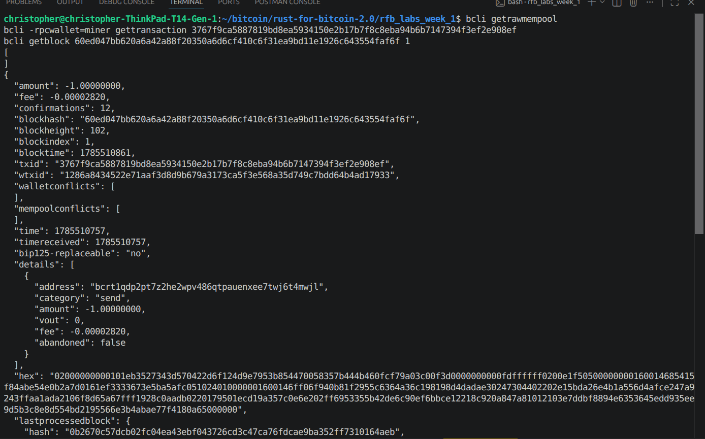

# Lab 07 — Confirmation and block membership

## Commands used

```
cargo test --test lab_07
bitcoin-cli -regtest -rpcwallet=miner generatetoaddress 1 <mining address>
bitcoin-cli -regtest getrawmempool
bitcoin-cli -regtest -rpcwallet=receiver getbalances
bitcoin-cli -regtest -rpcwallet=miner gettransaction <txid>
bitcoin-cli -regtest getblock <block hash> 1
```

## Terminal output

```
$ bitcoin-cli -regtest -rpcwallet=miner generatetoaddress 1 bcrt1q7fxfk3vl0nwthecqrqpm63mnfr6ngzky0677m2
[ "60ed047bb620a6a42a88f20350a6d6cf410c6f31ea9bd11e1926c643554faf6f" ]

$ bitcoin-cli -regtest getrawmempool
[]

$ bitcoin-cli -regtest -rpcwallet=receiver getbalances
{
  "mine": { "trusted": 1.00000000, "untrusted_pending": 0.00000000, "immature": 0.00000000 }
}

$ bitcoin-cli -regtest -rpcwallet=miner gettransaction 3767f9ca5887819bd8ea5934150e2b17b7f8c8eba94b6b7147394f3ef2e908ef
{
  "confirmations": 1,
  "blockhash": "60ed047bb620a6a42a88f20350a6d6cf410c6f31ea9bd11e1926c643554faf6f",
  "blockheight": 102,
  "blockindex": 1
}

$ bitcoin-cli -regtest getblock 60ed047bb620a6a42a88f20350a6d6cf410c6f31ea9bd11e1926c643554faf6f 1
"tx": [
  "907edd654f4aa08b6b05a49110d06b587adf812b2d56e128b25acdc86e55f0c4",
  "3767f9ca5887819bd8ea5934150e2b17b7f8c8eba94b6b7147394f3ef2e908ef"
]

$ cargo test --test lab_07
running 4 tests
test detects_empty_mempool ... ok
test mines_exactly_one_block ... ok
test reads_confirmation_count ... ok
test proves_transaction_is_inside_confirming_block ... ok
test result: ok. 4 passed; 0 failed; 0 ignored; 0 measured; 0 filtered out
```

## Evidence references



- `getrawmempool` is now `[]` — the TXID left the mempool.
- Receiver's `getbalances` moved the 1 BTC from `untrusted_pending` (lab 05)
  to `trusted`.
- `gettransaction` reports `confirmations: 1` and `blockhash:
  60ed047bb620a6a42a88f20350a6d6cf410c6f31ea9bd11e1926c643554faf6f`.
- That block's `tx` array (via `getblock ... 1`) contains
  `3767f9ca5887819bd8ea5934150e2b17b7f8c8eba94b6b7147394f3ef2e908ef` —
  independent confirmation the transaction is actually inside the block
  Core says it's in, not just trusting the wallet's claim.

## Explanation

Nothing about the transaction itself changed when it got mined — same
`hex`, same `txid`, before and after. What changed is where it sits: it went
from being one node's private, mutable guess sitting in a mempool to being
permanently ordered inside a block the whole network agreed on.
Confirmation isn't really a statement about content, since that was locked
in the moment it got signed — it's a statement about position in an agreed
history.
