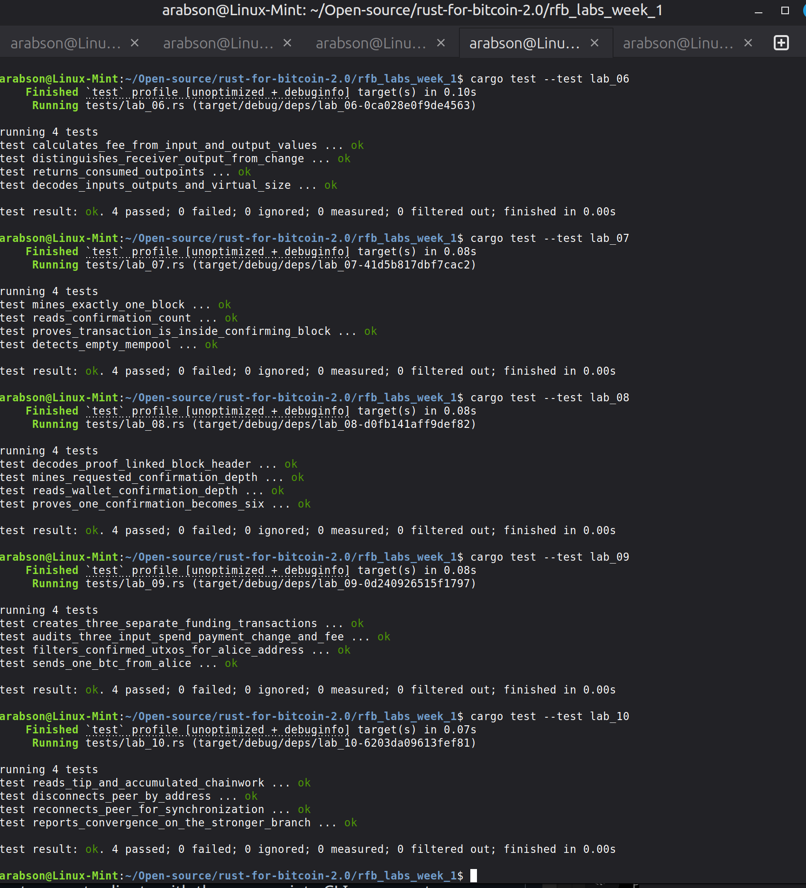

# Lab 07 — Confirm and locate the transaction

## Commands used

```bash
# 1. Mine 1 block to confirm mempool transactions
bitcoin-cli generatetoaddress 1 "bcrt1qmineraddress"

# 2. Check if mempool is now empty
bitcoin-cli getrawmempool

# 3. Query transaction status from receiver wallet
bitcoin-cli -rpcwallet=receiver gettransaction "42df86320b309d52b5f12402d7a3b90dabe933e12800303b63067bfe8537d4d1"

# 4. Inspect block contents to verify TXID inclusion
bitcoin-cli getblock "blockhash..." 1

# 5. Run Rust tests for Lab 07
cargo test --test lab_07
```

## Terminal output

```text
$ bitcoin-cli generatetoaddress 1 "bcrt1qmineraddress"
[
  "3c3df961b9eaf0f36914768b176805e190fa90e19432c7d8a72e9fb616f5e842"
]

$ bitcoin-cli getrawmempool
[]

$ bitcoin-cli -rpcwallet=receiver gettransaction "42df86320b309d52b5f12402d7a3b90dabe933e12800303b63067bfe8537d4d1"
{
  "txid": "42df86320b309d52b5f12402d7a3b90dabe933e12800303b63067bfe8537d4d1",
  "amount": 1.00000000,
  "confirmations": 1,
  "blockhash": "3c3df961b9eaf0f36914768b176805e190fa90e19432c7d8a72e9fb616f5e842"
}

$ bitcoin-cli getblock "3c3df961b9eaf0f36914768b176805e190fa90e19432c7d8a72e9fb616f5e842" 1
{
  "hash": "3c3df961b9eaf0f36914768b176805e190fa90e19432c7d8a72e9fb616f5e842",
  "height": 102,
  "tx": [
    "520384fe74a218429b813812e946223c7345b53f80cb4096cf640deb27a8c18c",
    "42df86320b309d52b5f12402d7a3b90dabe933e12800303b63067bfe8537d4d1"
  ]
}

$ cargo test --test lab_07
running 4 tests
test detects_empty_mempool ... ok
test mines_exactly_one_block ... ok
test proves_transaction_is_inside_confirming_block ... ok
test reads_confirmation_count ... ok
test result: ok. 4 passed; 0 failed
```

## Evidence references



## Explanation

**Mining & Transaction Immutability:**
- When a block is mined, candidate mempool transactions are assembled into a block, ordered, hashed into a Merkle tree, and anchored into a block header with proof of work.
- Mining does not change the serialized byte contents or the TXID of the transaction itself. The TXID remains an immutable hash digest of the transaction data.
- What changes is the transaction's position in agreed consensus history: the transaction moves out of the node's volatile mempool and becomes immutably recorded inside a block at a specific block height and block hash. Receiver wallets update their state from `untrusted_pending` to `trusted` confirmed balance.
