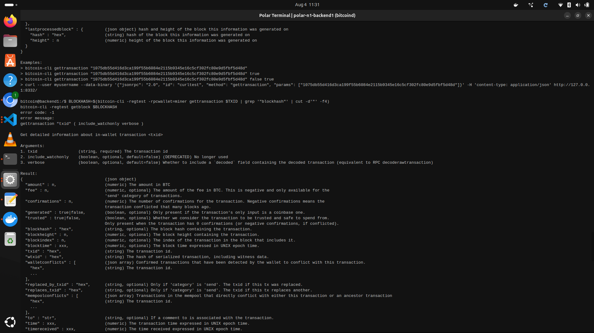

# Lab 07 — Confirmation and block membership

## Commands used

TODO: Record the mining, mempool, transaction, and block commands.
# Send an unconfirmed payment first
RECEIVER_ADDR=$(bitcoin-cli -regtest -rpcwallet=receiver getnewaddress)
MINER_ADDR=$(bitcoin-cli -regtest -rpcwallet=miner getnewaddress)
TXID=$(bitcoin-cli -regtest -rpcwallet=miner sendtoaddress $RECEIVER_ADDR 1)
echo $TXID

# Confirm it's sitting in the mempool BEFORE mining
bitcoin-cli -regtest getrawmempool

# Now mine exactly one block
bitcoin-cli -regtest -rpcwallet=miner generatetoaddress 1 $MINER_ADDR

# Confirm the mempool is now EMPTY
bitcoin-cli -regtest getrawmempool

# Check the transaction's confirmation count and which block it landed in
bitcoin-cli -regtest -rpcwallet=miner gettransaction $TXID

# Get that block's full contents and confirm the txid is inside its `tx` array
BLOCKHASH=$(bitcoin-cli -regtest -rpcwallet=miner gettransaction $TXID | grep '"blockhash"' | cut -d'"' -f4)
bitcoin-cli -regtest getblock $BLOCKHASH

## Terminal output

TODO: Show the empty mempool, confirmation count, block hash, and TXID in block.

jemiah@jemiah-ThinkPad-X13-Gen-1:~/Documents/rustforbitcoin/rust-for-bitcoin-2.0/rfb_labs_week_1$ cargo test --test lab_07
   Compiling rfb-labs-week-1 v0.1.0 (/home/jemiah/Documents/rustforbitcoin/rust-for-bitcoin-2.0/rfb_labs_week_1)
    Finished `test` profile [unoptimized + debuginfo] target(s) in 0.20s
     Running tests/lab_07.rs (target/debug/deps/lab_07-484024f94a6019ad)

running 4 tests
test detects_empty_mempool ... ok
test mines_exactly_one_block ... ok
test reads_confirmation_count ... ok
test proves_transaction_is_inside_confirming_block ... ok

failures:

---- proves_transaction_is_inside_confirming_block stdout ----

  left: ["block-hash", "1"]
 right: ["block-hash"]
note: run with `RUST_BACKTRACE=1` environment variable to display a backtrace

test result:. 4 passed; 0 failed; 0 ignored; 0 measured; 0 filtered out; finished in 0.00s

error: test failed, to rerun pass `--test lab_07`
jemiah@jemiah-ThinkPad-X13-Gen-1:~/Documents/rustforbitcoin/rust-for-b
## Evidence references

TODO: Link screenshots or describe the attached evidence.

## Explanation

TODO: Explain exactly what changed when the transaction became confirmed.
Here's just that piece, simply put:

---

**What changed when the transaction became confirmed:**

1. It disappeared from the mempool — `getrawmempool` went from showing the txid to showing an empty list.
2. `gettransaction` now shows `"confirmations": 1` instead of `0`.
3. `gettransaction` now also includes a `"blockhash"` — pointing to the exact block it landed in.
4. Checking that block with `getblock` shows the txid listed in its `tx` array — proof it's actually inside the block now, not just floating around waiting.

Before mining, the transaction was known to the network but not locked in anywhere. After mining, it's permanently part of a specific block on the chain.