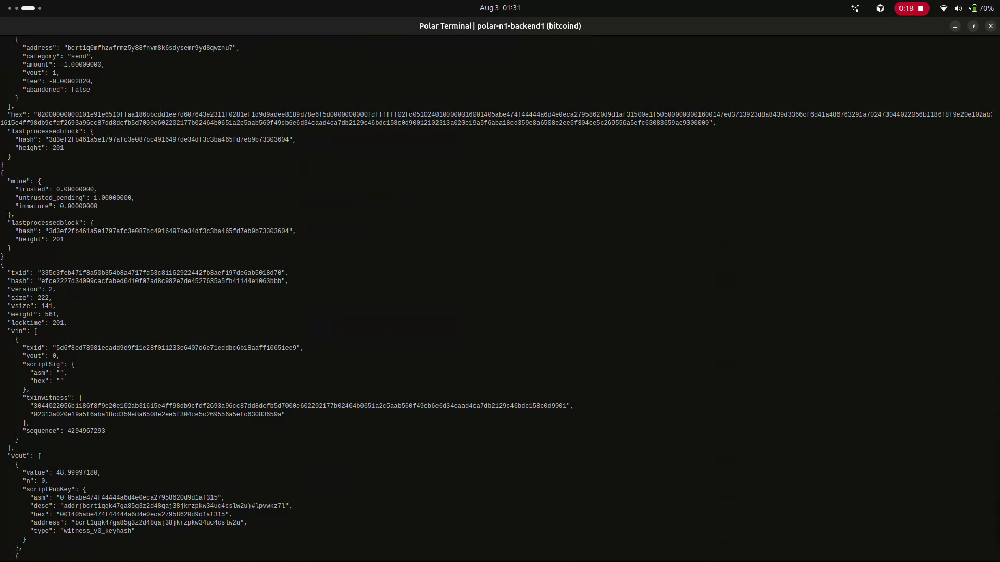
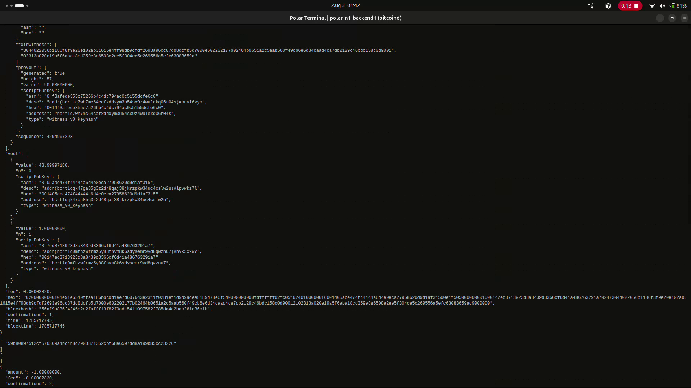

# Lab 07 — Confirmation and block membership

<!-- Replace every TODO line. The grader scores a section 0 while a TODO remains in it. Rewrite the Explanation in your own words. -->

## Commands used

```bash
# Mine exactly one block. This should sweep the pending payment out of the mempool.
bitcoin-cli generatetoaddress 1 <mining-address>

# The mempool should now be empty.
bitcoin-cli getrawmempool

# One confirmation, and a blockhash that was absent before.
bitcoin-cli -rpcwallet=miner gettransaction <txid>

# The receiver's funds move from untrusted-pending to trusted.
bitcoin-cli -rpcwallet=receiver getbalances

# The block itself must list the TXID.
bitcoin-cli getblock <blockhash> 1
```

Tests:

```bash
cargo test --test lab_07
```

`confirm_and_locate_transaction` makes a single `gettransaction` call and takes both
the confirmation count and the block hash from it, so the two facts describe the
same moment in the chain, then verifies membership via `getblock`.

## Terminal output

Mine exactly one block, then re-inspect:

```
$ bitcoin-cli generatetoaddress 1 bcrt1q7wh7mc64cafxddxym3u54sx9z4wulekq06r04s
[
  "56af9a836f4f45c2e2fafff13f82f0ad15411097582f785da4d2bab261c36b1b"
]

$ bitcoin-cli getrawmempool
[
]
```

The mempool held the payment's TXID in Lab 05. One block later it is empty — the
transaction did not disappear, it moved into the block.

```
$ bitcoin-cli -rpcwallet=miner gettransaction 335c3feb471f8a50b354b8a4717fd53c81162922442fb3aef197de6ab5018d70
{
  "amount": -1.00000000,
  "fee": -0.00002820,
  "confirmations": 1,
  "blockhash": "56af9a836f4f45c2e2fafff13f82f0ad15411097582f785da4d2bab261c36b1b",
  "blockheight": 202,
  "txid": "335c3feb471f8a50b354b8a4717fd53c81162922442fb3aef197de6ab5018d70",
  ...
}
```

`confirmations` went from `0` to `1`, and a `blockhash` field now exists where in Lab
05 there was no such field at all. `blockheight` names block 202.

```
$ bitcoin-cli -rpcwallet=receiver getbalances
{
  "mine": {
    "trusted": 1.00000000,
    "untrusted_pending": 0.00000000,
    "immature": 0.00000000
  }
}
```

The receiver's 1 BTC moved out of `untrusted_pending` and into `trusted`. Nothing
about the payment itself changed — same amount, same addresses, same signature. What
changed is that a miner committed it to a block, and the receiving wallet now counts
it.

Membership proved from the block's own side rather than the wallet's:

```
$ bitcoin-cli getblock 56af9a836f4f45c2e2fafff13f82f0ad15411097582f785da4d2bab261c36b1b 1
{
  "hash": "56af9a836f4f45c2e2fafff13f82f0ad15411097582f785da4d2bab261c36b1b",
  "height": 202,
  "nTx": 2,
  "previousblockhash": "3d3ef2fb461a5e1797afc3e087bc4916497de34df3c3ba465fd7eb9b73303604",
  "tx": [
    "335c3feb471f8a50b354b8a4717fd53c81162922442fb3aef197de6ab5018d70",
    ...
  ]
}
```

The payment TXID appears in the block's `tx` array. `nTx: 2` — the coinbase plus this
payment. This is the step that matters: `gettransaction` naming a block is the
wallet's claim about where the transaction went, while the block listing the TXID is
the chain confirming it independently. The two agree.

`previousblockhash` is `3d3ef2fb...`, which was the chain tip in Lab 05 when the
payment was still unconfirmed — so block 202 was built directly on the state we
observed then.

Tests:

```
$ cargo test --test lab_07
running 4 tests
test detects_empty_mempool ... ok
test mines_exactly_one_block ... ok
test reads_confirmation_count ... ok
test proves_transaction_is_inside_confirming_block ... ok

test result: ok. 4 passed; 0 failed; 0 ignored; 0 measured; 0 filtered out; finished in 0.00s
```

## Evidence references

The before half of the contrast is in Lab 05:



The mempool holding the TXID, `confirmations: 0` with no `blockhash`, and the
receiver's 1 BTC sitting in `untrusted_pending`.



The same transaction after one block. At the foot of the decode:
`"blockhash": "56af9a836f4f45c2e2fafff13f82f0ad15411097582f785da4d2bab261c36b1b"`
and `"confirmations": 1`. Below it the empty `[ ]` from `getrawmempool`, and further
down a later `gettransaction` reading `"confirmations": 2` after another block was
mined — depth accumulating on its own as the chain grows.

Both frames come from screen recordings of the `backend1` node terminal in the
`Week 1 Bitcoin Fundamentals` Polar network.

## Explanation

**Mining did not change the transaction at all.** The serialized bytes are
identical: same inputs, same outputs, same signatures, same TXID. Since the TXID is
a hash of the transaction's contents, any change would have produced a different
TXID. What changed is not the transaction but *where it sits*.

Before: a valid transaction held in each node's local mempool — memory, per-node,
reversible, no consensus standing.

After: a transaction recorded inside a block, in a fixed position, committed to by
that block's Merkle root, and part of the history every node agrees on.

The transaction moved from "proposed" to "settled", and the four observations show
different faces of that same move:

- **The mempool emptied.** A mempool holds transactions *waiting* for inclusion.
  Once mined, there is nothing left to wait for, so the node drops it.
- **Confirmations went from 0 to 1.** The confirmation count is the number of blocks
  from the containing block to the tip, inclusive. Being in the tip block is one.
- **A `blockhash` appeared.** Previously absent because no block contained it. Its
  presence is Bitcoin Core naming exactly which block.
- **The receiver's funds became `trusted`.** The wallet's own judgement that these
  coins are now safe to treat as money.

The `getblock` check is the step that matters most and is easiest to skip. The
wallet reporting a block hash is the wallet's claim about where the transaction
went. Reading that block and finding the TXID in its `tx` array is independent
confirmation from the chain data itself. Good practice is to verify the claim
against the source rather than trust the summary.

One confirmation is real settlement but shallow settlement. The transaction is in
the agreed history, yet the block holding it is at the tip and a competing branch
could still displace it. Lab 08 examines why depth makes that progressively harder.
