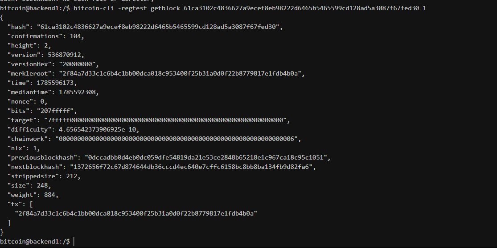

# Lab 07 — Confirmation and block membership

## Commands used

bitcoin-cli -regtest generatetoaddress 1 bcrt1q3vsmtd9gaenrw032adudukggrpqrfqwllntqu5
bitcoin-cli -regtest getrawmempool
bitcoin-cli -regtest -rpcwallet=receiver gettransaction 2f84a7d33c1c6b4c1bb00dca018c953400f25b31a0d0f22b8779817e1fdb4b0a
bitcoin-cli -regtest getblock 61ca3102c4836627a9ecef8eb98222d6465b5465599cd128ad5a3087f67fed30 1

## Terminal output

.......................
[
  "5cfa4b95ed6f050a310f1500a54a744c8dcd52be06196bfd00af4f9c06301366"
]
.......................
[
]
........................
{
  "hash": "61ca3102c4836627a9ecef8eb98222d6465b5465599cd128ad5a3087f67fed30",
  "confirmations": 104,
  "height": 2,
  "version": 536870912,
  "versionHex": "20000000",
  "merkleroot": "2f84a7d33c1c6b4c1bb00dca018c953400f25b31a0d0f22b8779817e1fdb4b0a",
  "time": 1785596173,
  "mediantime": 1785592308,
  "nonce": 0,
  "bits": "207fffff",
  "target": "7fffff0000000000000000000000000000000000000000000000000000000000",
  "difficulty": 4.656542373906925e-10,
  "chainwork": "0000000000000000000000000000000000000000000000000000000000000006",
  "nTx": 1,
  "previousblockhash": "0dccadbb0d4eb0dc059dfe54819da21e53ce2848b65218e1c967ca18c95c1051",
  "nextblockhash": "1372656f72c67d874644db36cccd4ec640e7cffc6158bc8bb8ba134fb9d82fa6",
  "strippedsize": 212,
  "size": 248,
  "weight": 884,
  "tx": [
    "2f84a7d33c1c6b4c1bb00dca018c953400f25b31a0d0f22b8779817e1fdb4b0a"
  ]
}
## Evidence references

## Explanation

Mining did not change the serialized transaction itself. The transaction data (inputs, outputs, signatures, locks, and unlocking scripts) is fixed at the time it is created and signed. Mining adds the transaction to a block by referencing it in the block's Merkle tree, but the transaction bytes remain identical whether it is in the mempool or confirmed in block 1 million.

What changes is the transaction's position in the agreed-upon history. Once a block containing the transaction is mined and accepted by the network, the transaction has a proof-of-work commitment linking it to that block through the Merkle root in the block header. This is what gives the transaction its first confirmation. The block header, in turn, is linked to all previous blocks through the `previousblockhash` field, creating an immutable chain. The transaction can no longer be dropped from the mempool or replaced without invalidating the block's proof-of-work.
