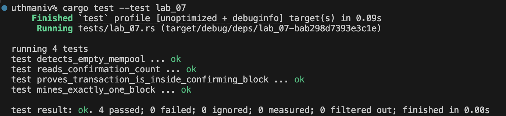

# Lab 07 — Confirmation and block membership

## Commands used

- Mining: `bitcoin-cli generatetoaddress 1 "$MINER_ADDRESS"`
- Mempool: `bitcoin-cli getrawmempool`
- Receiver transaction: `bitcoin-cli -rpcwallet=receiver gettransaction "$TXID"`
- Containing block: `bitcoin-cli getblock "$BLOCK_HASH" 1`

## Terminal output

```text
txid: fed36157b3cb634faf2ba9fb29adb0a8e6316599e59af7bb1f78db250f4ad070
block_hash: 2c798aadd7f59683a44de5f886b71bbdcb31480641e3f36a4cc725838bed5110
confirmations: 1
mempool_is_empty: true
transaction_is_in_block: true
```

## Evidence references


## Explanation

Mining did not change the transaction's serialized bytes or TXID. It changed the
transaction's status and position in history: the transaction left the mempool,
became a member of block
`2c798aadd7f59683a44de5f886b71bbdcb31480641e3f36a4cc725838bed5110`,
and gained one confirmation. The receiver's output consequently moved from
untrusted pending to trusted wallet value.
