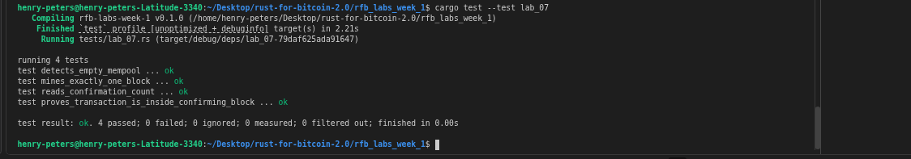

# Lab 07 — Confirmation and block membership

## Commands used

```bash
# Rust test suite
cargo test --test lab_07

# Mine exactly one block to confirm the pending transaction
bitcoin-cli generatetoaddress 1 bcrt1qp83jqswduwkhy494f86kyrvk36xnqrpn553e03  # miner address

# Verify the mempool is now empty
bitcoin-cli getrawmempool

# Read the transaction's confirmation count and containing block hash
bitcoin-cli -rpcwallet=receiver gettransaction 85e8d711749065243ec2b80b9a3f451ca0c196e0f8cf27478718adcf36530bd8  # txid

# Inspect the block and confirm the TXID appears in its tx list
bitcoin-cli getblock 52bfda7aecc946fd6782e6cc61de5e6f8830c901835d13c3dc981bb341e0ddf9 1  # block-hash
```

## Terminal output
<!-- Paste the relevant terminal output here -->
```bash
bitcoin@backend1:/$ bitcoin-cli generatetoaddress 1 bcrt1qp83jqswduwkhy494f86kyrvk36xnqrpn553e03
[
  "52bfda7aecc946fd6782e6cc61de5e6f8830c901835d13c3dc981bb341e0ddf9"
]
bitcoin@backend1:/$ bitcoin-cli getrawmempool
[
]
bitcoin@backend1:/$ bitcoin-cli -rpcwallet=receiver gettransaction 85e8d711749065243ec2b80b9a3f451ca0c196e0f8cf27478718adcf36530bd8
{
  "amount": 1.00000000,
  "confirmations": 1,
  "blockhash": "52bfda7aecc946fd6782e6cc61de5e6f8830c901835d13c3dc981bb341e0ddf9",
  "blockheight": 105,
  "blockindex": 1,
  "blocktime": 1785791697,
  "txid": "85e8d711749065243ec2b80b9a3f451ca0c196e0f8cf27478718adcf36530bd8",
  "wtxid": "6e3fe4d4fb5b8a4c067cc5318c576181130b2c87d2e254757a87cdf384e5c12b",
  "walletconflicts": [
  ],
  "mempoolconflicts": [
  ],
  "time": 1785788361,
  "timereceived": 1785788361,
  "bip125-replaceable": "no",
  "details": [
    {
      "address": "bcrt1qry57tkfsw9t6xp2m97y94ac5f7mj242f3a56mu",
      "parent_descs": [
        "wpkh([f3efbedd/84h/1h/0h]tpubDCgZyvg8ur83SFoaQFw9gyZLMMkf1eprpLHKnJytezfe6r45iL9Z32TtAbNCnatgm5e4caMX8ZHR4JDcuZmSSXY5rZ3hCdtGBFzLzwzdbsG/0/*)#f4us6s7c"
      ],
      "category": "receive",
      "amount": 1.00000000,
      "label": "receiver_address",
      "vout": 0,
      "abandoned": false
    }
  ],
  "hex": "020000000001016571cb6b08d8edbf5198025156a928d00a8389b6f5ddf101b5e78d8069a715920000000000fdffffff0200e1f505000000001600141929e5d9307157a3055b2f885af7144fb7255549fc05102401000000160014fedaea27707566a51be3d68ab38e3abc8a9ed2bb0247304402200dc3d4f9719ff14b7604fe3b40d1211f7e89f2cca452a32db77316df0c3621ef02205a23dbf51ee9912392a4a3a26178af34ed21c429822df9452c1b8e0ebcb98be4012102a016d02eed09f4474152796b722c3bad06ed261e2b52d0aa8a8d917ed5cd481968000000",
  "lastprocessedblock": {
    "hash": "52bfda7aecc946fd6782e6cc61de5e6f8830c901835d13c3dc981bb341e0ddf9",
    "height": 105
  }
}
bitcoin@backend1:/$ bitcoin-cli getblock 52bfda7aecc946fd6782e6cc61de5e6f8830c901835d13c3dc981bb341e0ddf9 1
{
  "hash": "52bfda7aecc946fd6782e6cc61de5e6f8830c901835d13c3dc981bb341e0ddf9",
  "confirmations": 1,
  "height": 105,
  "version": 536870912,
  "versionHex": "20000000",
  "merkleroot": "2c58cb23566b8f43afe6dfbd5a31cf847d3dd7875d9700a44a56076d4165b243",
  "time": 1785791697,
  "mediantime": 1785785811,
  "nonce": 1,
  "bits": "207fffff",
  "target": "7fffff0000000000000000000000000000000000000000000000000000000000",
  "difficulty": 4.656542373906925e-10,
  "chainwork": "00000000000000000000000000000000000000000000000000000000000000d4",
  "nTx": 2,
  "previousblockhash": "04210b631d198bbe65227f395966fba035774b8785a23c60cebb5004aa964456",
  "strippedsize": 326,
  "size": 471,
  "weight": 1449,
  "tx": [
    "39361999bf43372dff043ea3141cbb904df260d6c26564491bfad5878ba5dbed",
    "85e8d711749065243ec2b80b9a3f451ca0c196e0f8cf27478718adcf36530bd8"
  ]
}
```

## Evidence references
<!-- Describe or link to screenshots, logs, or other supporting evidence -->
.png)
.png)
<!-- My tests -->


## Explanation

When a block is mined and accepted by the network, the transaction's serialised bytes do not change at all — the transaction itself is identical before and after confirmation. What changes is its *context*.

Before confirmation the transaction is looked up by TXID in the mempool. After confirmation it is stored as part of a block and is accessible via its `blockhash` and position in the block's `tx` array. The wallet reflects this by promoting the receiver's balance from `untrusted_pending` to `trusted` and populating the `blockhash` field in `gettransaction`.

Mining did not alter the transaction — it altered the transaction's position in history. It is now part of a chain of proof-of-work commitments that would be expensive to rewrite, which is what makes it trustworthy.
