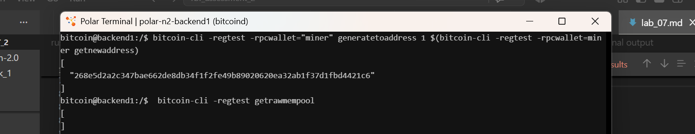
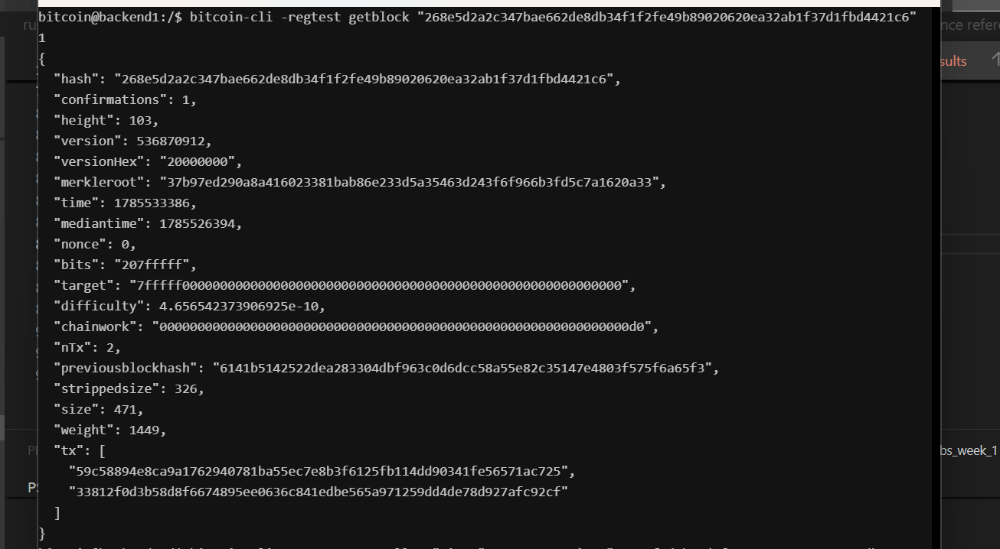
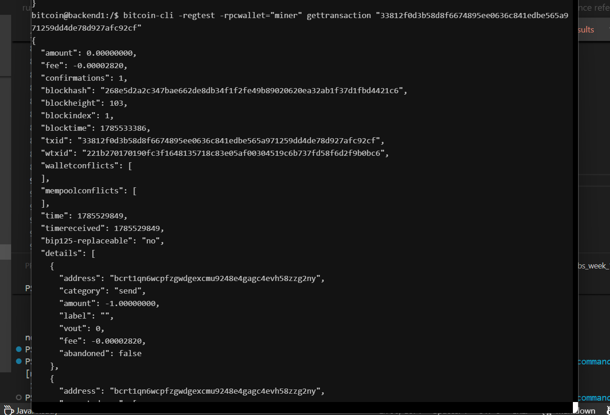

# Lab 07 — Confirmation and block membership

## Commands used
```bash
# 1. Mine one block to confirm pending mempool transactions
 bitcoin-cli -regtest -rpcwallet="miner" generatetoaddress 1 $(bitcoin-cli -regtest -rpcwallet=miner getnewaddress)

# 2. Check if local mempool is cleared 
bitcoin-cli -regtest getrawmempool

# 3. Query transaction status and verify updated block hash and confirmations
bitcoin-cli -regtest -rpcwallet="miner" gettransaction "33812f0d3b58d8f6674895ee0636c841edbe565a971259dd4de78d927afc92cf"

# 4. Fetch block details to prove transaction membership in tx array 
bitcoin-cli -regtest getblock "268e5d2a2c347bae662de8db34f1f2fe49b89020620ea32ab1f37d1fbd4421c6" 1

```

## Terminal output

* **empty mempool**
```bash
bitcoin@backend1:/$  bitcoin-cli -regtest getrawmempool
[
]

```

* **confirmation counts**
```bash
{
  "amount": 0.00000000,
  "fee": -0.00002820,
  "confirmations": 1,
  "blockhash": "268e5d2a2c347bae662de8db34f1f2fe49b89020620ea32ab1f37d1fbd4421c6",
  "blockheight": 103,
  "blockindex": 1,
  "blocktime": 1785533386,
  "txid": "33812f0d3b58d8f6674895ee0636c841edbe565a971259dd4de78d927afc92cf",
  "wtxid": "221b270170190fc3f1648135718c83e05af00304519c6b737fd58f6d2f9b0bc6",
  "walletconflicts": [
  ],
```

* **block hash**
```bash
[
  "268e5d2a2c347bae662de8db34f1f2fe49b89020620ea32ab1f37d1fbd4421c6"
]
```

* **txid in block**
```bash
{
  "hash": "268e5d2a2c347bae662de8db34f1f2fe49b89020620ea32ab1f37d1fbd4421c6",
  "confirmations": 1,
  "height": 103,
  "version": 536870912,
  "versionHex": "20000000",
  "merkleroot": "37b97ed290a8a416023381bab86e233d5a35463d243f6f966b3fd5c7a1620a33",
  "time": 1785533386,
  "mediantime": 1785526394,
  "nonce": 0,
  "bits": "207fffff",
  "target": "7fffff0000000000000000000000000000000000000000000000000000000000",
  "difficulty": 4.656542373906925e-10,
  "chainwork": "00000000000000000000000000000000000000000000000000000000000000d0",
  "nTx": 2,
  "previousblockhash": "6141b5142522dea283304dbf963c0d6dcc58a55e82c35147e4803f575f6a65f3",
  "strippedsize": 326,
  "size": 471,
  "weight": 1449,
  "tx": [
    "59c58894e8ca9a1762940781ba55ec7e8b3f6125fb114dd90341fe56571ac725",
    "33812f0d3b58d8f6674895ee0636c841edbe565a971259dd4de78d927afc92cf"
  ]
}
```


## Evidence references

* **Figure 1**
- mining and emptying the mempool


* **Figure 2**
- block inpection for the confirmed transaction


* **Figure 3**
- confirmation tx confirmation from zero to 1


## Explanation
the mempool became empty or reduces by one transaction, the transaction got one emmediate confirmation

