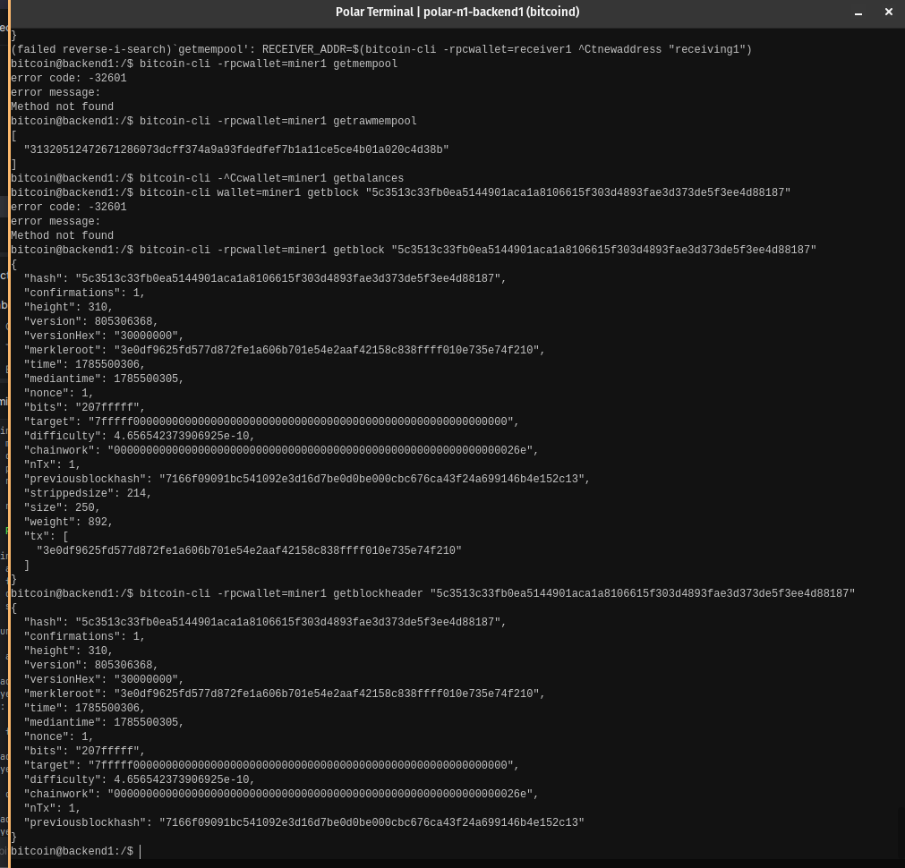

# Lab 08 — Block security

## Commands used

TODO: Record block-header inspection and additional mining commands.

bitcoin@backend1:/$ bitcoin-cli -rpcwallet=miner1 getblockheader "5c3513c33fb0ea5144901aca1a8106615f303d4893fae3d373de5f3ee4d88187"

## Terminal output

TODO: Show header fields and confirmation count changing from one to six.
```bash
bitcoin@backend1:/$ bitcoin-cli -rpcwallet=miner1 getblockheader "5c3513c33fb0ea5144901aca1a8106615f303d4893fae3d373de5f3ee4d88187"
{
  "hash": "5c3513c33fb0ea5144901aca1a8106615f303d4893fae3d373de5f3ee4d88187",
  "confirmations": 1,
  "height": 310,
  "version": 805306368,
  "versionHex": "30000000",
  "merkleroot": "3e0df9625fd577d872fe1a606b701e54e2aaf42158c838ffff010e735e74f210",
  "time": 1785500306,
  "mediantime": 1785500305,
  "nonce": 1,
  "bits": "207fffff",
  "target": "7fffff0000000000000000000000000000000000000000000000000000000000",
  "difficulty": 4.656542373906925e-10,
  "chainwork": "000000000000000000000000000000000000000000000000000000000000026e",
  "nTx": 1,
  "previousblockhash": "7166f09091bc541092e3d16d7be0d0be000cbc676ca43f24a699146b4e152c13"
}
```

## Evidence references

TODO: Link screenshots or describe the attached evidence.


## Explanation

TODO: Explain hash links, Merkle roots, proof of work, and confirmation depth.
Hash links and Merkle roots secure the ledger by linking each block to the previous one's fingerprint and committing headers to their specific transaction sets,,. Proof of work provides a costly-to-rewrite ordering of history, while confirmation depth tracks how many blocks bury a transaction to ensure probabilistic finality
