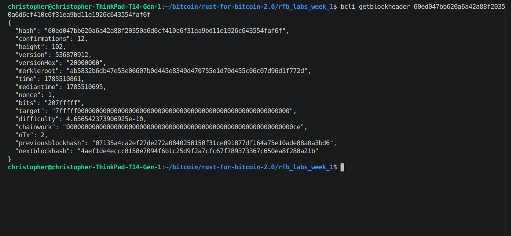

# Lab 08 — Block security

## Commands used

```
cargo test --test lab_08
bitcoin-cli -regtest getblockheader <block hash>
bitcoin-cli -regtest -rpcwallet=miner gettransaction <txid>
bitcoin-cli -regtest -rpcwallet=miner generatetoaddress 5 <mining address>
bitcoin-cli -regtest -rpcwallet=miner gettransaction <txid>
bitcoin-cli -regtest getblockheader <block hash>
```

## Terminal output

```
$ bitcoin-cli -regtest getblockheader 60ed047bb620a6a42a88f20350a6d6cf410c6f31ea9bd11e1926c643554faf6f
{
  "hash": "60ed047bb620a6a42a88f20350a6d6cf410c6f31ea9bd11e1926c643554faf6f",
  "confirmations": 1,
  "height": 102,
  "merkleroot": "ab5832b6db47e53e06607b0d445e8340d470755e1d70d455c06c07d96d1f772d",
  "nonce": 1,
  "bits": "207fffff",
  "target": "7fffff0000000000000000000000000000000000000000000000000000000000",
  "difficulty": 4.656542373906925e-10,
  "chainwork": "00000000000000000000000000000000000000000000000000000000000000ce",
  "previousblockhash": "07135a4ca2ef27de272a0840258150f31ce091877df164a75e10ade88a0a3bd6"
}

$ bitcoin-cli -regtest -rpcwallet=miner gettransaction 3767f9ca5887819bd8ea5934150e2b17b7f8c8eba94b6b7147394f3ef2e908ef
"confirmations": 1

$ bitcoin-cli -regtest -rpcwallet=miner generatetoaddress 5 bcrt1q7fxfk3vl0nwthecqrqpm63mnfr6ngzky0677m2
[ 5 block hashes ]

$ bitcoin-cli -regtest -rpcwallet=miner gettransaction 3767f9ca5887819bd8ea5934150e2b17b7f8c8eba94b6b7147394f3ef2e908ef
"confirmations": 6

$ bitcoin-cli -regtest getblockheader 60ed047bb620a6a42a88f20350a6d6cf410c6f31ea9bd11e1926c643554faf6f
"confirmations": 6
"chainwork": "00000000000000000000000000000000000000000000000000000000000000ce"

$ cargo test --test lab_08
running 4 tests
test mines_requested_confirmation_depth ... ok
test decodes_proof_linked_block_header ... ok
test reads_wallet_confirmation_depth ... ok
test proves_one_confirmation_becomes_six ... ok
test result: ok. 4 passed; 0 failed; 0 ignored; 0 measured; 0 filtered out
```

## Evidence references



- Block hash: `60ed047bb620a6a42a88f20350a6d6cf410c6f31ea9bd11e1926c643554faf6f`,
  height `102`.
- Previous-block hash:
  `07135a4ca2ef27de272a0840258150f31ce091877df164a75e10ade88a0a3bd6`.
- Merkle root: `ab5832b6db47e53e06607b0d445e8340d470755e1d70d455c06c07d96d1f772d`.
- Nonce: `1`. Bits: `207fffff` (regtest's minimal-difficulty target).
- Chainwork: `...ce` (hex), unchanged by mining more blocks *on top of* this
  one — it's the cumulative work *up to and including* this block.
- Confirmations went from `1` → `6` after mining 5 more blocks, matching the
  payment transaction's own confirmation count exactly.

## Explanation

Each block header points at the previous block's hash, and that's really
what chains blocks together into one unbreakable sequence — change anything
in an old block and its hash changes, which breaks every link built on top
of it. The Merkle root does something similar but for the transactions
inside that one block: change any transaction and the root changes, which
is exactly what let lab 07 prove a specific txid was inside a specific
block without re-hashing the whole thing.

Proof-of-work is the part where a miner searches for a nonce (plus a couple
other malleable fields) until the header hash comes in under the target
implied by `bits`. That search costs real computation, which is the whole
point of it — it's what makes rewriting history expensive instead of free.

Confirmations are just a count of how many blocks now sit on top of the one
holding your transaction. Every extra confirmation means an attacker would
need that much more accumulated proof-of-work to rewrite it, so
confirmations raise the *cost* of a reorg — but they don't change whether
the transaction was valid in the first place. An invalid transaction
doesn't become valid no matter how many blocks pile on top of it, and a
transaction with 1 confirmation is exactly as correct as one with 6. It's
just cheaper to try to undo.
