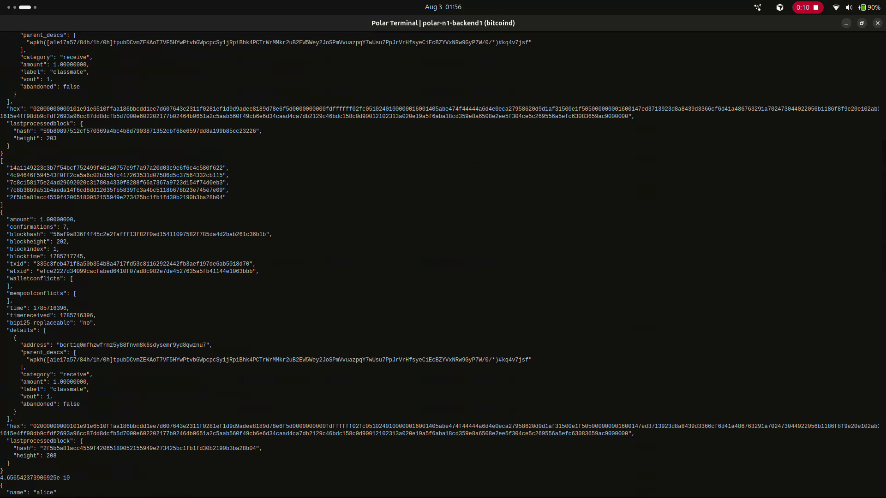
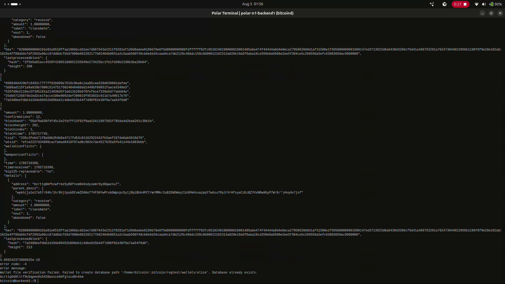

# Lab 08 — Block security

<!-- Replace every TODO line. The grader scores a section 0 while a TODO remains in it. Rewrite the Explanation in your own words. -->

## Commands used

```bash
# Full header of the block that confirmed the payment.
bitcoin-cli getblockheader <blockhash>

# Depth before: one confirmation.
bitcoin-cli -rpcwallet=receiver gettransaction <txid>

# Mine five more blocks.
bitcoin-cli generatetoaddress 5 <mining-address>

# Depth after: six confirmations.
bitcoin-cli -rpcwallet=receiver gettransaction <txid>
```

Optional, to see the target behind `bits` and the work behind `chainwork`:

```bash
bitcoin-cli getblockchaininfo
bitcoin-cli getdifficulty
```

Tests:

```bash
cargo test --test lab_08
```

`build_security_report` records the header, reads the depth, mines five blocks, and
reads the depth again — so the before and after figures bracket exactly that mining.

## Terminal output

The header of block 202, the block that confirmed the payment:

```
$ bitcoin-cli getblockheader 56af9a836f4f45c2e2fafff13f82f0ad15411097582f785da4d2bab261c36b1b
{
  "hash": "56af9a836f4f45c2e2fafff13f82f0ad15411097582f785da4d2bab261c36b1b",
  "confirmations": 12,
  "height": 202,
  "version": 536870912,
  "merkleroot": "b1af935875515a1ffe55150e1b5e8fa894ecdeb692a218f08747ac5a9508671f",
  "time": 1785717745,
  "nonce": 1,
  "bits": "207fffff",
  "difficulty": 4.656542373906925e-10,
  "chainwork": "0000000000000000000000000000000000000000000000000000000000000196",
  "nTx": 2,
  "previousblockhash": "3d3ef2fb461a5e1797afc3e087bc4916497de34df3c3ba465fd7eb9b73303604"
}
```

| Field | Value | What it commits to |
| --- | --- | --- |
| `hash` | `56af9a83...61c36b1b` | this block's identity |
| `height` | 202 | position in the chain |
| `previousblockhash` | `3d3ef2fb...73303604` | the parent, making the chain a chain |
| `merkleroot` | `b1af9358...9508671f` | every transaction in the block, including the payment |
| `nonce` | 1 | the value varied to satisfy the target |
| `bits` | `207fffff` | the compact difficulty target |
| `difficulty` | 4.656542373906925e-10 | that target expressed relative to mainnet |
| `confirmations` | 12 | depth at the time of this call |
| `chainwork` | `...00000196` | total work in the chain up to here |

Depth before mining, from the receiver's side:

```
$ bitcoin-cli -rpcwallet=receiver gettransaction 335c3feb471f8a50b354b8a4717fd53c81162922442fb3aef197de6ab5018d70
{
  "amount": 1.00000000,
  "confirmations": 7,
  "blockhash": "56af9a836f4f45c2e2fafff13f82f0ad15411097582f785da4d2bab261c36b1b",
  "blockheight": 202,
  ...
  "lastprocessedblock": {
    "hash": "2f5b5a81acc4559f42065180052155949e273425bc1fb1fd30b2190b3ba28b04",
    "height": 208
  }
}
```

Five blocks mined:

```
$ bitcoin-cli generatetoaddress 5 bcrt1q7wh7mc64cafxddxym3u54sx9z4wulekq06r04s
[
  "698640d429bfc8492c77f7ff82b009e7616c9ba8c2aa85cae528d639801dafea",
  "3d86ad115f1a9a820b7808c51475175024046486dd1449bf69851faace3348e3",
  "535fd9e2116ec5f395181a214838d5f1dd12b26b670fefbce7339a5d77abb64a",
  "25db57135874b1bd2ce1facce100e9092def390019f953032c911b7a49617b76",
  "7a5480eefdbb1d104e09452b896eb1c4dbe915b44f7d90f82e30f9a7aa54f6d6"
]
```

Depth after:

```
$ bitcoin-cli -rpcwallet=receiver gettransaction 335c3feb471f8a50b354b8a4717fd53c81162922442fb3aef197de6ab5018d70
{
  "amount": 1.00000000,
  "confirmations": 12,
  "blockhash": "56af9a836f4f45c2e2fafff13f82f0ad15411097582f785da4d2bab261c36b1b",
  "blockheight": 202,
  ...
  "lastprocessedblock": {
    "hash": "7a5480eefdbb1d104e09452b896eb1c4dbe915b44f7d90f82e30f9a7aa54f6d6",
    "height": 213
  }
}
```

**Depth went 7 → 12: five blocks, five confirmations.** The lab template describes
this as 1 → 6; on this chain the payment already had extra depth before the step
began, because a block was mined after Lab 07 confirmed it. I ran the sequence twice,
and it behaved identically both times — 2 → 7 on the first pass, 7 → 12 on the second.
Five blocks always buys exactly five confirmations.

Note what did **not** change between the two calls: `blockhash`, `blockheight`,
`amount`, and the txid are all identical. The transaction was not re-mined or altered.
Only `confirmations` moved, and it moved because the chain grew on top of it.
Confirmation depth is not a property of the transaction — it is a measurement of how
much chain now sits above it.

```
$ bitcoin-cli getdifficulty
4.656542373906925e-10
```

Difficulty on regtest is effectively zero, which is why `nonce` is 1 — the first value
tried satisfied the target. On mainnet that same field would have required an
astronomical number of attempts, and that gap is exactly what makes confirmations
expensive to undo in the real network and free to undo here.

Tests:

```
$ cargo test --test lab_08
running 4 tests
test mines_requested_confirmation_depth ... ok
test reads_wallet_confirmation_depth ... ok
test decodes_proof_linked_block_header ... ok
test proves_one_confirmation_becomes_six ... ok

test result: ok. 4 passed; 0 failed; 0 ignored; 0 measured; 0 filtered out; finished in 0.00s
```

## Evidence references

Both frames are stills from a screen recording of the `backend1` node terminal.



The receiver's `gettransaction` reading `"confirmations": 7` against
`"blockheight": 202`, with `lastprocessedblock` at height 208. Above it, the previous
pass through the same sequence ends with `lastprocessedblock` at height 203 — the
depth-2 reading that the first run started from. The five block hashes returned by
`generatetoaddress` sit between the two calls.



The same call after mining: `"confirmations": 12`, with `blockhash` and `blockheight`
unchanged at `56af9a83...` and 202, and `lastprocessedblock` now at height 213. The
`getdifficulty` result `4.656542373906925e-10` appears at the foot of the frame.

## Explanation

A block header is small and fixed-size, yet it commits to everything that matters.

**Hash links.** `previousblockhash` names the header before it. Because a block's
hash is computed over its own header, and that header contains the previous hash,
changing any old block changes its hash, which invalidates the `previousblockhash`
of the block after it, and so on to the tip. The chain is a chain in the literal
sense: each link is a hash of the last. Genesis is the only block without this
field.

**Merkle commitment.** `merkleroot` is the root of a binary hash tree built over
every transaction in the block. Altering, adding, removing, or reordering any
transaction changes the root, which changes the header, which changes the block
hash. So an 80-byte header commits to a block of any size. It also allows a light
client to be shown that one transaction is in a block using only a short path of
hashes, without downloading the block.

**Proof-of-work search.** `bits` is a compact encoding of the target — a threshold
the block hash must fall below. `difficulty` expresses the same constraint as a
ratio against the easiest target. The `nonce` is the field miners vary while
repeatedly hashing the header, searching for a value that satisfies the target.
There is no shortcut: the only way to find one is to try, so a valid header is
public evidence that real computational work was performed. On regtest the target
is deliberately trivial (`bits` of `207fffff`), which is why blocks mine instantly.

**Confirmations and chainwork.** `confirmations` is the depth from this block to the
tip. `chainwork` is the total accumulated work in the whole branch up to this block,
and it is the figure nodes actually compare when branches compete (Lab 10).

Depth raises the cost of reversal. Rewriting a transaction six blocks deep means
producing a replacement for its block *and* out-pacing the honest chain across all
six, since each descendant commits to its parent's hash. That work grows with depth,
which is why "six confirmations" became a convention: not a rule in the software,
but a point where the cost of reversal outweighs most plausible gains.

**Depth never makes an invalid transaction valid.** Proof of work orders history and
resolves competition between valid branches; it does not substitute for validation.
Every node independently checks signatures, that inputs exist and are unspent, that
outputs do not exceed inputs, and that coinbase maturity is respected. A block
containing an invalid transaction is rejected outright no matter how much work sits
behind it — such a chain is not a stronger competitor, it is simply not a valid
chain. Work decides *which valid history wins*, never *what counts as valid*.
