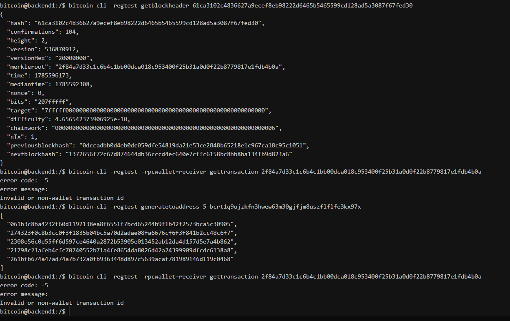

# Lab 08 — Block security

## Commands used

bitcoin-cli -regtest getblockheader 61ca3102c4836627a9ecef8eb98222d6465b5465599cd128ad5a3087f67fed30
bitcoin-cli -regtest -rpcwallet=receiver gettransaction 2f84a7d33c1c6b4c1bb00dca018c953400f25b31a0d0f22b8779817e1fdb4b0a
bitcoin-cli -regtest generatetoaddress 5 bcrt1q9ujzkfn3hwew63m30gjfjm8uszflflfe3kx97x
bitcoin-cli -regtest -rpcwallet=receiver gettransaction 2f84a7d33c1c6b4c1bb00dca018c953400f25b31a0d0f22b8779817e1fdb4b0a

## Terminal output

................................
61ca3102c4836627a9ecef8eb98222d6465b5465599cd128ad5a3087f67fed30
{
  "hash": "61ca3102c4836627a9ecef8eb98222d6465b5465599cd128ad5a3087f67fed30",
  "confirmations": 104,
  "height": 2,
  "version": 536870912,
  "versionHex": "20000000",
  "merkleroot": "2f84a7d33c1c6b4c1bb00dca018c953400f25b31a0d0f22b8779817e1fdb4b0a",
  "time": 1785596173,
  "mediantime": 1785592308,
  "nonce": 0,
  "bits": "207fffff",
  "target": "7fffff0000000000000000000000000000000000000000000000000000000000",
  "difficulty": 4.656542373906925e-10,
  "chainwork": "0000000000000000000000000000000000000000000000000000000000000006",
  "nTx": 1,
  "previousblockhash": "0dccadbb0d4eb0dc059dfe54819da21e53ce2848b65218e1c967ca18c95c1051",
  "nextblockhash": "1372656f72c67d874644db36cccd4ec640e7cffc6158bc8bb8ba134fb9d82fa6"
}
...........................................
 2f84a7d33c1c6b4c1bb00dca018c953400f25b31a0d0f22b8779817e1fdb4b0a
error code: -5
error message:
Invalid or non-wallet transaction id
.............................................
[
  "061b3c8ba4232f60d1192138ea8f6551f7bcd65244b9f1b42f2573bca5c30905",
  "274323f0c8b3cc0f3f1835b04bc5a70d2adae08fa6676cf6f3f841b2cc48c6f7",
  "2308e56c0e55ff6d597ce4640a2872b53905e013452ab12da4d157d5e7a4b862",
  "21798c21afeb4cfc70740552b71a4fe8654da8026d42a24399909dfcdc6138a8",
  "261bfb674a47ad74a7b732a0fb9363448d897c5639acaf781989146d119c0468"
]
...................................................
error code: -5
error message:
Invalid or non-wallet transaction id

## Evidence references

## Explanation

Each block header contains a hash link to the previous block (`previousblockhash`), creating a chain where every block cryptographically commits to its predecessor. The `merkleroot` is the root of a binary Merkle tree built from all transactions in the block. Each leaf of this tree is a transaction hash, and each internal node is the hash of its two children. This structure allows compact Merkle proofs: to prove a transaction is in a block, you only need the transaction hash plus the sibling hashes along the path to the root, rather than the entire block.

Proof-of-work search is the process of varying the `nonce` (and other fields in the coinbase transaction) until the block header hash falls below the `target` value encoded by `bits`. In regtest, the difficulty is set to the minimum (`0.00000001`), so a valid nonce is found almost instantly. On mainnet, the difficulty adjusts every 2,016 blocks to target a 10-minute block interval.

Each additional confirmation increases the cost of reorganizing the chain. To reverse a transaction with 6 confirmations, an attacker would need to produce 7 blocks (the containing block plus 6 more) that collectively have more accumulated work than the honest chain. This does not make an invalid transaction valid—no amount of proof-of-work can override consensus rules like double-spend protection or signature verification. Confirmations only increase assurance against a temporary chain fork replacing honest work.
