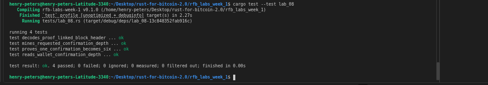

# Lab 08 — Block security

## Commands used

```bash
# Rust test suite
cargo test --test lab_08

# Inspect the confirming block's header
bitcoin-cli getblockheader 52bfda7aecc946fd6782e6cc61de5e6f8830c901835d13c3dc981bb341e0ddf9  # block hash

# Read transaction confirmation count before additional mining
bitcoin-cli -rpcwallet=receiver gettransaction 85e8d711749065243ec2b80b9a3f451ca0c196e0f8cf27478718adcf36530bd8   # txid

# Mine five more blocks
bitcoin-cli generatetoaddress 5 bcrt1qp83jqswduwkhy494f86kyrvk36xnqrpn553e03  # miner address

# Read confirmation count again (should now be 6)
bitcoin-cli -rpcwallet=receiver gettransaction 85e8d711749065243ec2b80b9a3f451ca0c196e0f8cf27478718adcf36530bd8  # txid
```

## Terminal output
<!-- Paste the relevant terminal output here -->
```bash
bitcoin@backend1:/$ bitcoin-cli getblockheader 52bfda7aecc946fd6782e6cc61de5e6f8830c901835d13c3dc981bb341e0ddf9
{
  "hash": "52bfda7aecc946fd6782e6cc61de5e6f8830c901835d13c3dc981bb341e0ddf9",
  "confirmations": 1,
  "height": 105,
  "version": 536870912,
  "versionHex": "20000000",
  "merkleroot": "2c58cb23566b8f43afe6dfbd5a31cf847d3dd7875d9700a44a56076d4165b243",
  "time": 1785791697,
  "mediantime": 1785785811,
  "nonce": 1,
  "bits": "207fffff",
  "target": "7fffff0000000000000000000000000000000000000000000000000000000000",
  "difficulty": 4.656542373906925e-10,
  "chainwork": "00000000000000000000000000000000000000000000000000000000000000d4",
  "nTx": 2,
  "previousblockhash": "04210b631d198bbe65227f395966fba035774b8785a23c60cebb5004aa964456"
}
bitcoin@backend1:/$ bitcoin-cli -rpcwallet=receiver gettransaction 85e8d711749065243ec2b80b9a3f451ca0c196e0f8cf27478718adcf36530bd8 
{
  "amount": 1.00000000,
  "confirmations": 1,
  "blockhash": "52bfda7aecc946fd6782e6cc61de5e6f8830c901835d13c3dc981bb341e0ddf9",
  "blockheight": 105,
  "blockindex": 1,
  "blocktime": 1785791697,
  "txid": "85e8d711749065243ec2b80b9a3f451ca0c196e0f8cf27478718adcf36530bd8",
  "wtxid": "6e3fe4d4fb5b8a4c067cc5318c576181130b2c87d2e254757a87cdf384e5c12b",
  "walletconflicts": [
  ],
  "mempoolconflicts": [
  ],
  "time": 1785788361,
  "timereceived": 1785788361,
  "bip125-replaceable": "no",
  "details": [
    {
      "address": "bcrt1qry57tkfsw9t6xp2m97y94ac5f7mj242f3a56mu",
      "parent_descs": [
        "wpkh([f3efbedd/84h/1h/0h]tpubDCgZyvg8ur83SFoaQFw9gyZLMMkf1eprpLHKnJytezfe6r45iL9Z32TtAbNCnatgm5e4caMX8ZHR4JDcuZmSSXY5rZ3hCdtGBFzLzwzdbsG/0/*)#f4us6s7c"
      ],
      "category": "receive",
      "amount": 1.00000000,
      "label": "receiver_address",
      "vout": 0,
      "abandoned": false
    }
  ],
  "hex": "020000000001016571cb6b08d8edbf5198025156a928d00a8389b6f5ddf101b5e78d8069a715920000000000fdffffff0200e1f505000000001600141929e5d9307157a3055b2f885af7144fb7255549fc05102401000000160014fedaea27707566a51be3d68ab38e3abc8a9ed2bb0247304402200dc3d4f9719ff14b7604fe3b40d1211f7e89f2cca452a32db77316df0c3621ef02205a23dbf51ee9912392a4a3a26178af34ed21c429822df9452c1b8e0ebcb98be4012102a016d02eed09f4474152796b722c3bad06ed261e2b52d0aa8a8d917ed5cd481968000000",
  "lastprocessedblock": {
    "hash": "52bfda7aecc946fd6782e6cc61de5e6f8830c901835d13c3dc981bb341e0ddf9",
    "height": 105
  }
}
bitcoin@backend1:/$ bitcoin-cli generatetoaddress 5 bcrt1qp83jqswduwkhy494f86kyrvk36xnqrpn553e03
[
  "519117cfdb2f54497697812dadec3059c5feedb222e4b1428fd748eb09217252",
  "733268378f8e5acc18219d5552e1fc4466d7ed2306999423189a3078ced79671",
  "3eaffaa438349f1443be1c47de5e4dda3e7ed7ff445ff4012bbc853742b1b8b9",
  "261c61704bcd21f6588d9197aff919a82491744a8a0969fb5fe65b5686fd7829",
  "15286f9b6ed897e06446753d60e5dd52f9e665932270474fc9960d05e768951d"
]
bitcoin@backend1:/$ bitcoin-cli -rpcwallet=receiver gettransaction 85e8d711749065243ec2b80b9a3f451ca0c196e0f8cf27478718adcf36530bd8
{
  "amount": 1.00000000,
  "confirmations": 6,
  "blockhash": "52bfda7aecc946fd6782e6cc61de5e6f8830c901835d13c3dc981bb341e0ddf9",
  "blockheight": 105,
  "blockindex": 1,
  "blocktime": 1785791697,
  "txid": "85e8d711749065243ec2b80b9a3f451ca0c196e0f8cf27478718adcf36530bd8",
  "wtxid": "6e3fe4d4fb5b8a4c067cc5318c576181130b2c87d2e254757a87cdf384e5c12b",
  "walletconflicts": [
  ],
  "mempoolconflicts": [
  ],
  "time": 1785788361,
  "timereceived": 1785788361,
  "bip125-replaceable": "no",
  "details": [
    {
      "address": "bcrt1qry57tkfsw9t6xp2m97y94ac5f7mj242f3a56mu",
      "parent_descs": [
        "wpkh([f3efbedd/84h/1h/0h]tpubDCgZyvg8ur83SFoaQFw9gyZLMMkf1eprpLHKnJytezfe6r45iL9Z32TtAbNCnatgm5e4caMX8ZHR4JDcuZmSSXY5rZ3hCdtGBFzLzwzdbsG/0/*)#f4us6s7c"
      ],
      "category": "receive",
      "amount": 1.00000000,
      "label": "receiver_address",
      "vout": 0,
      "abandoned": false
    }
  ],
  "hex": "020000000001016571cb6b08d8edbf5198025156a928d00a8389b6f5ddf101b5e78d8069a715920000000000fdffffff0200e1f505000000001600141929e5d9307157a3055b2f885af7144fb7255549fc05102401000000160014fedaea27707566a51be3d68ab38e3abc8a9ed2bb0247304402200dc3d4f9719ff14b7604fe3b40d1211f7e89f2cca452a32db77316df0c3621ef02205a23dbf51ee9912392a4a3a26178af34ed21c429822df9452c1b8e0ebcb98be4012102a016d02eed09f4474152796b722c3bad06ed261e2b52d0aa8a8d917ed5cd481968000000",
  "lastprocessedblock": {
    "hash": "15286f9b6ed897e06446753d60e5dd52f9e665932270474fc9960d05e768951d",
    "height": 110
  }
}
```

## Evidence references
<!-- Describe or link to screenshots, logs, or other supporting evidence -->
.png)
.png)
.png)
<!-- My tests -->



## Explanation

**Hash links** form the chain structure. Every block header commits to the hash of the previous block via `previousblockhash`. Changing any historical block changes its hash, breaking the link from every subsequent block — all following proof-of-work would need to be redone.

**The Merkle root** is a single 32-byte commitment to every transaction in the block, computed by hashing pairs of TXIDs up a binary tree. A miner cannot add, remove, or reorder transactions without changing the Merkle root, which changes the block hash and invalidates the proof of work.

**Proof-of-work** is the process of incrementing the `nonce` until the resulting block hash falls below the target encoded in `bits`. On regtest the difficulty is negligible so this is instant. On mainnet it represents enormous real-world energy expenditure, making history rewriting prohibitively expensive.

**Confirmation depth** increases each time a new block is added after the one containing the transaction. Each additional block requires its own proof of work, so reorganising *n* blocks deep requires producing *n* valid blocks faster than the rest of the network — a task that grows more impractical with each confirmation.
