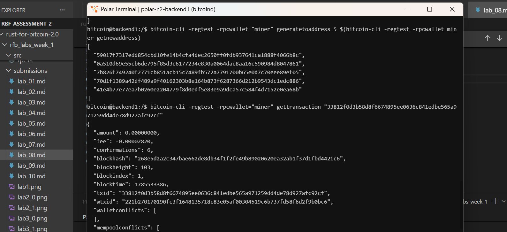
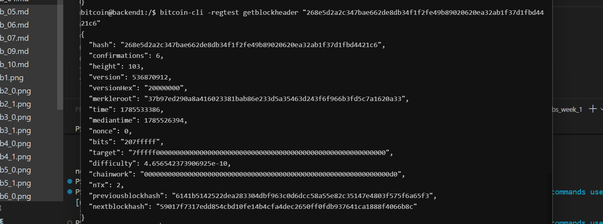

# Lab 08 — Block security

## Commands used

```bash
```bash
# 1. Inspect the initial block header containing the transaction 
bitcoin-cli -regtest getblockheader "268e5d2a2c347bae662de8db34f1f2fe49b89020620ea32ab1f37d1fbd4421c6"

# 2. Check initial transaction confirmations
bitcoin-cli -regtest -rpcwallet="miner" gettransaction "33812f0d3b58d8f6674895ee0636c841edbe565a971259dd4de78d927afc92cf"

# 3. Mine 5 additional blocks to build chain depth 
bitcoin-cli -regtest -rpcwallet="miner" generatetoaddress 5 $(bitcoin-cli -regtest -rpcwallet=miner getnewaddress)

# 4. Check updated transaction confirmations
bitcoin-cli -regtest -rpcwallet="miner" gettransaction "33812f0d3b58d8f6674895ee0636c841edbe565a971259dd4de78d927afc92cf"
```


## Terminal output

header field for block
```bash
bitcoin@backend1:/$ bitcoin-cli -regtest getblockheader "268e5d2a2c347bae662de8db34f1f2fe49b89020620ea32ab1f37d1fbd4421c6"
{
  "hash": "268e5d2a2c347bae662de8db34f1f2fe49b89020620ea32ab1f37d1fbd4421c6",
  "confirmations": 6,
  "height": 103,
  "version": 536870912,
  "versionHex": "20000000",
  "merkleroot": "37b97ed290a8a416023381bab86e233d5a35463d243f6f966b3fd5c7a1620a33",
  "time": 1785533386,
  "mediantime": 1785526394,
  "nonce": 0,
  "bits": "207fffff",
  "target": "7fffff0000000000000000000000000000000000000000000000000000000000",
  "difficulty": 4.656542373906925e-10,
  "chainwork": "00000000000000000000000000000000000000000000000000000000000000d0",
  "nTx": 2,
  "previousblockhash": "6141b5142522dea283304dbf963c0d6dcc58a55e82c35147e4803f575f6a65f3",
  "nextblockhash": "59017f7317edd854cbd10fe14b4cfa4dec2650ff0fdb937641ca1888f4066b8c"
}
```

tx header fields
```bash
"amount": 0.00000000,
  "fee": -0.00002820,
  "confirmations": 6,
  "blockhash": "268e5d2a2c347bae662de8db34f1f2fe49b89020620ea32ab1f37d1fbd4421c6",
  "blockheight": 103,
  "blockindex": 1,
  "blocktime": 1785533386,
  "txid": "33812f0d3b58d8f6674895ee0636c841edbe565a971259dd4de78d927afc92cf",
  "wtxid": "221b270170190fc3f1648135718c83e05af00304519c6b737fd58f6d2f9b0bc6",
  "walletconflicts": [
  ],
```


## Evidence references

- mining five block and tx confirmation chnage
---

- the updated block counter from 1 to 6


## Explanation

* **block hash links**
- This creates an append-only, sequential chain of headers where altering historical data in an earlier block invalidates all downstream header hashes.

* **Merkle roots**
- The merkleroot field is a 32-byte hash computed by recursively hashing pairs of transaction IDs included in the block. It immutably binds the full set of transactions to the header: changing a single bit in any transaction alters the root hash and invalidates the block header.
* **proof of work**
- The cumulative difficulty across the chain is tracked via chainwork. Nodes accept the valid chain with the greatest accumulated Proof of Work as canonical.
* **confirmation depth**
- a transaction is first mined into a block, it receives $1$ confirmation (confirmations_before). Every subsequent block mined on top appends $1$ to its depth. Reversing a transaction with $6$ confirmations (confirmations_after) would require an attacker to re-mine that block plus all $5$ subsequent blocks, competing against the entire network's hash rate—making 6 confirmations the standard benchmark for irreversible economic settlement.
