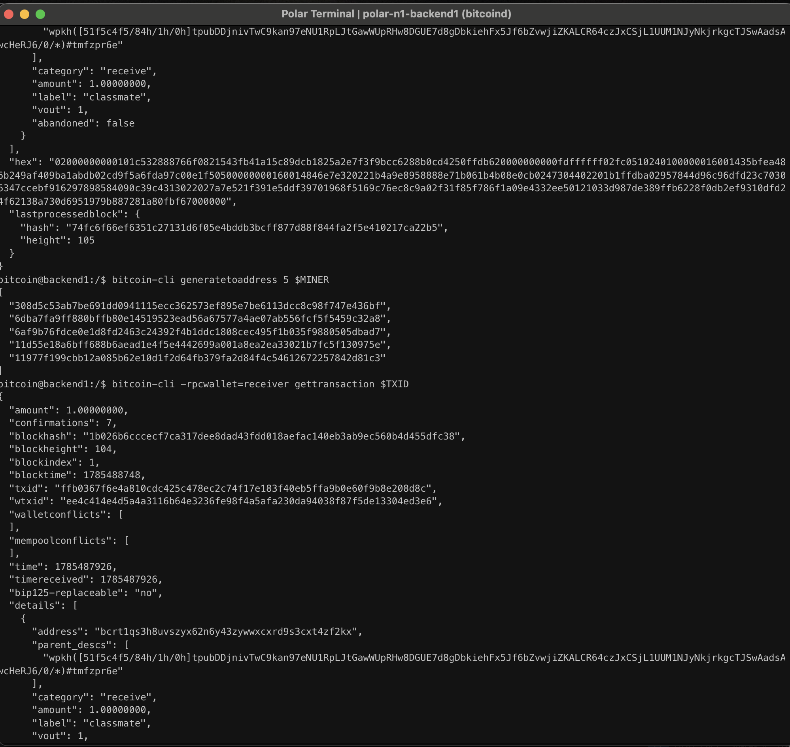

# Lab 08 — Block security

## Commands used

```bash
bitcoin-cli getblockheader 1b026b6cccecf7ca317dee8dad43fdd018aefac140eb3ab9ec560b4d455dfc38

bitcoin-cli -rpcwallet=receiver gettransaction $TXID

bitcoin-cli generatetoaddress 5 $MINER

bitcoin-cli -rpcwallet=receiver gettransaction $TXID
```

## Terminal output

```text
Block Header

Hash:
1b026b6cccecf7ca317dee8dad43fdd018aefac140eb3ab9ec560b4d455dfc38

Height:
104

Previous Block:
64747d697ea5624a2bee622088d30a685af4a5196e62a499f1fa9a64d7ff8358

Merkle Root:
514f9447d40fca13cffa3c2e2fc25c621766e7f8e504c04dd985c92eae445d73

Bits:
207fffff

Difficulty:
4.656542373906925e-10

Chainwork:
00000000000000000000000000000000000000000000000000000000000000d2

Transaction confirmations

Before mining:
2

After mining 5 blocks:
7
```

## Evidence references

The attached screenshots show:

- The block header containing the previous block hash, Merkle root, bits, difficulty, and chainwork.
- The transaction with 2 confirmations.
- Five additional mined blocks.
- The transaction with 7 confirmations after the additional blocks.



## Explanation

A Bitcoin block header links each block to the previous one using the previous block hash, forming an immutable blockchain. The Merkle root commits to all transactions included in the block, allowing any transaction to be verified as part of that block. The proof of work is represented by the block hash satisfying the target encoded by the `bits` and `difficulty` fields, while `chainwork` represents the cumulative work performed by the chain.

Each new block mined on top of the block containing a transaction increases its confirmation count. In this exercise, the transaction already had **2 confirmations** before mining five additional blocks, so it reached **7 confirmations** afterwards. As confirmation depth increases, reversing the transaction becomes progressively more difficult because an attacker would need to replace the proof of work for the confirming block and every subsequent block.