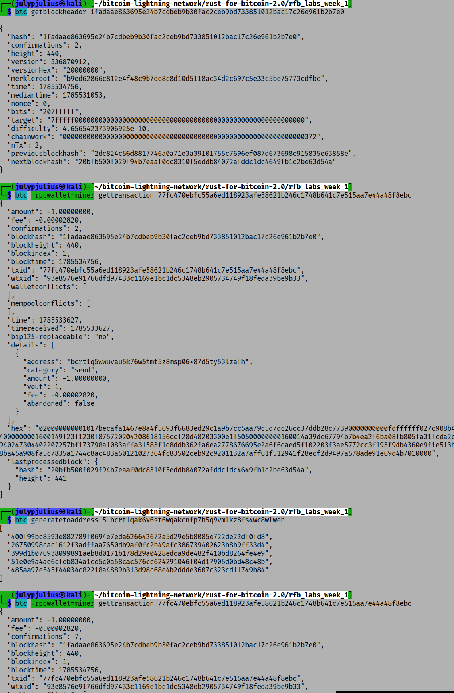

# Lab 08 — Block security

## Commands used
Here are the commands used:
```
# 1. Inspect the block header directly(I reused my lab 7 network info and configuration)
btc getblockheader 1fadaae863695e24b7cdbeb9b30fac2ceb9bd733851012bac17c26e961b2b7e0

btc -rpcwallet=miner gettransaction 77fc470ebfc55a6ed118923afe58621b246c1748b641c7e515aa7e44a48f8ebc

btc generatetoaddress 5 bcrt1qak6v6st6wqakcnfp7h5q9vmlkz8fs4wc8wlweh

btc -rpcwallet=miner gettransaction 77fc470ebfc55a6ed118923afe58621b246c1748b641c7e515aa7e44a48f8ebc

```

## Terminal output

### The terminal output is shown in the screenshot below

## Evidence references


## Explanation

Each block header includes the hash of the *previous* block
(`previousblockhash`), chaining every block to the one before it — this
is what makes the "blockchain" a chain: altering any past block would
change its hash and break every link after it. The `merkleroot` is a
single hash summarizing all transactions in the block, built by
repeatedly hashing pairs of transaction hashes together; it lets anyone
verify a transaction belongs to a block without needing every other
transaction in it. `nonce`, `bits`, and `difficulty` relate to proof of
work — miners repeatedly vary the nonce until the block's hash falls
below a target threshold set by `bits`/`difficulty`, which is
computationally expensive to find but trivial to verify, and is what
secures the chain against rewriting history. `confirmations` measures how
many blocks have been mined on top of a given block or transaction —
each additional confirmation means an attacker would need to redo that
much proof of work to reverse it, so higher confirmation depth means
greater practical finality.
