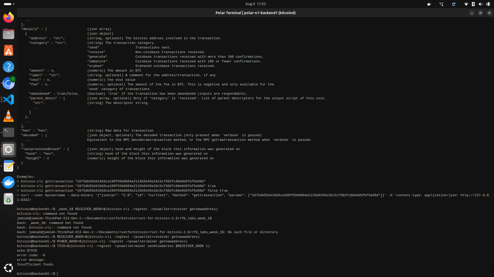

# Lab 08 — Block security

## Commands used

TODO: Record block-header inspection and additional mining commands.
RECEIVER_ADDR=$(bitcoin-cli -regtest -rpcwallet=receiver getnewaddress)
MINER_ADDR=$(bitcoin-cli -regtest -rpcwallet=miner getnewaddress)
TXID=$(bitcoin-cli -regtest -rpcwallet=miner sendtoaddress $RECEIVER_ADDR 1)
echo $TXID

bitcoin-cli -regtest -rpcwallet=miner generatetoaddress 1 $MINER_ADDR

bitcoin-cli -regtest -rpcwallet=miner gettransaction $TXID
BLOCKHASH=$(bitcoin-cli -regtest -rpcwallet=miner gettransaction $TXID | grep '"blockhash"' | cut -d'"' -f4)
echo $BLOCKHASH

bitcoin-cli -regtest getblockheader $BLOCKHASH

bitcoin-cli -regtest -rpcwallet=miner generatetoaddress 5 $MINER_ADDR

bitcoin-cli -regtest -rpcwallet=miner gettransaction $TXID

## Terminal output

TODO: Show header fields and confirmation count changing from one to six.
:~/Documents/rustforbitcoin/rust-for-bitcoin-2.0/rfb_labs_week_1$ cargo test --test lab_08
   Compiling rfb-labs-week-1 v0.1.0 (/home/jemiah/Documents/rustforbitcoin/rust-for-bitcoin-2.0/rfb_labs_week_1)
    Finished `test` profile [unoptimized + debuginfo] target(s) in 0.21s
     Running tests/lab_08.rs (target/debug/deps/lab_08-05cacbf2964e06da)

running 4 tests
test decodes_proof_linked_block_header ... ok
test mines_requested_confirmation_depth ... ok
test proves_one_confirmation_becomes_six ... ok
test reads_wallet_confirmation_depth ... ok

test result: ok. 4 passed; 0 failed; 0 ignored; 0 measured; 0 filtered out; finished in 0.00s

## Evidence references

TODO: Link screenshots or describe the attached evidence.

## Explanation

TODO: Explain hash links, Merkle roots, proof of work, and confirmation depth.
Here's that section, plain and simple:

---

**Hash links:** Every block header stores the hash of the block before it. This is what actually connects blocks into a "chain" — each block hash depends on the previous one, so if someone tried to change an old block, its hash would change, breaking the link to every block after it.

**Merkle root:** A single hash that summarizes every transaction in a block. It's built by hashing transactions together in pairs, repeatedly, until only one hash is left. If any transaction in the block changed, the Merkle root would change too — which changes the block's hash, which breaks the hash link mentioned above.

**Proof of work:** A block is only valid if its hash is below a certain target (based on the current difficulty). Since hashes come out essentially random, miners have to try tons of different `nonce` values until they get lucky and find one that produces a valid hash. This is what makes mining "work" — you can't just make a block, you have to search for a valid one.

**Confirmation depth:** How many blocks have been mined on top of the block containing your transaction (counting that first block as 1 confirmation). More confirmations means more blocks would need to be undone to reverse it — so the transaction gets safer over time.