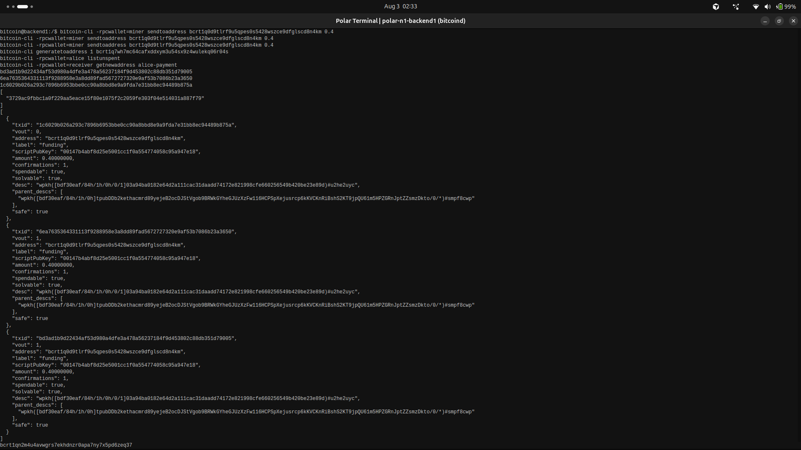
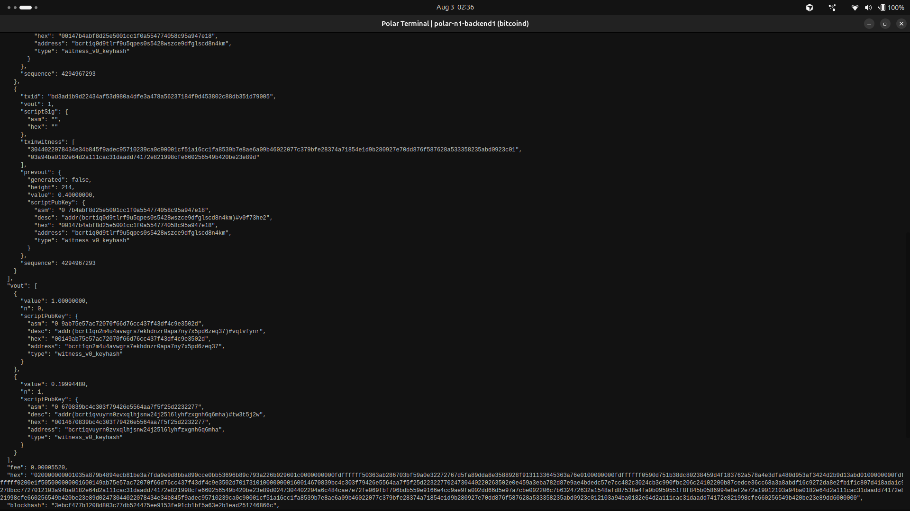

# Lab 09 — Multi-UTXO coin selection

<!-- Replace every TODO line. The grader scores a section 0 while a TODO remains in it. Rewrite the Explanation in your own words. -->

## Commands used

```bash
# Alice's wallet and a receiving address for her.
bitcoin-cli createwallet alice
bitcoin-cli -rpcwallet=alice getnewaddress funding

# Three SEPARATE payments, not one of 1.2 BTC. This is the point of the lab:
# it leaves Alice holding three distinct UTXOs.
bitcoin-cli -rpcwallet=miner sendtoaddress <alice-address> 0.4
bitcoin-cli -rpcwallet=miner sendtoaddress <alice-address> 0.4
bitcoin-cli -rpcwallet=miner sendtoaddress <alice-address> 0.4

# Confirm them.
bitcoin-cli generatetoaddress 1 <mining-address>

# Alice should now show three confirmed UTXOs of 0.4 BTC each.
bitcoin-cli -rpcwallet=alice listunspent

# No single 0.4 BTC output covers 1 BTC, so the wallet must combine inputs.
bitcoin-cli -rpcwallet=receiver getnewaddress alice-payment
bitcoin-cli -rpcwallet=alice sendtoaddress <new-receiver-address> 1

# Decode the spend and audit it.
bitcoin-cli getrawtransaction <spend-txid> 2
```

Tests:

```bash
cargo test --test lab_09
```

`audit_multi_utxo_spend` sends the payment, reuses the Lab 06 decoder, and reports
the funding outpoints, the input count, the payment and change outputs, and the fee.

## Terminal output

Alice's wallet after three separate 0.4 BTC payments — three distinct UTXOs, each
with a different `txid`, all paid to the same funding address:

```
$ bitcoin-cli -rpcwallet=alice listunspent
[
  {
    "txid": "1c6029b026a293c7896b6953bbe0cc90a8bbd8e9a9fda7e31bb8ec94489b875a",
    "vout": 0,
    "address": "bcrt1q0d9tlrf9u5qpes0s5428wszce9dfglscd8n4km",
    "label": "funding",
    "amount": 0.40000000,
    "confirmations": 1,
    "spendable": true
  },
  {
    "txid": "6ea7635364331113f9288958e3a8dd89fad5672727320e9af53b7086b23a3650",
    "vout": 1,
    "amount": 0.40000000,
    "confirmations": 1,
    "spendable": true
  },
  {
    "txid": "bd3ad1b9d22434af53d980a4dfe3a478a56237184f9d453802c88db351d79005",
    "vout": 1,
    "amount": 0.40000000,
    "confirmations": 1,
    "spendable": true
  }
]
```

Alice holds 1.2 BTC in total, but not as 1.2 BTC. She holds three separate 0.4 BTC
chunks, and no single one covers a 1 BTC payment.

The spend, decoded after confirmation so `prevout` is attached:

```
$ bitcoin-cli -rpcwallet=alice sendtoaddress bcrt1qn2m4u4avwgrs7ekhdnzr0apa7ny7x5pd6zeq37 1
9ca817deb75427ee95b5abbd90afb21403cbbfce394d32853b5fe985fd93652a

$ bitcoin-cli getrawtransaction 9ca817deb75427ee95b5abbd90afb21403cbbfce394d32853b5fe985fd93652a 2
{
  "txid": "9ca817deb75427ee95b5abbd90afb21403cbbfce394d32853b5fe985fd93652a",
  "version": 2,
  "size": 518,
  "vsize": 276,
  "weight": 1103,
  "locktime": 214,
  "vin": [
    {
      "txid": "1c6029b026a293c7896b6953bbe0cc90a8bbd8e9a9fda7e31bb8ec94489b875a",
      "vout": 0,
      "prevout": { "generated": false, "height": 214, "value": 0.40000000 }
    },
    {
      "txid": "6ea7635364331113f9288958e3a8dd89fad5672727320e9af53b7086b23a3650",
      "vout": 1,
      "prevout": { "generated": false, "height": 214, "value": 0.40000000 }
    },
    {
      "txid": "bd3ad1b9d22434af53d980a4dfe3a478a56237184f9d453802c88db351d79005",
      "vout": 1,
      "prevout": { "generated": false, "height": 214, "value": 0.40000000 }
    }
  ],
  "vout": [
    {
      "value": 1.00000000,
      "n": 0,
      "scriptPubKey": {
        "address": "bcrt1qn2m4u4avwgrs7ekhdnzr0apa7ny7x5pd6zeq37",
        "type": "witness_v0_keyhash"
      }
    },
    {
      "value": 0.19994480,
      "n": 1,
      "scriptPubKey": {
        "address": "bcrt1qvuyrn0zvxqlhjsnw24j25l6lyhfzxgnh6q6mha",
        "type": "witness_v0_keyhash"
      }
    }
  ],
  "fee": 0.00005520,
  "blockhash": "3ebcf477b1208d803c77db524475ee9153fe91cb1bf5a63e2b1ead251746866c",
  "confirmations": 1
}
```

**All three UTXOs were consumed.** The `vin` array has three entries, and the three
outpoints match Alice's three UTXOs exactly. Two would have supplied only 0.8 BTC, so
the wallet had no choice.

| Consumed outpoint | Value |
| --- | --- |
| `1c6029b0...94489b875a:0` | 0.40000000 |
| `6ea76353...b23a3650:1` | 0.40000000 |
| `bd3ad1b9...351d79005:1` | 0.40000000 |

Each input is consumed **in full**. There is no way to spend part of a UTXO, which is
why 1.2 BTC had to be destroyed to make a 1 BTC payment, with the remainder returned
as change.

**The arithmetic**, in satoshis:

```
inputs   = 40,000,000 + 40,000,000 + 40,000,000 = 120,000,000
payment  = 100,000,000   (to the receiver)
change   =  19,994,480   (back to Alice)
fee      =       5,520

120,000,000 = 100,000,000 + 19,994,480 + 5,520
120,000,000 = 120,000,000            ✓ both sides match
```

At 276 vbytes the fee of 5,520 satoshis is 20 sat/vB — the same rate as the
single-input payment in Lab 06, which paid 2,820 satoshis over 141 vbytes. The
transaction cost roughly twice as much because it is roughly twice the size, and it is
twice the size because it carries three inputs and three signatures instead of one.
That is the real cost of holding many small UTXOs.

The change went to `bcrt1qvuyrn0zvxqlhjsnw24j25l6lyhfzxgnh6q6mha`, an address Alice
never asked for. Her wallet derived it internally.

Alice's wallet afterwards:

```
$ bitcoin-cli -rpcwallet=alice listunspent
[
  {
    "txid": "9ca817deb75427ee95b5abbd90afb21403cbbfce394d32853b5fe985fd93652a",
    "vout": 1,
    "address": "bcrt1qvuyrn0zvxqlhjsnw24j25l6lyhfzxgnh6q6mha",
    "amount": 0.19994480,
    "confirmations": 1,
    "spendable": true
  }
]
```

Three UTXOs became one. The three 0.4 BTC outputs no longer exist anywhere in the UTXO
set; what remains is a single change output belonging to the spend that destroyed them.

Tests:

```
$ cargo test --test lab_09
running 4 tests
test creates_three_separate_funding_transactions ... ok
test sends_one_btc_from_alice ... ok
test filters_confirmed_utxos_for_alice_address ... ok
test audits_three_input_spend_payment_change_and_fee ... ok

test result: ok. 4 passed; 0 failed; 0 ignored; 0 measured; 0 filtered out; finished in 0.00s
```

## Evidence references



Alice's `listunspent` before the spend: three entries, three different `txid` values,
each `"amount": 0.40000000` and each paid to the same funding address
`bcrt1q0d9tlrf9u5qpes0s5428wszce9dfglscd8n4km`. The three `sendtoaddress` calls that
created them are visible at the top of the frame, along with the three TXIDs they
returned — separate payments, not one payment of 1.2 BTC.



The decoded spend. The frame ends the `vin` array on its third input — outpoint
`bd3ad1b9...351d79005:1` with `"value": 0.40000000` — then opens `vout` with the
1.00000000 BTC payment to `bcrt1qn2m4u4avwgrs7ekhdnzr0apa7ny7x5pd6zeq37` and the
0.19994480 BTC change to `bcrt1qvuyrn0zvxqlhjsnw24j25l6lyhfzxgnh6q6mha`, followed by
`"fee": 0.00005520`.

Put side by side, the two frames are the lab: three separate outputs going in, one
payment and one change output coming out. Both are from the `backend1` node terminal
in the `Week 1 Bitcoin Fundamentals` Polar network.

## Explanation

Alice receives 1.2 BTC in total, but not as 1.2 BTC. Three separate payments create
three separate UTXOs of 0.4 BTC each. Her balance is their sum, and no single one of
them is worth more than 0.4.

When she sends 1 BTC, the wallet performs **coin selection**: choosing which of her
UTXOs to spend. Because outputs are atomic and no single UTXO covers 1 BTC, it has
no option but to combine at least three. That is not a heuristic — it is forced by
the arithmetic.

Each selected input is consumed **completely**. There is no partial spend. So the
transaction pulls in 1.2 BTC to pay 1 BTC, and the surplus must go somewhere: back
to an address Alice controls, as **change**. What is left after payment and change
is the **fee**, claimed by the miner:

```text
sum(inputs) − payment − change = fee
```

The fee also explains why the change is slightly under 0.2 BTC rather than exactly
0.2. Three inputs make a physically larger transaction than one would, and since
fees are charged per vbyte, **consolidating UTXOs costs more to spend.** A wallet
holding many small outputs pays more in fees than one holding a few large ones for
the same payment.

**The privacy trade-off.** Signing one transaction that spends three inputs is a
public assertion that a single party held the keys to all three. Anyone reading the
chain can now cluster those three outputs as commonly owned — this is the
"common-input-ownership heuristic", and it is the foundation of most chain-analysis.
Before the spend, Alice's three UTXOs were three unrelated-looking coins. After it,
they are permanently and publicly linked, and any information attached to any one of
them — an exchange withdrawal, a known donation address, a purchase — now attaches
to the whole cluster, retroactively and forever.

Change makes it worse. The change output is usually identifiable by elimination: if
one output matches a round payment amount and the other is an odd remainder to a
fresh address, the odd one is almost certainly change returning to the sender. That
lets an observer follow Alice forward as well as backward.

So there is a real tension. Consolidating UTXOs is cheaper to spend later and
simpler to manage, but it discloses ownership. Keeping funds separated preserves
privacy but costs more in fees and eventually forces a linking spend anyway. There
is no configuration that avoids the trade-off — which is why techniques like using a
fresh address per payment, coin control, and avoiding needless consolidation exist
in the first place.
