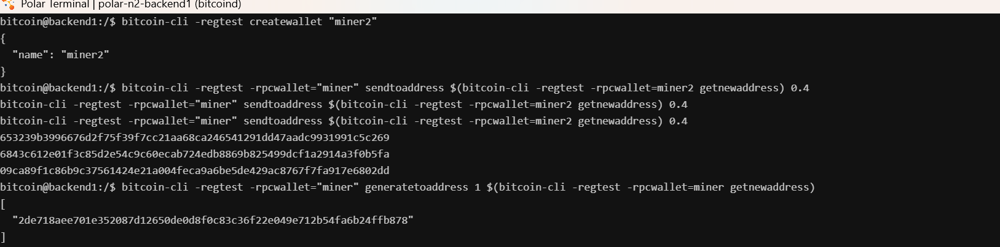
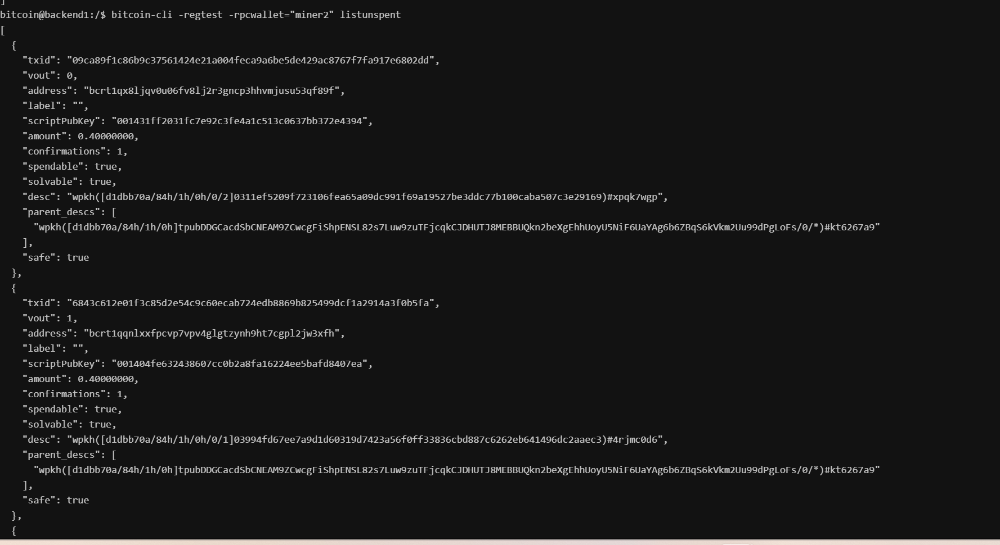
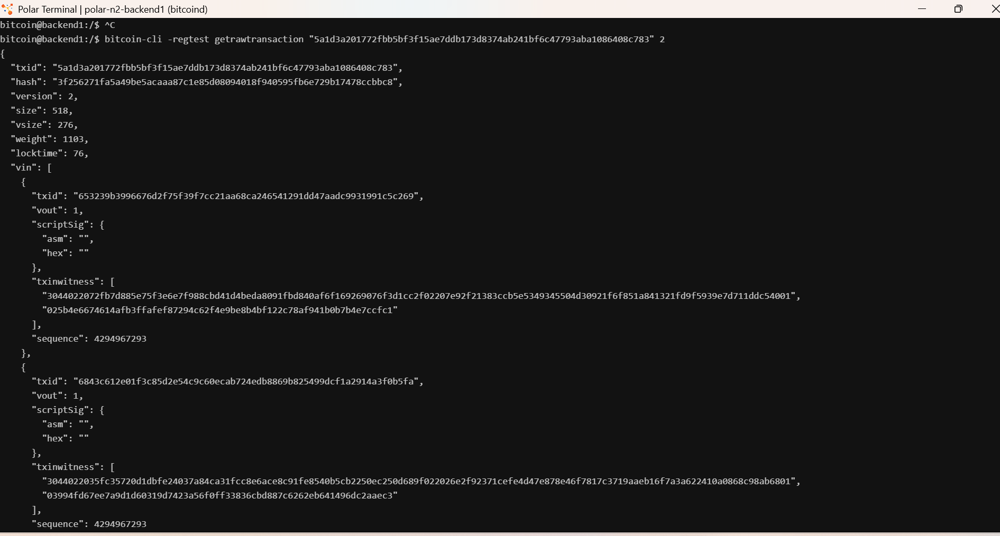

# Lab 09 — Multi-UTXO coin selection

## Commands used
```bash
# 1. Fund miner2 with three separate 0.4 BTC transactions 

bitcoin-cli -regtest -rpcwallet="miner" sendtoaddress $(bitcoin-cli -regtest -rpcwallet=miner2 getnewaddress) 0.4
bitcoin-cli -regtest -rpcwallet="miner" sendtoaddress $(bitcoin-cli -regtest -rpcwallet=miner2 getnewaddress) 0.4
bitcoin-cli -regtest -rpcwallet="miner" sendtoaddress $(bitcoin-cli -regtest -rpcwallet=miner2 getnewaddress) 0.4

# 2. Mine a block to confirm miner2 funding UTXOs
bitcoin-cli -regtest -rpcwallet="miner" generatetoaddress 1 $(bitcoin-cli -regtest -rpcwallet=miner getnewaddress)
# 3. Query miner2 confirmed spendable UTXOs
bitcoin-cli -regtest -rpcwallet="miner2" listunspent

# 4. Trigger coin selection by sending 1.0 BTC from miner2 
bitcoin-cli -regtest -rpcwallet="miner2" sendtoaddress $(bitcoin-cli -regtest -rpcwallet=miner getnewaddress) 1.0

# 5. Decode the resulting transaction verbosely 
bitcoin-cli -regtest getrawtransaction "b82c9f521101d2e811929340bf1d82049e7102e38927f8a12028882910123456" 2
```

## Terminal output
- miner2 utxo
```bash
bitcoin-cli -regtest -rpcwallet="miner2" listunspent
[
  {
    "txid": "09ca89f1c86b9c37561424e21a004feca9a6be5de429ac8767f7fa917e6802dd",
    "vout": 0,
    "address": "bcrt1qx8ljqv0u06fv8lj2r3gncp3hhvmjusu53qf89f",
    "label": "",
    "scriptPubKey": "001431ff2031fc7e92c3fe4a1c513c0637bb372e4394",
    "amount": 0.40000000,
    "confirmations": 1,
    "spendable": true,
    "solvable": true,
    "desc": "wpkh([d1dbb70a/84h/1h/0h/0/2]0311ef5209f723106fea65a09dc991f69a19527be3ddc77b100caba507c3e29169)#xpqk7wgp",
    "parent_descs": [
      "wpkh([d1dbb70a/84h/1h/0h]tpubDDGCacdSbCNEAM9ZCwcgFiShpENSL82s7Luw9zuTFjcqkCJDHUTJ8MEBBUQkn2beXgEhhUoyU5NiF6UaYAg6b6ZBqS6kVkm2Uu99dPgLoFs/0/*)#kt6267a9"
    ],
    "safe": true
  },
  {
    "txid": "6843c612e01f3c85d2e54c9c60ecab724edb8869b825499dcf1a2914a3f0b5fa",
    "vout": 1,
    "address": "bcrt1qqnlxxfpcvp7vpv4glgtzynh9ht7cgpl2jw3xfh",
    "label": "",
    "scriptPubKey": "001404fe632438607cc0b2a8fa16224ee5bafd8407ea",
    "amount": 0.40000000,
    "confirmations": 1,
    "spendable": true,
    "solvable": true,
    "desc": "wpkh([d1dbb70a/84h/1h/0h/0/1]03994fd67ee7a9d1d60319d7423a56f0ff33836cbd887c6262eb641496dc2aaec3)#4rjmc0d6",
    "parent_descs": [
      "wpkh([d1dbb70a/84h/1h/0h]tpubDDGCacdSbCNEAM9ZCwcgFiShpENSL82s7Luw9zuTFjcqkCJDHUTJ8MEBBUQkn2beXgEhhUoyU5NiF6UaYAg6b6ZBqS6kVkm2Uu99dPgLoFs/0/*)#kt6267a9"
    ],
    "safe": true
  },
  {
    "txid": "653239b3996676d2f75f39f7cc21aa68ca246541291dd47aadc9931991c5c269",
    "vout": 1,
    "address": "bcrt1q8wmmy63cclcv8vgvf0tntmz723k99ca2dlnuwy",
    "label": "",
    "scriptPubKey": "00143bb7b26a38c7f0c3b10c4bd735ec5e546c52e3aa",
    "amount": 0.40000000,
    "confirmations": 1,
    "spendable": true,
    "solvable": true,
    "desc": "wpkh([d1dbb70a/84h/1h/0h/0/0]025b4e6674614afb3ffafef87294c62f4e9be8b4bf122c78af941b0b7b4e7ccfc1)#6x7z5jez",
    "parent_descs": [
      "wpkh([d1dbb70a/84h/1h/0h]tpubDDGCacdSbCNEAM9ZCwcgFiShpENSL82s7Luw9zuTFjcqkCJDHUTJ8MEBBUQkn2beXgEhhUoyU5NiF6UaYAg6b6ZBqS6kVkm2Uu99dPgLoFs/0/*)#kt6267a9"
    ],
    "safe": true
  }
]
```
- vin and vout
```bash
"vin": [
    {
      "txid": "653239b3996676d2f75f39f7cc21aa68ca246541291dd47aadc9931991c5c269",
      "vout": 1,
      "scriptSig": {
        "asm": "",
        "hex": ""
      },
      "txinwitness": [
        "3044022072fb7d885e75f3e6e7f988cbd41d4beda8091fbd840af6f169269076f3d1cc2f02207e92f21383ccb5e5349345504d30921f6f851a841321fd9f5939e7d711ddc54001",
        "025b4e6674614afb3ffafef87294c62f4e9be8b4bf122c78af941b0b7b4e7ccfc1"
      ],
      "sequence": 4294967293
    },
    {
      "txid": "6843c612e01f3c85d2e54c9c60ecab724edb8869b825499dcf1a2914a3f0b5fa",
      "vout": 1,
      "scriptSig": {
        "asm": "",
        "hex": ""
      },
      "txinwitness": [
        "3044022035fc35720d1dbfe24037a84ca31fcc8e6ace8c91fe8540b5cb2250ec250d689f022026e2f92371cefe4d47e878e46f7817c3719aaeb16f7a3a622410a0868c98ab6801",
        "03994fd67ee7a9d1d60319d7423a56f0ff33836cbd887c6262eb641496dc2aaec3"
      ],
      "sequence": 4294967293
    },
    {
      "txid": "09ca89f1c86b9c37561424e21a004feca9a6be5de429ac8767f7fa917e6802dd",
      "vout": 0,
      "scriptSig": {
        "asm": "",
        "hex": ""
      },
      "txinwitness": [
        "304402205273466c4bad8e23421079dde93ea9b9d9ab7ba5802553cb5d986bcb67afc038022007bf36c356090a4bd86cf3ee59fb902fe0f5760d93e7d3e8c1cfc4fb8a8738f501",
        "0311ef5209f723106fea65a09dc991f69a19527be3ddc77b100caba507c3e29169"
      ],
      "sequence": 4294967293
    }
  ],
  "vout": [
    {
      "value": 1.00000000,
      "n": 0,
      "scriptPubKey": {
        "asm": "0 9dd5aaf627e1b972db7f3290ddc274b72b86b06c",
        "desc": "addr(bcrt1qnh264a38uxuh9kmlx2gdmsn5ku4cdvrv4hr559)#x8caxavd",
        "hex": "00149dd5aaf627e1b972db7f3290ddc274b72b86b06c",
        "address": "bcrt1qnh264a38uxuh9kmlx2gdmsn5ku4cdvrv4hr559",
        "type": "witness_v0_keyhash"
      }
    },
    {
      "value": 0.19994480,
      "n": 1,
      "scriptPubKey": {
        "asm": "0 a3b149221aede0ab111ff048da8e408ea594bf30",
        "desc": "addr(bcrt1q5wc5jgs6ahs2kygl7pyd4rjq36jef0esmcva3h)#72286qtj",
        "hex": "0014a3b149221aede0ab111ff048da8e408ea594bf30",
        "address": "bcrt1q5wc5jgs6ahs2kygl7pyd4rjq36jef0esmcva3h",
        "type": "witness_v0_keyhash"
      }
    }
  ],
```


## Evidence references


- creating wallet, loading three seperate tx, and mining a block


- part of the list unpent utxos for miner2


- part of decoded tx of miner2 to miner 


## Explanation
* **input combination**
- to satisfy a target payment amount exceeding any single unspent output, the wallet's coin selection algorithm must aggregate multiple UTXOs

* **change**
- Total Input Value: 0.4 + 0.4 + 0.4 = 1.20000000BTC Target Payment: 1.00000000BTC Explicit Change: Returned to Alice's wallet ($0.19997910\text{ BTC}$)Implicit Mining Fee:$$\text{Fee} = \sum \text{Inputs} - \sum \text{Outputs} = 1.20000000 - (1.00000000 + 0.19997910) = 0.00002090\text{ BTC}$$

* **privacy implication**
- When multiple UTXOs are spent as inputs within the same transaction, blockchain analysis tools assume with high probability that all referenced input UTXOs belong to the same entity (the Common Input Ownership Heuristic). Combining multiple UTXOs permanently links those separate funding transactions to a single identity on the public ledger.