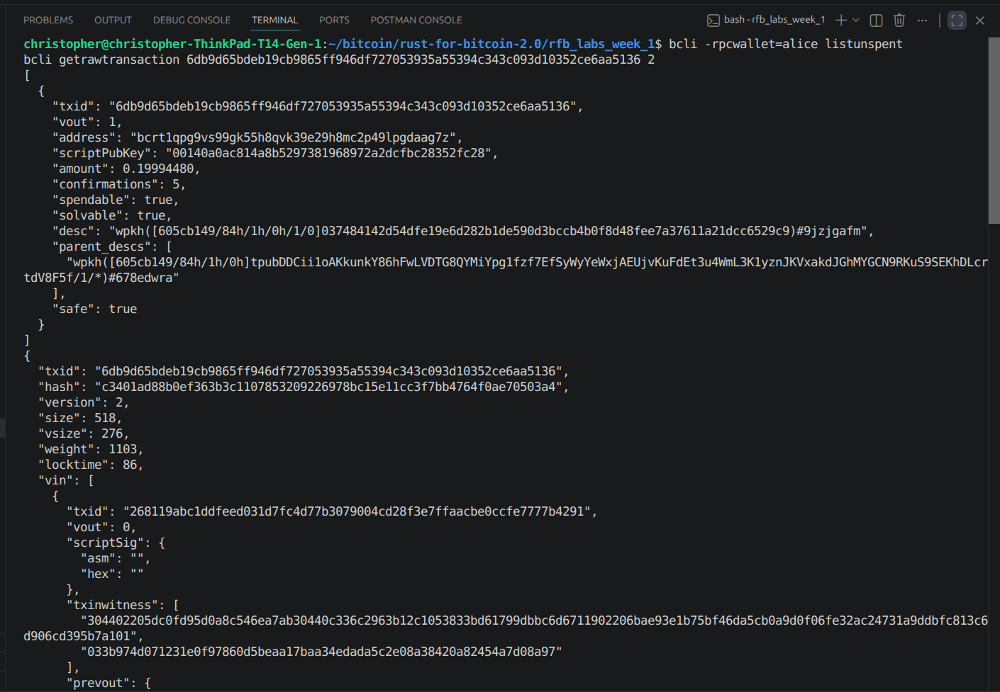

# Lab 09 — Multi-UTXO coin selection

## Commands used

```
cargo test --test lab_09
bitcoin-cli -regtest createwallet alice
bitcoin-cli -regtest -rpcwallet=alice getnewaddress funding
bitcoin-cli -regtest -rpcwallet=miner sendtoaddress <alice address> 0.4   # x3
bitcoin-cli -regtest -rpcwallet=miner generatetoaddress 1 <mining address>
bitcoin-cli -regtest -rpcwallet=alice listunspent
bitcoin-cli -regtest -rpcwallet=receiver getnewaddress alice_payment
bitcoin-cli -regtest -rpcwallet=alice sendtoaddress <new receiver address> 1
bitcoin-cli -regtest -rpcwallet=miner generatetoaddress 1 <mining address>
bitcoin-cli -regtest getrawtransaction <spend txid> 2
```

## Terminal output

```
$ bitcoin-cli -regtest createwallet alice
{ "name": "alice" }

$ bitcoin-cli -regtest -rpcwallet=alice getnewaddress funding
bcrt1q2wmlr66s8cqwevd95k8x9v2lz0fmwevvk7y8d4

$ bitcoin-cli -regtest -rpcwallet=miner sendtoaddress bcrt1q2wmlr66s8cqwevd95k8x9v2lz0fmwevvk7y8d4 0.4   (x3)
268119abc1ddfeed031d7fc4d77b3079004cd28f3e7ffaacbe0ccfe7777b4291
2fad7f913a774da342335e86bd0b05982529af12824859ef712b13f8ad360450
46ffd5a96d834407b2e16fe1a4ec8f40889fbe16c8bb6bf45f4dde27852c5cb1

$ bitcoin-cli -regtest -rpcwallet=miner generatetoaddress 1 bcrt1q7fxfk3vl0nwthecqrqpm63mnfr6ngzky0677m2
[ "73311062b866888d37a98b03ee90b2db8477e273296e5c12ddc5cef932bc6419" ]

$ bitcoin-cli -regtest -rpcwallet=alice listunspent
[ 3 entries, each: "amount": 0.40000000, "confirmations": 1, "spendable": true,
  txids: 46ffd5a9..., 2fad7f91..., 268119ab... ]

$ bitcoin-cli -regtest -rpcwallet=alice sendtoaddress bcrt1q00f3zryvees8a2d835updzgh97mtuxxlvc2d20 1
6db9d65bdeb19cb9865ff946df727053935a55394c343c093d10352ce6aa5136

$ bitcoin-cli -regtest -rpcwallet=miner generatetoaddress 1 bcrt1q7fxfk3vl0nwthecqrqpm63mnfr6ngzky0677m2
[ "32b9132dd7e9c89743516c3c27add2afe45fb8c65170f963469d636ab9111ca5" ]

$ bitcoin-cli -regtest getrawtransaction 6db9d65bdeb19cb9865ff946df727053935a55394c343c093d10352ce6aa5136 2
{
  "vin": [
    { "txid": "268119abc1ddfeed031d7fc4d77b3079004cd28f3e7ffaacbe0ccfe7777b4291", "vout": 0,
      "prevout": { "value": 0.40000000 } },
    { "txid": "46ffd5a96d834407b2e16fe1a4ec8f40889fbe16c8bb6bf45f4dde27852c5cb1", "vout": 0,
      "prevout": { "value": 0.40000000 } },
    { "txid": "2fad7f913a774da342335e86bd0b05982529af12824859ef712b13f8ad360450", "vout": 0,
      "prevout": { "value": 0.40000000 } }
  ],
  "vout": [
    { "value": 1.00000000, "n": 0,
      "scriptPubKey": { "address": "bcrt1q00f3zryvees8a2d835updzgh97mtuxxlvc2d20" } },
    { "value": 0.19994480, "n": 1,
      "scriptPubKey": { "address": "bcrt1qpg9vs99gk55h8qvk39e29h8mc2p49lpgdaag7z" } }
  ],
  "fee": 0.00005520
}

$ cargo test --test lab_09
running 4 tests
test creates_three_separate_funding_transactions ... ok
test sends_one_btc_from_alice ... ok
test filters_confirmed_utxos_for_alice_address ... ok
test audits_three_input_spend_payment_change_and_fee ... ok
test result: ok. 4 passed; 0 failed; 0 ignored; 0 measured; 0 filtered out
```

(Note: like lab 06, `getrawtransaction ... 2` only returns `prevout` once
the spend is confirmed on this Core build — the block was mined before this
final decode.)

## Evidence references



- Alice owns 3 distinct UTXOs of `0.40000000` BTC each before spending
  (different txids, same address, all confirmed) — proven by `listunspent`.
- The combined spend consumed **all 3** inputs, each fully at `0.4` BTC (no
  input left partially spent — Bitcoin inputs are all-or-nothing).
- Receiver output: `1.00000000` BTC to the new address.
- Change output: `0.19994480` BTC back to an alice-controlled change address.
- Fee = `3 × 0.4 − (1.0 + 0.19994480)` = `0.00005520`, matching the `fee`
  field Core itself reports in the verbose decode.

## Explanation

None of Alice's individual 0.4 BTC UTXOs is enough on its own to cover a
1 BTC payment, so the wallet had no choice but to pull in all three as
inputs — and that's exactly what leaks information. Anyone watching the
chain can now see that those three previously unrelated-looking payments
were controlled by the same person, purely because they all got spent
together in one transaction. That's the common-input-ownership heuristic:
nothing on-chain literally says "this is Alice," but combining inputs like
this hands that link out for free.

So there's a real privacy cost to needing multiple UTXOs to cover a
payment. A wallet that happened to hold a single UTXO big enough wouldn't
have had to combine anything, and wouldn't have created that link at all.
