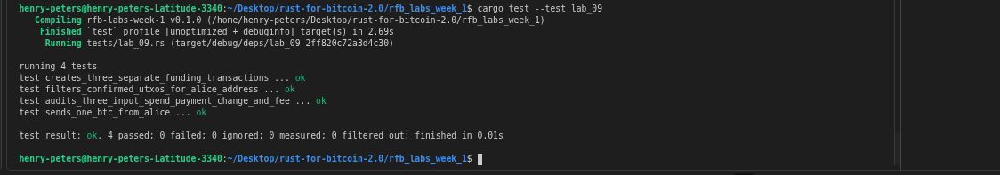

# Lab 09 — Multi-UTXO coin selection

## Commands used

```bash
# Rust test suite
cargo test --test lab_09

# Create alice wallet and generate her address
bitcoin-cli createwallet "alice"
bitcoin-cli -rpcwallet=alice getnewaddress "alice"

# Send three separate 0.4 BTC payments to alice from miner 
bitcoin-cli -rpcwallet=miner sendtoaddress bcrt1qjefqnkgzhqpewrjnhcjceyv4zgjcqfdh375vv9 0.4 # alice-address
bitcoin-cli -rpcwallet=miner sendtoaddress bcrt1qjefqnkgzhqpewrjnhcjceyv4zgjcqfdh375vv9 0.4 # alice-address
bitcoin-cli -rpcwallet=miner sendtoaddress bcrt1qjefqnkgzhqpewrjnhcjceyv4zgjcqfdh375vv9 0.4 # alice-address

# Mine one block to confirm the three funding transactions
bitcoin-cli generatetoaddress 1 bcrt1qp83jqswduwkhy494f86kyrvk36xnqrpn553e03  # miner address

# Verify alice has three distinct confirmed UTXOs
bitcoin-cli -rpcwallet=alice listunspent

# Have alice send 1 BTC to a receiver address (forces multi-UTXO selection)
bitcoin-cli -rpcwallet=alice sendtoaddress bcrt1qry57tkfsw9t6xp2m97y94ac5f7mj242f3a56mu 1  # <receiver_address>

# Decode the spend to inspect inputs and outputs
bitcoin-cli getrawtransaction 51d30805cab085a157a9084cecfc19cc723597e5be014f31a569e4eb26e58e46  2   #  <spend_txid>
```

## Terminal output
<!-- Paste the relevant terminal output here -->
```bash
bitcoin@backend1:/$ bitcoin-cli createwallet "alice"
{
  "name": "alice"
}
bitcoin@backend1:/$ bitcoin-cli -rpcwallet=alice getnewaddress "alice"
bcrt1qjefqnkgzhqpewrjnhcjceyv4zgjcqfdh375vv9
bitcoin@backend1:/$ bitcoin-cli -rpcwallet=miner sendtoaddress bcrt1qjefqnkgzhqpewrjnhcjceyv4zgjcqfdh375vv9 0.4
98f31ff26fee9d131e8125c577b5d4065b9eb390417356f3356cc878e3a2e121
bitcoin@backend1:/$ bitcoin-cli -rpcwallet=miner sendtoaddress bcrt1qjefqnkgzhqpewrjnhcjceyv4zgjcqfdh375vv9 0.4
2d4d44e179f228a815a4c07c30b51e57d929ded1663a556668edd955aefc3b7e
bitcoin@backend1:/$ bitcoin-cli -rpcwallet=miner sendtoaddress bcrt1qjefqnkgzhqpewrjnhcjceyv4zgjcqfdh375vv9 0.4 
4d41f8f180c16a7c7b6e95aabfaac75d681abe9e8f10e4e0c91fc01838155c60
bitcoin@backend1:/$ bitcoin-cli generatetoaddress 1 bcrt1qp83jqswduwkhy494f86kyrvk36xnqrpn553e03
[
  "247d2ed3bebc8d13f5727cf6dafd50559fbd8fcb7462250b374fe5311e414553"
]
bitcoin@backend1:/$ bitcoin-cli -rpcwallet=alice listunspent
[
  {
    "txid": "4d41f8f180c16a7c7b6e95aabfaac75d681abe9e8f10e4e0c91fc01838155c60",
    "vout": 1,
    "address": "bcrt1qjefqnkgzhqpewrjnhcjceyv4zgjcqfdh375vv9",
    "label": "alice",
    "scriptPubKey": "0014965209d902b803970e53be258c919512258025b7",
    "amount": 0.40000000,
    "confirmations": 1,
    "spendable": true,
    "solvable": true,
    "desc": "wpkh([630468aa/84h/1h/0h/0/0]031b04c3be323c2fc054b8b591ed49b8eb4708ef0053fc4fd00d61b2dc06d6b956)#jjy74cew",
    "parent_descs": [
      "wpkh([630468aa/84h/1h/0h]tpubDDdbJaJN1A8sUZg7b3J7CoZPiwDuK5aZGeHkNHnKCshMoFvpH6PdVe5Y3mLNy7nNnrY4beux2kSXpdmzZw7W6JrKuBckhbtqekAe2aVmyhp/0/*)#e3z84cn5"
    ],
    "safe": true
  },
  {
    "txid": "2d4d44e179f228a815a4c07c30b51e57d929ded1663a556668edd955aefc3b7e",
    "vout": 1,
    "address": "bcrt1qjefqnkgzhqpewrjnhcjceyv4zgjcqfdh375vv9",
    "label": "alice",
    "scriptPubKey": "0014965209d902b803970e53be258c919512258025b7",
    "amount": 0.40000000,
    "confirmations": 1,
    "spendable": true,
    "solvable": true,
    "desc": "wpkh([630468aa/84h/1h/0h/0/0]031b04c3be323c2fc054b8b591ed49b8eb4708ef0053fc4fd00d61b2dc06d6b956)#jjy74cew",
    "parent_descs": [
      "wpkh([630468aa/84h/1h/0h]tpubDDdbJaJN1A8sUZg7b3J7CoZPiwDuK5aZGeHkNHnKCshMoFvpH6PdVe5Y3mLNy7nNnrY4beux2kSXpdmzZw7W6JrKuBckhbtqekAe2aVmyhp/0/*)#e3z84cn5"
    ],
    "safe": true
  },
  {
    "txid": "98f31ff26fee9d131e8125c577b5d4065b9eb390417356f3356cc878e3a2e121",
    "vout": 1,
    "address": "bcrt1qjefqnkgzhqpewrjnhcjceyv4zgjcqfdh375vv9",
    "label": "alice",
    "scriptPubKey": "0014965209d902b803970e53be258c919512258025b7",
    "amount": 0.40000000,
    "confirmations": 1,
    "spendable": true,
    "solvable": true,
    "desc": "wpkh([630468aa/84h/1h/0h/0/0]031b04c3be323c2fc054b8b591ed49b8eb4708ef0053fc4fd00d61b2dc06d6b956)#jjy74cew",
    "parent_descs": [
      "wpkh([630468aa/84h/1h/0h]tpubDDdbJaJN1A8sUZg7b3J7CoZPiwDuK5aZGeHkNHnKCshMoFvpH6PdVe5Y3mLNy7nNnrY4beux2kSXpdmzZw7W6JrKuBckhbtqekAe2aVmyhp/0/*)#e3z84cn5"
    ],
    "safe": true
  }
]
bitcoin@backend1:/$ bitcoin-cli -rpcwallet=alice sendtoaddress bcrt1qry57tkfsw9t6xp2m97y94ac5f7mj242f3a56mu 1
51d30805cab085a157a9084cecfc19cc723597e5be014f31a569e4eb26e58e46
bitcoin@backend1:/$ bitcoin-cli getrawtransaction 51d30805cab085a157a9084cecfc19cc723597e5be014f31a569e4eb26e58e46  2 
{
  "txid": "51d30805cab085a157a9084cecfc19cc723597e5be014f31a569e4eb26e58e46",
  "hash": "680871e92e0648ae6f32b339de6ad31bc4da56263e47af37926090b8e021b997",
  "version": 2,
  "size": 518,
  "vsize": 276,
  "weight": 1103,
  "locktime": 111,
  "vin": [
    {
      "txid": "4d41f8f180c16a7c7b6e95aabfaac75d681abe9e8f10e4e0c91fc01838155c60",
      "vout": 1,
      "scriptSig": {
        "asm": "",
        "hex": ""
      },
      "txinwitness": [
        "3044022014d18207506c1d4adb0ec15407d2f9b0096ede22d010b393bd56b24a7f6e7d1702202ab97f2bc17d1f125d7816a637dd8f164018a2602c10bff4d91d776e54bc0c1501",
        "031b04c3be323c2fc054b8b591ed49b8eb4708ef0053fc4fd00d61b2dc06d6b956"
      ],
      "sequence": 4294967293
    },
    {
      "txid": "2d4d44e179f228a815a4c07c30b51e57d929ded1663a556668edd955aefc3b7e",
      "vout": 1,
      "scriptSig": {
        "asm": "",
        "hex": ""
      },
      "txinwitness": [
        "304402207a092376b58d9f66388a3c89b9d3708460de4b28dd6983c82b329dd5a70ceb7e02201fd14adaaead0fdc12f7a8e7f6b474db8470e035c6688209e1a7697ddd0699ba01",
        "031b04c3be323c2fc054b8b591ed49b8eb4708ef0053fc4fd00d61b2dc06d6b956"
      ],
      "sequence": 4294967293
    },
    {
      "txid": "98f31ff26fee9d131e8125c577b5d4065b9eb390417356f3356cc878e3a2e121",
      "vout": 1,
      "scriptSig": {
        "asm": "",
        "hex": ""
      },
      "txinwitness": [
        "304402201e23e4415302caf044444b9b2ed12fadd99aec0a444961e1b6b040cb47b9c51a022002446601a80c5ab55138ca752b5ba7e3c9b3570cf042cc2096c114b5a84ca82c01",
        "031b04c3be323c2fc054b8b591ed49b8eb4708ef0053fc4fd00d61b2dc06d6b956"
      ],
      "sequence": 4294967293
    }
  ],
  "vout": [
    {
      "value": 1.00000000,
      "n": 0,
      "scriptPubKey": {
        "asm": "0 1929e5d9307157a3055b2f885af7144fb7255549",
        "desc": "addr(bcrt1qry57tkfsw9t6xp2m97y94ac5f7mj242f3a56mu)#54vw0nrr",
        "hex": "00141929e5d9307157a3055b2f885af7144fb7255549",
        "address": "bcrt1qry57tkfsw9t6xp2m97y94ac5f7mj242f3a56mu",
        "type": "witness_v0_keyhash"
      }
    },
    {
      "value": 0.19994480,
      "n": 1,
      "scriptPubKey": {
        "asm": "0 2c4a112ef806a31e2824fff233610a967c43de82",
        "desc": "addr(bcrt1q939pzthcq633u2pyllerxcg2je7y8h5zn468z3)#x5w2t60v",
        "hex": "00142c4a112ef806a31e2824fff233610a967c43de82",
        "address": "bcrt1q939pzthcq633u2pyllerxcg2je7y8h5zn468z3",
        "type": "witness_v0_keyhash"
      }
    }
  ],
  "hex": "02000000000103605c153818c01fc9e0e4108f9ebe1a685dc7aabfaa956e7b7c6ac180f1f8414d0100000000fdffffff7e3bfcae55d9ed6866553a66d1de29d9571eb5307cc0a415a828f279e1444d2d0100000000fdffffff21e1a2e378c86c35f356734190b39e5b06d4b577c525811e139dee6ff21ff3980100000000fdffffff0200e1f505000000001600141929e5d9307157a3055b2f885af7144fb725554970173101000000001600142c4a112ef806a31e2824fff233610a967c43de8202473044022014d18207506c1d4adb0ec15407d2f9b0096ede22d010b393bd56b24a7f6e7d1702202ab97f2bc17d1f125d7816a637dd8f164018a2602c10bff4d91d776e54bc0c150121031b04c3be323c2fc054b8b591ed49b8eb4708ef0053fc4fd00d61b2dc06d6b9560247304402207a092376b58d9f66388a3c89b9d3708460de4b28dd6983c82b329dd5a70ceb7e02201fd14adaaead0fdc12f7a8e7f6b474db8470e035c6688209e1a7697ddd0699ba0121031b04c3be323c2fc054b8b591ed49b8eb4708ef0053fc4fd00d61b2dc06d6b9560247304402201e23e4415302caf044444b9b2ed12fadd99aec0a444961e1b6b040cb47b9c51a022002446601a80c5ab55138ca752b5ba7e3c9b3570cf042cc2096c114b5a84ca82c0121031b04c3be323c2fc054b8b591ed49b8eb4708ef0053fc4fd00d61b2dc06d6b9566f000000"
}
```

## Evidence references
<!-- Describe or link to screenshots, logs, or other supporting evidence -->
.png)
.png)
.png)
.png)
<!-- My tests -->


## Explanation

**Why multiple inputs were required:** no single UTXO held 1 BTC — the largest was 0.4 BTC. To meet the payment amount the wallet had to combine UTXOs. Bitcoin Core's coin selection algorithm picks the minimum set of UTXOs whose combined value covers the payment plus an estimated fee.

**Inputs are consumed completely:** a UTXO cannot be partially spent. Once selected as an input it is consumed in its entirety. Any surplus above the payment and fee must be explicitly returned to the sender as a new change output — the wallet creates this automatically.

**The privacy trade-off:** combining UTXOs from separate transactions into a single spend reveals that those UTXOs are controlled by the same wallet. An observer can infer common ownership because all inputs must be signed by their respective owners and all signatures appear together in one transaction. This is known as the "common input ownership" heuristic and is used by blockchain analysis tools to cluster addresses. Privacy-conscious users may avoid merging UTXOs from different sources or use protocols like CoinJoin to break the link.
