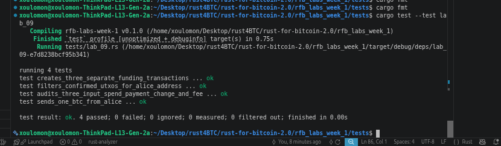

# Lab 09 — Multi-UTXO coin selection

## Commands used

<!-- TODO: Record funding, confirmation, spending, and decoding commands. -->
```bash
# Send BTC
bitcoin-cli -rpcwallet=<wallet> sendtoaddress <address> <amount>

# Mine Block
bitcoin-cli -generatetoaddress <block-count> <address>

# List UTXOs
bitcoin-cli -rpcwallet=<wallet> listunspent

# Decode transaction
bitcoin-cli  getrawtransaction <tx-hash> 2
```

## Terminal output

<!-- TODO: Show Alice's three UTXOs and the combined transaction inputs and outputs. -->
SEND 0.4btc TO ALICE THREE TIMES AND MINE A BLOCK SO IT COME SPENDABLE
```bash
bitcoin@backend1:/$ bitcoin-cli -rpcwallet=alice getnewaddress "alice1"
bcrt1qxnpfhgpfngv55jknujz8agxmyjx3t835yr93u7
bitcoin@backend1:/$ bitcoin-cli -rpcwallet=receiver sendtoaddress bcrt1qxnpfhgpfngv55jknujz8agxmyjx3t835yr93u7 0.4
4ba7445b4052317aa264282d39e0a18822cca31d031ff3c8fe49588f13fd45f6
bitcoin@backend1:/$ bitcoin-cli -rpcwallet=receiver sendtoaddress bcrt1qxnpfhgpfngv55jknujz8agxmyjx3t835yr93u7 0.4
0e43cf6a3528438c6b3dfd41843c121232f6521e5b2752a1229ab1079880e5fb
bitcoin@backend1:/$ bitcoin-cli -rpcwallet=receiver sendtoaddress bcrt1qxnpfhgpfngv55jknujz8agxmyjx3t835yr93u7 0.4
af37b864948068f9ebc4c4f204617d2003c94e409f04583721b929ccc9eb8fb5
bitcoin@backend1:/$ 
bitcoin@backend1:/$ bitcoin-cli -rpcwallet=alice getbalances                                                       
{
  "mine": {
    "trusted": 0.00000000,
    "untrusted_pending": 1.20000000,
    "immature": 0.00000000
  },
  "lastprocessedblock": {
    "hash": "39c9ffd1357409f1bb145b2a1746b95fd4599bf044619f50e447dd1261aeaa14",
    "height": 109
  }
}
bitcoin@backend1:/$                                         
bitcoin@backend1:/$ 
bitcoin@backend1:/$ bitcoin-cli -rpcwallet=miner generatetoaddress 1 bcrt1qn893ldl3w0zt5myjm0lxh3kpreedtwtnsc0272 
[
  "197f71291095211767b32833a4ad5eeecda2bcf01defa1f40873b15fe95255df"
]
bitcoin@backend1:/$ bitcoin-cli -rpcwallet=alice getbalances
{
  "mine": {
    "trusted": 1.20000000,
    "untrusted_pending": 0.00000000,
    "immature": 0.00000000
  },
  "lastprocessedblock": {
    "hash": "197f71291095211767b32833a4ad5eeecda2bcf01defa1f40873b15fe95255df",
    "height": 110
  }
}
```

LIST OF ALICE UTXO
```bash
bitcoin@backend1:/$ bitcoin-cli -rpcwallet=alice listunspent 
[
  {
    "txid": "af37b864948068f9ebc4c4f204617d2003c94e409f04583721b929ccc9eb8fb5",
    "vout": 1,
    "address": "bcrt1qxnpfhgpfngv55jknujz8agxmyjx3t835yr93u7",
    "label": "alice1",
    "scriptPubKey": "001434c29ba0299a194a4ad3e4847ea0db248d159e34",
    "amount": 0.40000000,
    "confirmations": 1,
    "spendable": true,
    "solvable": true,
    "desc": "wpkh([5e6e84f1/84h/1h/0h/0/0]020a71f5b5d764e989b3ecf65f30e87c0c255114356bbfcbdf7f43cb83d00e7b05)#4yr53q3e",
    "parent_descs": [
      "wpkh([5e6e84f1/84h/1h/0h]tpubDCBJNZE9TUbpzjwfPamgd6eae71fwnTWczN3BpRxXLB4kcPs1yXLQJjZL6ci2vDQYo3ugN2Yg9JPdtQy1MfPDpbAyy7JwFv8813APVwLvSg/0/*)#6v72xtja"
    ],
    "safe": true
  },
  {
    "txid": "0e43cf6a3528438c6b3dfd41843c121232f6521e5b2752a1229ab1079880e5fb",
    "vout": 1,
    "address": "bcrt1qxnpfhgpfngv55jknujz8agxmyjx3t835yr93u7",
    "label": "alice1",
    "scriptPubKey": "001434c29ba0299a194a4ad3e4847ea0db248d159e34",
    "amount": 0.40000000,
    "confirmations": 1,
    "spendable": true,
    "solvable": true,
    "desc": "wpkh([5e6e84f1/84h/1h/0h/0/0]020a71f5b5d764e989b3ecf65f30e87c0c255114356bbfcbdf7f43cb83d00e7b05)#4yr53q3e",
    "parent_descs": [
      "wpkh([5e6e84f1/84h/1h/0h]tpubDCBJNZE9TUbpzjwfPamgd6eae71fwnTWczN3BpRxXLB4kcPs1yXLQJjZL6ci2vDQYo3ugN2Yg9JPdtQy1MfPDpbAyy7JwFv8813APVwLvSg/0/*)#6v72xtja"
    ],
    "safe": true
  },
  {
    "txid": "4ba7445b4052317aa264282d39e0a18822cca31d031ff3c8fe49588f13fd45f6",
    "vout": 1,
    "address": "bcrt1qxnpfhgpfngv55jknujz8agxmyjx3t835yr93u7",
    "label": "alice1",
    "scriptPubKey": "001434c29ba0299a194a4ad3e4847ea0db248d159e34",
    "amount": 0.40000000,
    "confirmations": 1,
    "spendable": true,
    "solvable": true,
    "desc": "wpkh([5e6e84f1/84h/1h/0h/0/0]020a71f5b5d764e989b3ecf65f30e87c0c255114356bbfcbdf7f43cb83d00e7b05)#4yr53q3e",
    "parent_descs": [
      "wpkh([5e6e84f1/84h/1h/0h]tpubDCBJNZE9TUbpzjwfPamgd6eae71fwnTWczN3BpRxXLB4kcPs1yXLQJjZL6ci2vDQYo3ugN2Yg9JPdtQy1MfPDpbAyy7JwFv8813APVwLvSg/0/*)#6v72xtja"
    ],
    "safe": true
  }
]
```

SEND 1BTC FROM ALICE TO MINER ADDRESS AND SHOWING DETAILS OF THE TRANSACTION HAVING THREE INPUT AND TWO OUTPTS
```bash
bitcoin@backend1:/$ bitcoin-cli -rpcwallet=alice sendtoaddress bcrt1qn893ldl3w0zt5myjm0lxh3kpreedtwtnsc0272 1
bb09a5129b655cee31fd675cc952d03899aebbd95f22c82f934119830e9600d1
bitcoin@backend1:/$ 
bitcoin@backend1:/$ bitcoin-cli getrawtransaction bb09a5129b655cee31fd675cc952d03899aebbd95f22c82f934119830e9600d1 2
{
  "txid": "bb09a5129b655cee31fd675cc952d03899aebbd95f22c82f934119830e9600d1",
  "hash": "f8646a4bb9a435862a51729b9d16ea3e35adb85b029e0c29734a57dd9c3dc3b0",
  "version": 2,
  "size": 518,
  "vsize": 276,
  "weight": 1103,
  "locktime": 110,
  "vin": [
    {
      "txid": "af37b864948068f9ebc4c4f204617d2003c94e409f04583721b929ccc9eb8fb5",
      "vout": 1,
      "scriptSig": {
        "asm": "",
        "hex": ""
      },
      "txinwitness": [
        "304402205e8afa538a8bfbb0ffd5917e9f457b69dccae1eeb39186d89cfc1a7cbd97a9ce02204b09a6a15b2882522bdf73bb829d1a923bc94e317740d0c60e51fbc79f54d1e901",
        "020a71f5b5d764e989b3ecf65f30e87c0c255114356bbfcbdf7f43cb83d00e7b05"
      ],
      "sequence": 4294967293
    },
    {
      "txid": "4ba7445b4052317aa264282d39e0a18822cca31d031ff3c8fe49588f13fd45f6",
      "vout": 1,
      "scriptSig": {
        "asm": "",
        "hex": ""
      },
      "txinwitness": [
        "3044022033d665063c3dafa7b7d4f537ff4f3997ad09f06708f07fa7e35112d0891dc52e022071a5ba220e8b4019668de57fe689ff9b1a7e94508573ad74dbe5112689f269af01",
        "020a71f5b5d764e989b3ecf65f30e87c0c255114356bbfcbdf7f43cb83d00e7b05"
      ],
      "sequence": 4294967293
    },
    {
      "txid": "0e43cf6a3528438c6b3dfd41843c121232f6521e5b2752a1229ab1079880e5fb",
      "vout": 1,
      "scriptSig": {
        "asm": "",
        "hex": ""
      },
      "txinwitness": [
        "304402201850b1ddf1769857eae1b861164cb27bbd942782dfb771f7162d5e8db55ce0e40220593001c79172f904fd918548766a21d88f645212a51c0499b23b355d13d791eb01",
        "020a71f5b5d764e989b3ecf65f30e87c0c255114356bbfcbdf7f43cb83d00e7b05"
      ],
      "sequence": 4294967293
    }
  ],
  "vout": [
    {
      "value": 0.19994480,
      "n": 0,
      "scriptPubKey": {
        "asm": "0 222441e9c22ba78b3d3a67fd583d272bd56cdbc1",
        "desc": "addr(bcrt1qygjyr6wz9wnck0f6vl74s0f8902kek7py2xjlq)#vyyf339c",
        "hex": "0014222441e9c22ba78b3d3a67fd583d272bd56cdbc1",
        "address": "bcrt1qygjyr6wz9wnck0f6vl74s0f8902kek7py2xjlq",
        "type": "witness_v0_keyhash"
      }
    },
    {
      "value": 1.00000000,
      "n": 1,
      "scriptPubKey": {
        "asm": "0 99cb1fb7f173c4ba6c92dbfe6bc6c11e72d5b973",
        "desc": "addr(bcrt1qn893ldl3w0zt5myjm0lxh3kpreedtwtnsc0272)#9x8jpae4",
        "hex": "001499cb1fb7f173c4ba6c92dbfe6bc6c11e72d5b973",
        "address": "bcrt1qn893ldl3w0zt5myjm0lxh3kpreedtwtnsc0272",
        "type": "witness_v0_keyhash"
      }
    }
  ],
  "hex": "02000000000103b58febc9cc29b9213758049f404ec903207d6104f2c4c4ebf968809464b837af0100000000fdfffffff645fd138f5849fec8f31f031da3cc2288a1e0392d2864a27a3152405b44a74b0100000000fdfffffffbe5809807b19a22a152275b1e52f63212123c8441fd3d6b8c4328356acf430e0100000000fdffffff027017310100000000160014222441e9c22ba78b3d3a67fd583d272bd56cdbc100e1f5050000000016001499cb1fb7f173c4ba6c92dbfe6bc6c11e72d5b9730247304402205e8afa538a8bfbb0ffd5917e9f457b69dccae1eeb39186d89cfc1a7cbd97a9ce02204b09a6a15b2882522bdf73bb829d1a923bc94e317740d0c60e51fbc79f54d1e90121020a71f5b5d764e989b3ecf65f30e87c0c255114356bbfcbdf7f43cb83d00e7b0502473044022033d665063c3dafa7b7d4f537ff4f3997ad09f06708f07fa7e35112d0891dc52e022071a5ba220e8b4019668de57fe689ff9b1a7e94508573ad74dbe5112689f269af0121020a71f5b5d764e989b3ecf65f30e87c0c255114356bbfcbdf7f43cb83d00e7b050247304402201850b1ddf1769857eae1b861164cb27bbd942782dfb771f7162d5e8db55ce0e40220593001c79172f904fd918548766a21d88f645212a51c0499b23b355d13d791eb0121020a71f5b5d764e989b3ecf65f30e87c0c255114356bbfcbdf7f43cb83d00e7b056e000000"
}
```

MINING AFTER SEND AND SHOWING ALICE BALANCE
```bash
bitcoin@backend1:/$ bitcoin-cli -rpcwallet=miner generatetoaddress 1 bcrt1qn893ldl3w0zt5myjm0lxh3kpreedtwtnsc0272
[
  "05307cefc0471c9d90933e8ead7697a6501b62f70db5a5565733d1bdb05ff9f4"
]
bitcoin@backend1:/$ bitcoin-cli -rpcwallet=alice getbalances
{
  "mine": {
    "trusted": 0.19994480,
    "untrusted_pending": 0.00000000,
    "immature": 0.00000000
  },
  "lastprocessedblock": {
    "hash": "05307cefc0471c9d90933e8ead7697a6501b62f70db5a5565733d1bdb05ff9f4",
    "height": 111
  }
}
```


## Evidence references

<!-- TODO: Link screenshots or describe the attached evidence. -->
SCREENSHOT OF TEST PASSING FOR IMPLEMENTATION OF LAB09




## Explanation

<!-- TODO: Explain input combination, change, fees, and the privacy implication. -->
Input combination
When your wallet doesn't have one UTXO big enough to cover a payment, it combines multiple UTXOs as inputs to reach the needed amount.

UTXO1 (0.4 BTC) + UTXO2 (0.4 BTC) + UTXO3 (0.4 BTC) = 1.2 BTC available

Change
If combined inputs exceed the payment amount, the excess isn't just "kept" — it must go somewhere as a new output. The wallet creates a change output, usually to a new address it controls, sending the leftover back to itself.

inputs (1.2 BTC) = payment (1 BTC) + change (0.199 BTC) + fee (0.001 BTC)

Fees
The fee is whatever's left after outputs are subtracted from inputs (see earlier explanation — no dedicated fee output, it's implicit).

Privacy implication
Combining UTXOs as inputs links them together publicly — anyone watching the blockchain can now see those addresses are controlled by the same entity (this is called "common-input-ownership heuristic").

Also, the change output is often indistinguishable from a real payment to an outside observer — but sophisticated chain analysis can sometimes guess which output is "change" (e.g., by round numbers, address type patterns), potentially deanonymizing the sender further.

Bottom line: every time your wallet merges UTXOs to make a payment, it leaks a link between those coins' histories — a core reason Bitcoin privacy is harder than it looks.
