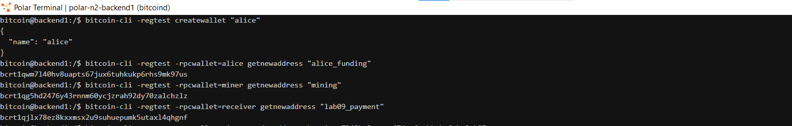
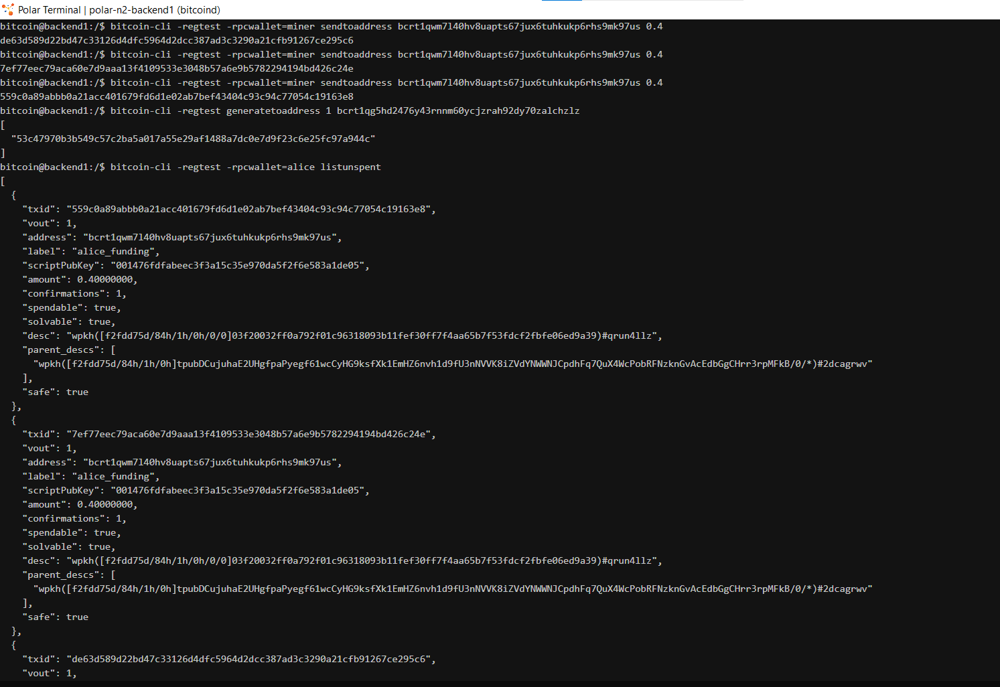
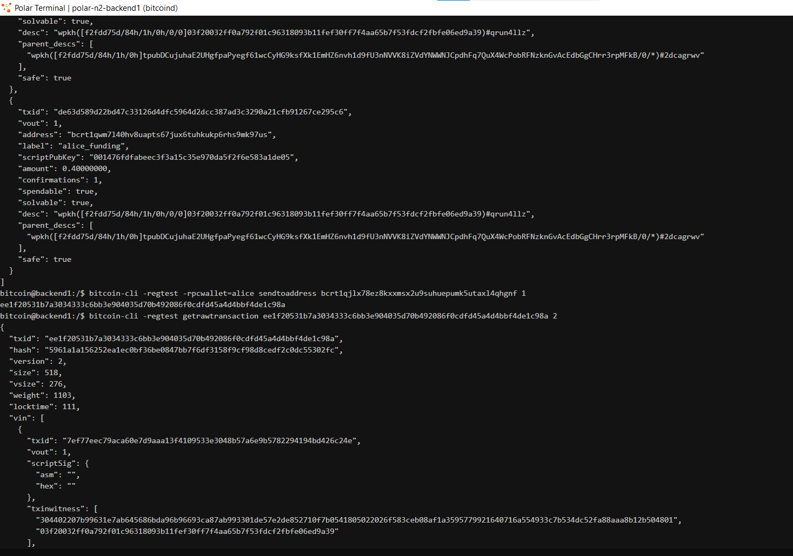
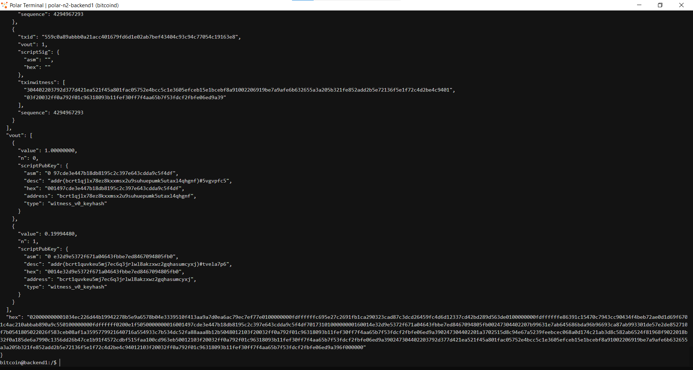

# Lab 09 — Multi-UTXO coin selection

## Commands used

bitcoin-cli -regtest createwallet "alice"
bitcoin-cli -regtest -rpcwallet=miner sendtoaddress bcrt1qwm7l40hv8uapts67jux6tuhkukp6rhs9mk97us
bitcoin-cli -regtest -rpcwallet=miner sendtoaddress bcrt1qwm7l40hv8uapts67jux6tuhkukp6rhs9mk97us
bitcoin-cli -regtest -rpcwallet=miner sendtoaddress bcrt1qwm7l40hv8uapts67jux6tuhkukp6rhs9mk97us
bitcoin-cli -regtest generatetoaddress 1 bcrt1qg5hd2476y43rnnm60ycjzrah92dy70zalchzlz
bitcoin-cli -regtest -rpcwallet=alice listunspent
bitcoin-cli -regtest -rpcwallet=alice sendtoaddress bcrt1qjlx78ez8kxxmsx2u9suhuepumk5utaxl4qhgnf 1
bitcoin-cli -regtest getrawtransaction ee1f20531b7a3034333c6bb3e904035d70b492086f0cdfd45a4d4bbf4de1c98a 2

## Terminal output
.....................................
bitcoin@backend1:/$ bitcoin-cli -regtest createwallet "alice"
{
  "name": "alice"
}
bitcoin@backend1:/$ bitcoin-cli -regtest -rpcwallet=alice getnewaddress "alice_funding"
bcrt1qwm7l40hv8uapts67jux6tuhkukp6rhs9mk97us
bitcoin@backend1:/$ bitcoin-cli -regtest -rpcwallet=miner getnewaddress "mining"
bcrt1qg5hd2476y43rnnm60ycjzrah92dy70zalchzlz
bitcoin@backend1:/$ bitcoin-cli -regtest -rpcwallet=receiver getnewaddress "lab09_payment"
bcrt1qjlx78ez8kxxmsx2u9suhuepumk5utaxl4qhgnf
.....................................
bitcoin@backend1:/$ bitcoin-cli -regtest -rpcwallet=miner sendtoaddress bcrt1qwm7l40hv8uapts67jux6tuhkukp6rhs9mk97us 0.4
de63d589d22bd47c33126d4dfc5964d2dcc387ad3c3290a21cfb91267ce295c6
bitcoin@backend1:/$ bitcoin-cli -regtest -rpcwallet=miner sendtoaddress bcrt1qwm7l40hv8uapts67jux6tuhkukp6rhs9mk97us 0.4
7ef77eec79aca60e7d9aaa13f4109533e3048b57a6e9b5782294194bd426c24e
bitcoin@backend1:/$ bitcoin-cli -regtest -rpcwallet=miner sendtoaddress bcrt1qwm7l40hv8uapts67jux6tuhkukp6rhs9mk97us 0.4
559c0a89abbb0a21acc401679fd6d1e02ab7bef43404c93c94c77054c19163e8
bitcoin@backend1:/$ bitcoin-cli -regtest generatetoaddress 1 bcrt1qg5hd2476y43rnnm60ycjzrah92dy70zalchzlz
[
  "53c47970b3b549c57c2ba5a017a55e29af1488a7dc0e7d9f23c6e25fc97a944c"
]
................................................................
bitcoin@backend1:/$ bitcoin-cli -regtest -rpcwallet=alice listunspent
[
  {
    "txid": "559c0a89abbb0a21acc401679fd6d1e02ab7bef43404c93c94c77054c19163e8",
    "vout": 1,
    "address": "bcrt1qwm7l40hv8uapts67jux6tuhkukp6rhs9mk97us",
    "label": "alice_funding",
    "scriptPubKey": "001476fdfabeec3f3a15c35e970da5f2f6e583a1de05",
    "amount": 0.40000000,
    "confirmations": 1,
    "spendable": true,
    "solvable": true,
    "desc": "wpkh([f2fdd75d/84h/1h/0h/0/0]03f20032ff0a792f01c96318093b11fef30ff7f4aa65b7f53fdcf2fbfe06ed9a39)#qrun4llz",
    "parent_descs": [
      "wpkh([f2fdd75d/84h/1h/0h]tpubDCujuhaE2UHgfpaPyegf61wcCyHG9ksfXk1EmHZ6nvh1d9fU3nNVVK8iZVdYNWWNJCpdhFq7QuX4WcPobRFNzknGvAcEdbGgCHrr3rpMFkB/0/*)#2dcagrwv"
    ],
    "safe": true
  },
  {
    "txid": "7ef77eec79aca60e7d9aaa13f4109533e3048b57a6e9b5782294194bd426c24e",
    "vout": 1,
    "address": "bcrt1qwm7l40hv8uapts67jux6tuhkukp6rhs9mk97us",
    "label": "alice_funding",
    "scriptPubKey": "001476fdfabeec3f3a15c35e970da5f2f6e583a1de05",
    "amount": 0.40000000,
    "confirmations": 1,
    "spendable": true,
    "solvable": true,
    "desc": "wpkh([f2fdd75d/84h/1h/0h/0/0]03f20032ff0a792f01c96318093b11fef30ff7f4aa65b7f53fdcf2fbfe06ed9a39)#qrun4llz",
    "parent_descs": [
      "wpkh([f2fdd75d/84h/1h/0h]tpubDCujuhaE2UHgfpaPyegf61wcCyHG9ksfXk1EmHZ6nvh1d9fU3nNVVK8iZVdYNWWNJCpdhFq7QuX4WcPobRFNzknGvAcEdbGgCHrr3rpMFkB/0/*)#2dcagrwv"
    ],
    "safe": true
  },
  {
    "txid": "de63d589d22bd47c33126d4dfc5964d2dcc387ad3c3290a21cfb91267ce295c6",
    "vout": 1,
    "address": "bcrt1qwm7l40hv8uapts67jux6tuhkukp6rhs9mk97us",
    "label": "alice_funding",
    "scriptPubKey": "001476fdfabeec3f3a15c35e970da5f2f6e583a1de05",
    "amount": 0.40000000,
    "confirmations": 1,
    "spendable": true,
    "solvable": true,
    "desc": "wpkh([f2fdd75d/84h/1h/0h/0/0]03f20032ff0a792f01c96318093b11fef30ff7f4aa65b7f53fdcf2fbfe06ed9a39)#qrun4llz",
    "parent_descs": [
      "wpkh([f2fdd75d/84h/1h/0h]tpubDCujuhaE2UHgfpaPyegf61wcCyHG9ksfXk1EmHZ6nvh1d9fU3nNVVK8iZVdYNWWNJCpdhFq7QuX4WcPobRFNzknGvAcEdbGgCHrr3rpMFkB/0/*)#2dcagrwv"
    ],
    "safe": true
  }
]
....................................................................
bitcoin@backend1:/$ bitcoin-cli -regtest -rpcwallet=alice sendtoaddress bcrt1qjlx78ez8kxxmsx2u9suhuepumk5utaxl4qhgnf 1
ee1f20531b7a3034333c6bb3e904035d70b492086f0cdfd45a4d4bbf4de1c98a
....................................................................
bitcoin@backend1:/$ bitcoin-cli -regtest getrawtransaction ee1f20531b7a3034333c6bb3e904035d70b492086f0cdfd45a4d4bbf4de1c98a 2
{
  "txid": "ee1f20531b7a3034333c6bb3e904035d70b492086f0cdfd45a4d4bbf4de1c98a",
  "hash": "5961a1a156252ea1ec0bf36be0847bb7f6df3158f9cf98d8cedf2c0dc55302fc",
  "version": 2,
  "size": 518,
  "vsize": 276,
  "weight": 1103,
  "locktime": 111,
  "vin": [
    {
      "txid": "7ef77eec79aca60e7d9aaa13f4109533e3048b57a6e9b5782294194bd426c24e",
      "vout": 1,
      "scriptSig": {
        "asm": "",
        "hex": ""
      },
      "txinwitness": [
        "304402207b99631e7ab645686bda96b96693ca87ab993301de57e2de852710f7b0541805022026f583ceb08af1a3595779921640716a554933c7b534dc52fa88aaa8b12b504801",
        "03f20032ff0a792f01c96318093b11fef30ff7f4aa65b7f53fdcf2fbfe06ed9a39"
      ],
      "sequence": 4294967293
    },
    {
      "txid": "de63d589d22bd47c33126d4dfc5964d2dcc387ad3c3290a21cfb91267ce295c6",
      "vout": 1,
      "scriptSig": {
        "asm": "",
        "hex": ""
      },
      "txinwitness": [
        "304402201a3702515d8c94e67a5239feebcec068a0d174c21ab3d8c582ab6524f81968f9022018b32f0a185de6a7990c1356dd26b47ce1b91f4572cdbf515faa100cd963eb5001",
        "03f20032ff0a792f01c96318093b11fef30ff7f4aa65b7f53fdcf2fbfe06ed9a39"
      ],
      "sequence": 4294967293
    },
    {
      "txid": "559c0a89abbb0a21acc401679fd6d1e02ab7bef43404c93c94c77054c19163e8",
      "vout": 1,
      "scriptSig": {
        "asm": "",
        "hex": ""
      },
      "txinwitness": [
        "304402203792d377d421ea521f45a801fac05752e4bcc5c1e3605efceb15e1bcebf8a91002206919be7a9afe6b632655a3a205b321fe852add2b5e72136f5e1f72c4d2be4c9401",
        "03f20032ff0a792f01c96318093b11fef30ff7f4aa65b7f53fdcf2fbfe06ed9a39"
      ],
      "sequence": 4294967293
    }
  ],
  "vout": [
    {
      "value": 1.00000000,
      "n": 0,
      "scriptPubKey": {
        "asm": "0 97cde3e447b18db8195c2c397e643cdda9c5f4df",
        "desc": "addr(bcrt1qjlx78ez8kxxmsx2u9suhuepumk5utaxl4qhgnf)#5vgvpfc5",
        "hex": "001497cde3e447b18db8195c2c397e643cdda9c5f4df",
        "address": "bcrt1qjlx78ez8kxxmsx2u9suhuepumk5utaxl4qhgnf",
        "type": "witness_v0_keyhash"
      }
    },
    {
      "value": 0.19994480,
      "n": 1,
      "scriptPubKey": {
        "asm": "0 e32d9e5372f671a04643fbbe7ed8467094805fb0",
        "desc": "addr(bcrt1quvkeu5mj7ec6q3jrlwl8akzxwz2gqhasumcyxj)#tvela7p6",
        "hex": "0014e32d9e5372f671a04643fbbe7ed8467094805fb0",
        "address": "bcrt1quvkeu5mj7ec6q3jrlwl8akzxwz2gqhasumcyxj",
        "type": "witness_v0_keyhash"
      }
    }
  ],
  "hex": "020000000001034ec226d44b19942278b5e9a6578b04e3339510f413aa9a7d0ea6ac79ec7ef77e0100000000fdffffffc695e27c2691fb1ca290323cad87c3dcd26459fc4d6d12337cd42bd289d563de0100000000fdffffffe86391c15470c7943cc90434f4beb72ae0d1d69f6701c4ac210abbab890a9c550100000000fdffffff0200e1f5050000000016001497cde3e447b18db8195c2c397e643cdda9c5f4df7017310100000000160014e32d9e5372f671a04643fbbe7ed8467094805fb00247304402207b99631e7ab645686bda96b96693ca87ab993301de57e2de852710f7b0541805022026f583ceb08af1a3595779921640716a554933c7b534dc52fa88aaa8b12b5048012103f20032ff0a792f01c96318093b11fef30ff7f4aa65b7f53fdcf2fbfe06ed9a390247304402201a3702515d8c94e67a5239feebcec068a0d174c21ab3d8c582ab6524f81968f9022018b32f0a185de6a7990c1356dd26b47ce1b91f4572cdbf515faa100cd963eb50012103f20032ff0a792f01c96318093b11fef30ff7f4aa65b7f53fdcf2fbfe06ed9a390247304402203792d377d421ea521f45a801fac05752e4bcc5c1e3605efceb15e1bcebf8a91002206919be7a9afe6b632655a3a205b321fe852add2b5e72136f5e1f72c4d2be4c94012103f20032ff0a792f01c96318093b11fef30ff7f4aa65b7f53fdcf2fbfe06ed9a396f000000"
}
bitcoin@backend1:/$ 
## Evidence references

## Explanation

When Alice needs to send 1 BTC but her largest single UTXO is only 0.4 BTC, the wallet must combine multiple UTXOs as inputs to a single transaction. This is called coin selection, and it is a fundamental operation for any wallet that receives many small payments.

However, combining UTXOs creates a privacy trade-off. When multiple inputs are spent in the same transaction, external observers can reasonably infer that all those inputs belong to the same entity. If funding-0, funding-1, and funding-2 were received at different times from different parties, linking them reveals a connection that was not previously visible on-chain. This is a form of input heuristic analysis and is one of the reasons why Bitcoin privacy is not as strong as many people assume. Wallets that prioritize privacy try to minimize input consolidation, or use techniques like CoinJoin to break the assumption that all inputs in a transaction belong to the same owner.

In this lab, Alice's wallet automatically selected all three 0.4 BTC UTXOs because none alone could cover the 1 BTC payment plus the transaction fee. The surplus (0.2 BTC minus the fee) was returned to Alice as a single change output, further consolidating her coins.
