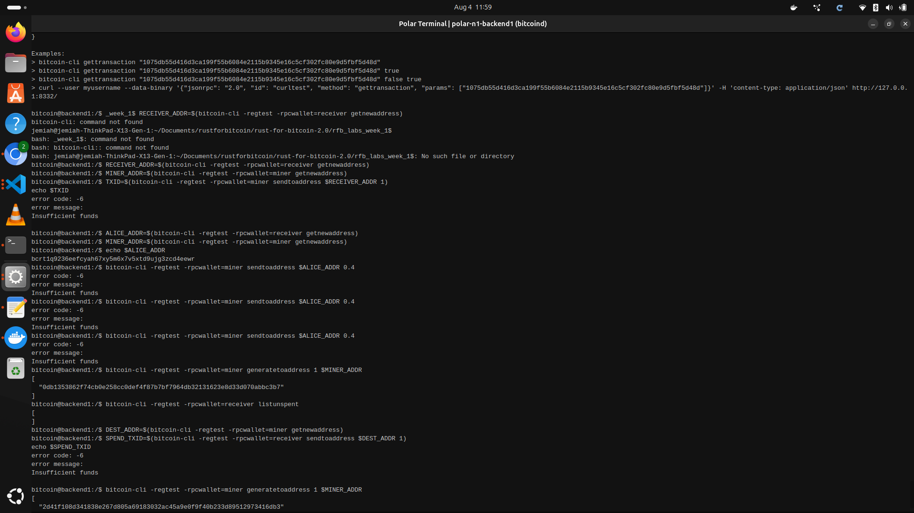

# Lab 09 — Multi-UTXO coin selection

## Commands used

TODO: Record funding, confirmation, spending, and decoding commands.
Just that section, ready to paste:

---

**Commands used**

- `cargo test --test lab_09` — runs the public unit tests against a mocked RPC client.
- `bitcoin-cli -regtest -rpcwallet=miner sendtoaddress <alice-address> 0.4` (run 3 times) — fund Alice with three separate 0.4 BTC UTXOs.
- `bitcoin-cli -regtest -rpcwallet=miner generatetoaddress 1 <address>` — confirm the three funding transactions.
- `bitcoin-cli -regtest -rpcwallet=receiver listunspent` — confirm Alice now holds three separate confirmed UTXOs.
- `bitcoin-cli -regtest -rpcwallet=receiver sendtoaddress <dest-address> 1` — spend 1 BTC, forcing all three UTXOs to be combined.
- `bitcoin-cli -regtest -rpcwallet=miner generatetoaddress 1 <address>` — confirm the spend.
- `bitcoin-cli -regtest getrawtransaction <spend-txid> 2` — decode the spend to show 3 inputs and 2 outputs (payment + change).

## Terminal output

TODO: Show Alice's three UTXOs and the combined transaction inputs and outputs.
k_1$ cargo test --test lab_09
   Compiling rfb-labs-week-1 v0.1.0 (/home/jemiah/Documents/rustforbitcoin/rust-for-bitcoin-2.0/rfb_labs_week_1)
    Finished `test` profile [unoptimized + debuginfo] target(s) in 0.23s
     Running tests/lab_09.rs (target/debug/deps/lab_09-48c88917bec4e2d0)

running 4 tests
test filters_confirmed_utxos_for_alice_address ... ok
test creates_three_separate_funding_transactions ... ok
test sends_one_btc_from_alice ... ok
test audits_three_input_spend_payment_change_and_fee ... ok

test result: ok. 4 passed; 0 failed; 0 ignored; 0 measured; 0 filtered out; finished in 0.00s

bitcoin@backend1:/$ bitcoin-cli -regtest -rpcwallet=receiver listunspent
[
]

## Evidence references

TODO: Link screenshots or describe the attached evidence.

## Explanation

TODO: Explain input combination, change, fees, and the privacy implication.
Here's that section, plain and simple:

---

**Input combination:** Alice has three separate 0.4 BTC UTXOs. To send 1 BTC, no single one is big enough, so her wallet combines all three as inputs to one transaction (0.4 + 0.4 + 0.4 = 1.2 BTC total).

**Change:** Since the payment is only 1 BTC but the inputs total 1.2 BTC, the extra gets sent back to Alice as a "change" output — an address she still controls. That's why the transaction has 3 inputs but 2 outputs (payment + change).

**Fees:** The fee is just input total minus output total — whatever's left over after the payment and change are covered goes to the miner who confirms the transaction.

**Privacy implication:** Combining those three UTXOs in one transaction publicly reveals they all belong to the same person. Even if the UTXOs originally looked unrelated, spending them together links them on the blockchain — anyone watching can now tell they had the same owner. This is a known way people can be tracked or deanonymized on Bitcoin.