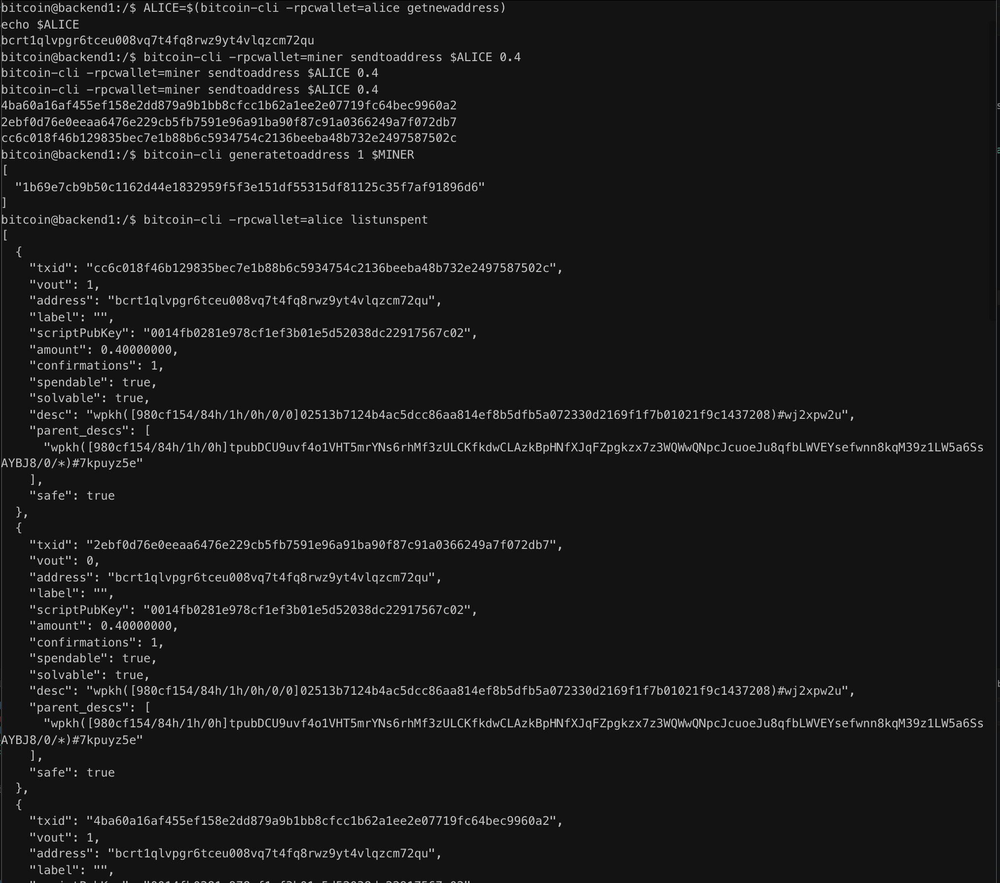

# Lab 09 — Multi-UTXO coin selection

## Commands used

```bash
bitcoin-cli createwallet alice

ALICE=$(bitcoin-cli -rpcwallet=alice getnewaddress)

bitcoin-cli -rpcwallet=miner sendtoaddress $ALICE 0.4
bitcoin-cli -rpcwallet=miner sendtoaddress $ALICE 0.4
bitcoin-cli -rpcwallet=miner sendtoaddress $ALICE 0.4

bitcoin-cli generatetoaddress 1 $MINER

bitcoin-cli -rpcwallet=alice listunspent

RECEIVER=$(bitcoin-cli -rpcwallet=receiver getnewaddress "classmate")

SPEND=$(bitcoin-cli -rpcwallet=alice sendtoaddress $RECEIVER 1)

bitcoin-cli getrawtransaction $SPEND 2
```

## Terminal output

```text
Alice confirmed UTXOs

4ba60a16af455ef158e2dd879a9b1bb8cfcc1b62a1ee2e07719fc64bec9960a2
Amount: 0.40000000 BTC

2ebf0d76e0eeaa6476e229cb5fb7591e96a91ba90f87c91a0366249a7f072db7
Amount: 0.40000000 BTC

cc6c018f46b129835bec7e1b88b6c5934754c2136beeba48b732e2497587502c
Amount: 0.40000000 BTC

Spend transaction

TXID:
3487231493c6f6eeaa5ee32a8f2ea4444ddc5215fb0022f543794439d195e040

Inputs:
3

Outputs:
Payment:
1.00000000 BTC

Change:
0.19994480 BTC

Transaction fee:
0.00005520 BTC
```

## Evidence references

The attached screenshots show:

- Alice's wallet containing three confirmed 0.4 BTC UTXOs.
- The decoded transaction with three transaction inputs (`vin`).
- A 1 BTC payment output.
- A change output returning the remaining funds after deducting the miner fee.



## Explanation

Bitcoin transactions spend entire UTXOs rather than partial balances. Since Alice owned three separate 0.4 BTC UTXOs, sending 1 BTC required the wallet to combine all three as inputs, providing a total input value of 1.2 BTC.

The transaction created two outputs: a 1 BTC payment to the receiver and a change output returning the remaining funds to Alice. The difference between the total input value (1.2 BTC) and the total output value (1.19994480 BTC) is the miner fee of **0.00005520 BTC**.

Using multiple inputs also has a privacy implication: anyone inspecting the blockchain can reasonably infer that all three input UTXOs were controlled by the same wallet because they were spent together in a single transaction.