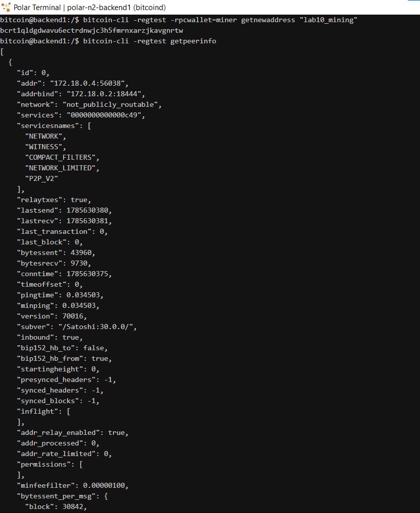
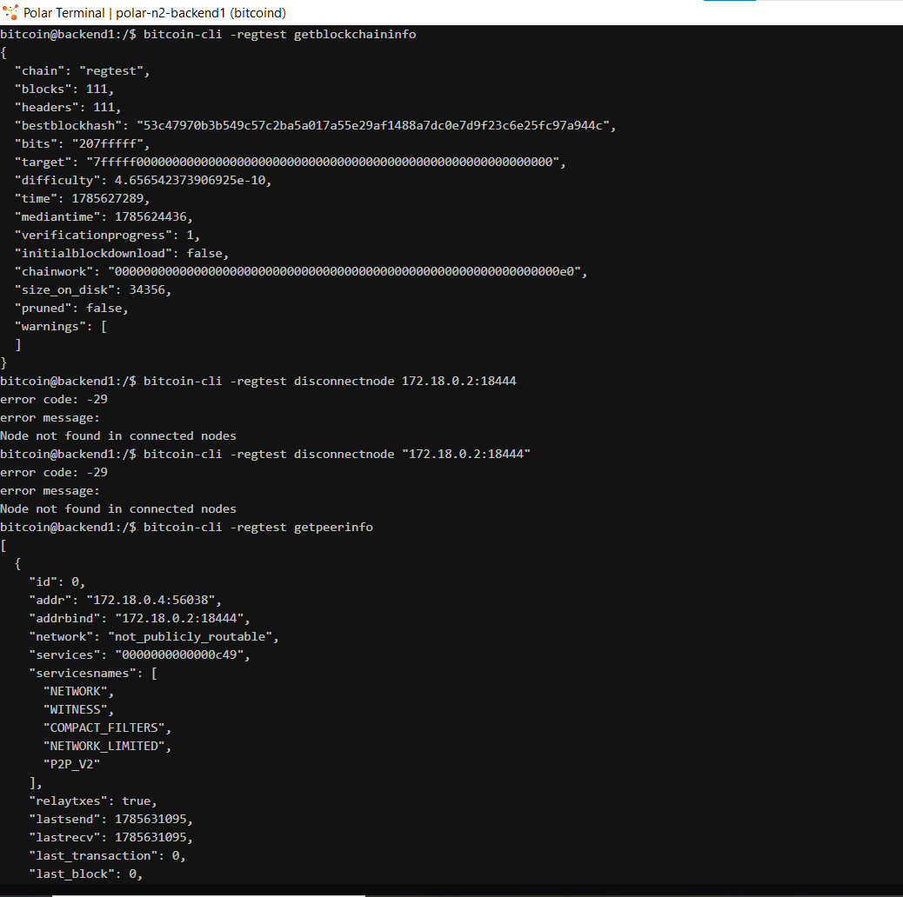
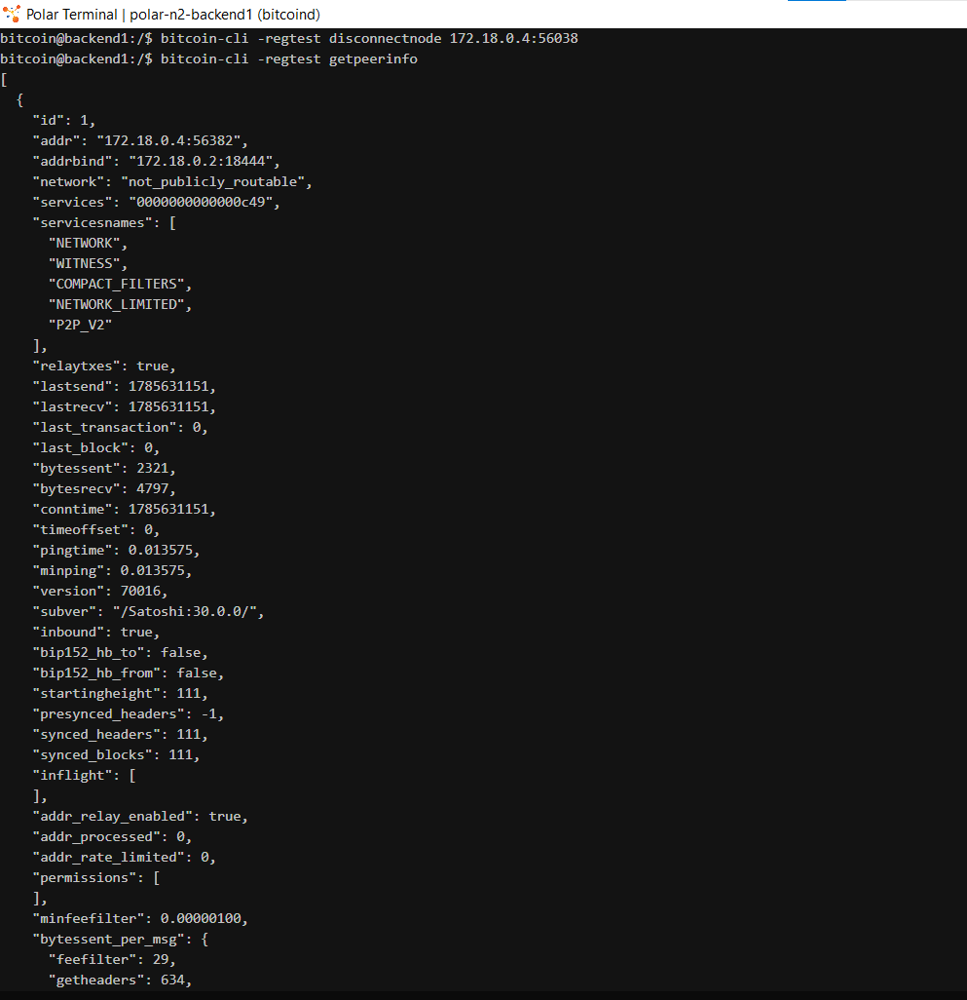
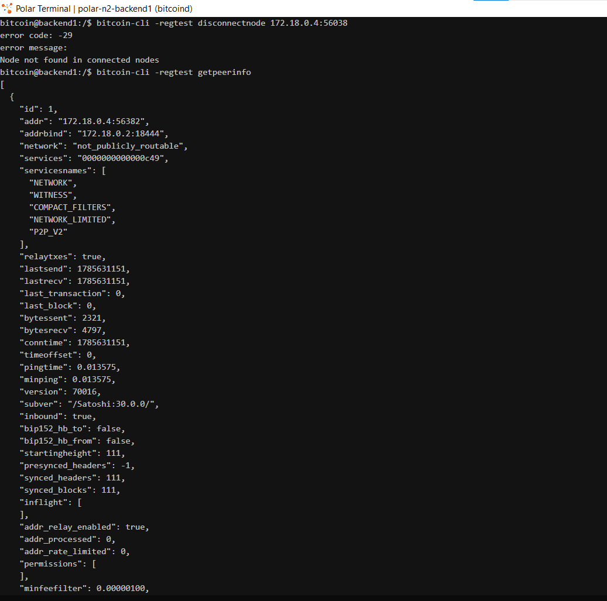
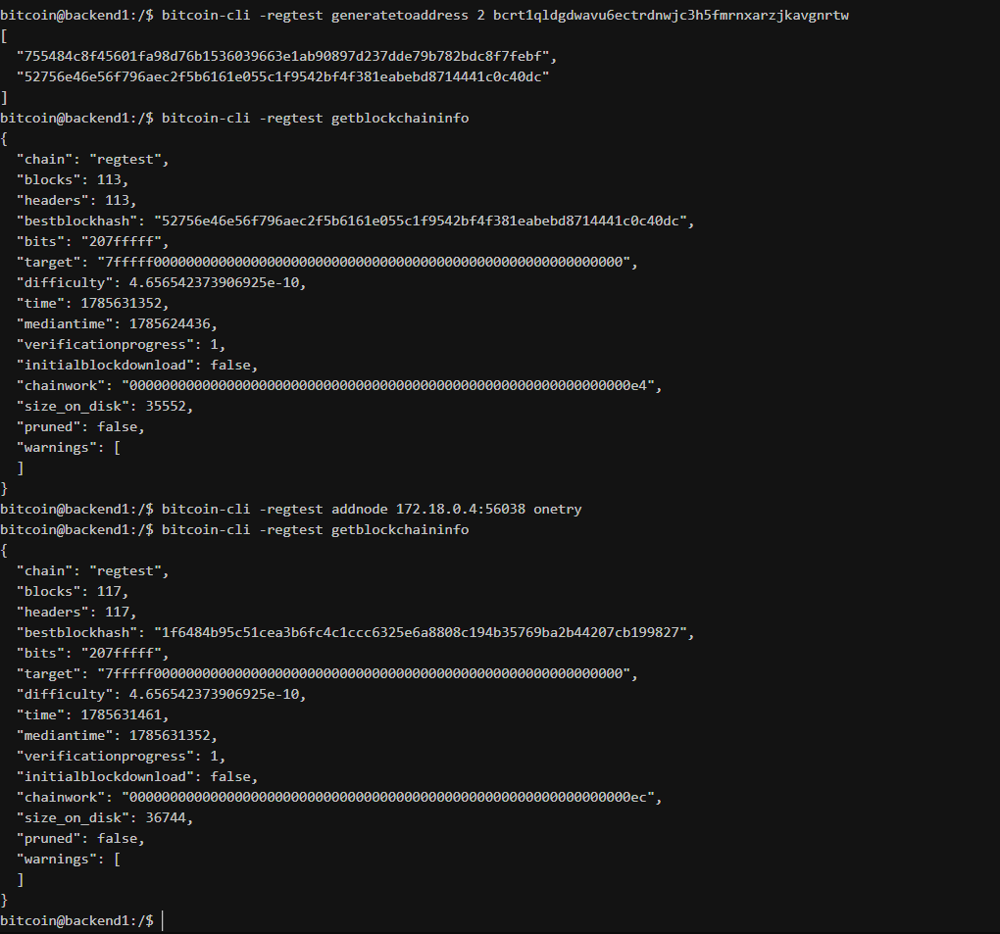
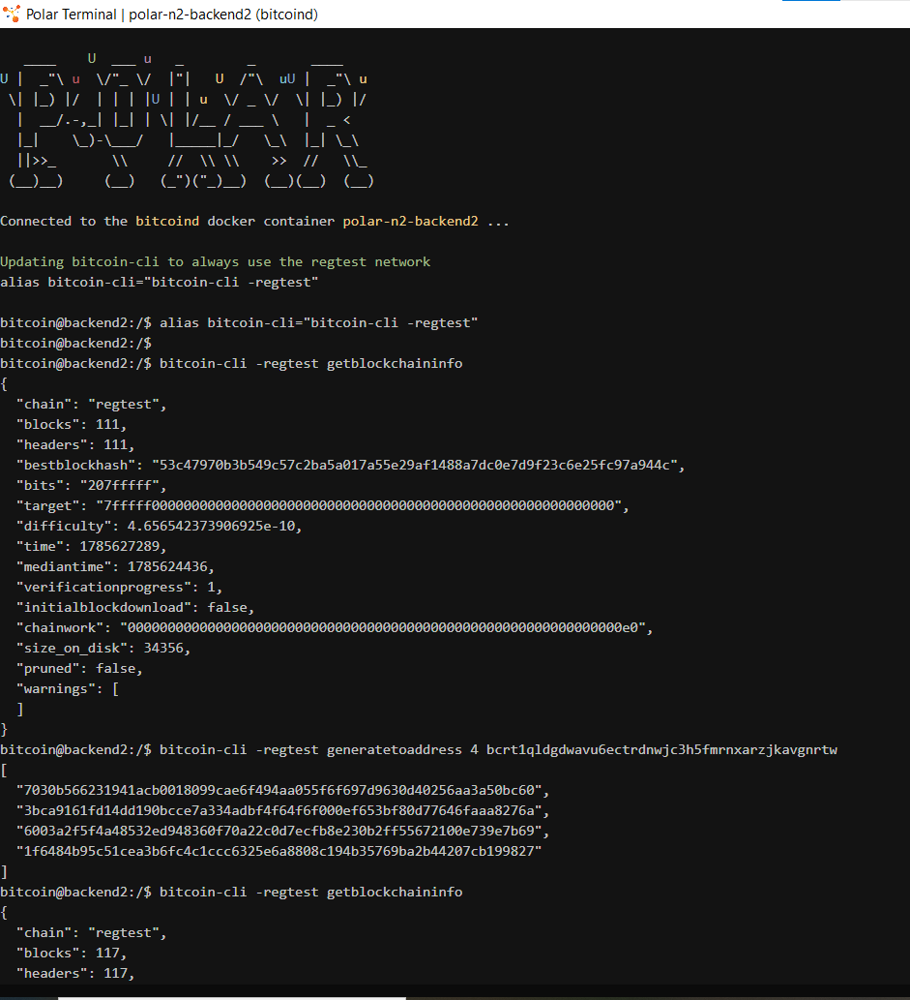
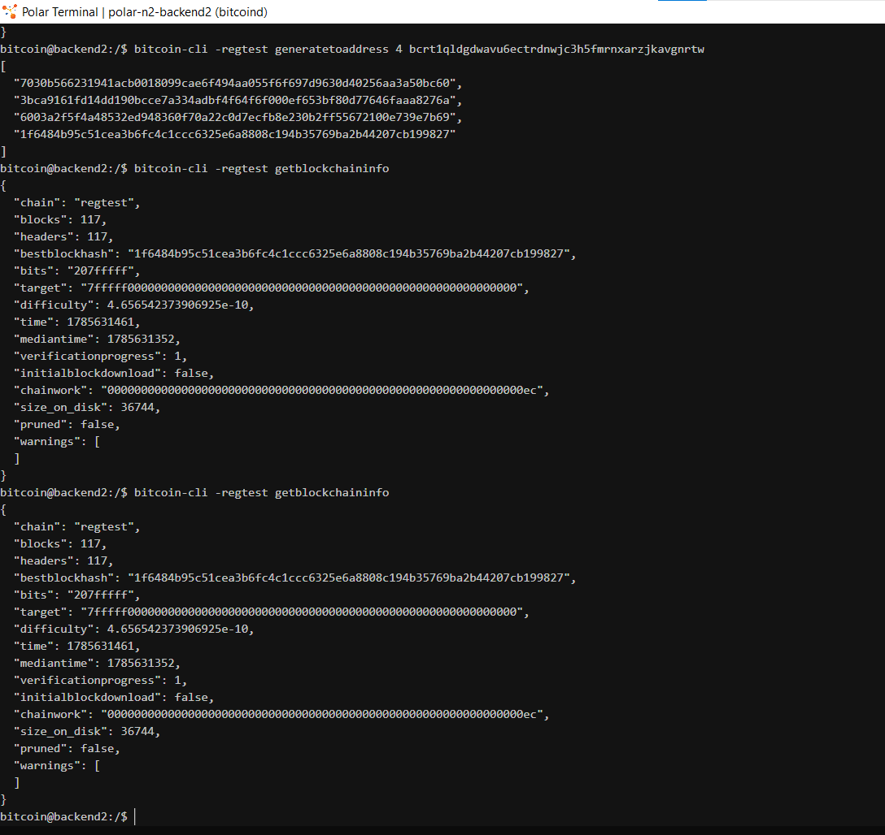

# Lab 10 — Competing branches and reorganization

## Commands used
# Node A terminal:
bitcoin-cli -regtest -rpcwallet=miner getnewaddress "lab10_mining"
bitcoin-cli -regtest getpeerinfo
bitcoin-cli -regtest getblockchaininfo
# Node B terminal:
bitcoin-cli -regtest getblockchaininfo
# Both should show the SAME bestblockhash and chainwork

# === DISCONNECT (run on Node A) ===
bitcoin-cli -regtest disconnectnode 172.18.0.4:56038
bitcoin-cli -regtest getpeerinfo
bitcoin-cli -regtest generatetoaddress 2 bcrt1qldgdwavu6ectrdnwjc3h5fmrnxarzjkavgnrtw
bitcoin-cli -regtest getblockchaininfo
# === MINE ON NODE B (4 blocks) ===
# Switch to Node B's terminal in Polar
bitcoin-cli -regtest generatetoaddress 4 bcrt1qldgdwavu6ectrdnwjc3h5fmrnxarzjkavgnrtw
bitcoin-cli -regtest getblockchaininfo
# === RECONNECT (run on Node A) ===
bitcoin-cli -regtest addnode 172.18.0.4:56038 onetry
# Node A:
bitcoin-cli -regtest getblockchaininfo
# Node B:
bitcoin-cli -regtest getblockchaininfo
## Terminal output
# NODE A:
.................................................
bitcoin@backend1:/$ bitcoin-cli -regtest -rpcwallet=miner getnewaddress "lab10_mining"
bcrt1qldgdwavu6ectrdnwjc3h5fmrnxarzjkavgnrtw
.....................................................
bitcoin@backend1:/$ bitcoin-cli -regtest getpeerinfo
[
  {
    "id": 0,
    "addr": "172.18.0.4:56038",
    "addrbind": "172.18.0.2:18444",
    "network": "not_publicly_routable",
    "services": "0000000000000c49",
    "servicesnames": [
      "NETWORK",
      "WITNESS",
      "COMPACT_FILTERS",
      "NETWORK_LIMITED",
      "P2P_V2"
    ],
    "relaytxes": true,
    "lastsend": 1785630380,
    "lastrecv": 1785630381,
    "last_transaction": 0,
    "last_block": 0,
    "bytessent": 43960,
    "bytesrecv": 9730,
    "conntime": 1785630375,
    "timeoffset": 0,
    "pingtime": 0.034503,
    "minping": 0.034503,
    "version": 70016,
    "subver": "/Satoshi:30.0.0/",
    "inbound": true,
    "bip152_hb_to": false,
    "bip152_hb_from": true,
    "startingheight": 0,
    "presynced_headers": -1,
    "synced_headers": -1,
    "synced_blocks": -1,
    "inflight": [
    ],
    "addr_relay_enabled": true,
    "addr_processed": 0,
    "addr_rate_limited": 0,
    "permissions": [
    ],
    "minfeefilter": 0.00000100,
    "bytessent_per_msg": {
      "block": 30842,
      "feefilter": 29,
      "getheaders": 634,
      "headers": 9013,
      "ping": 29,
      "pong": 29,
      "sendaddrv2": 33,
      "sendcmpct": 30,
      "verack": 33,
      "version": 135,
      "wtxidrelay": 33
    },
    "bytesrecv_per_msg": {
      "feefilter": 58,
      "getaddr": 33,
      "getdata": 6108,
      "getheaders": 90,
      "headers": 22,
      "ping": 29,
      "pong": 29,
      "sendaddrv2": 33,
      "sendcmpct": 60,
      "sendheaders": 33,
      "verack": 33,
      "version": 135,
      "wtxidrelay": 33
    },
    "connection_type": "inbound",
    "transport_protocol_type": "v2",
    "session_id": "164ddfa9848b58381f2534e9516881c3ebf04ead7d2b3849c8644cfd6075cb0a"
  }
]
..............................................................
bitcoin@backend1:/$ bitcoin-cli -regtest getblockchaininfo
{
  "chain": "regtest",
  "blocks": 111,
  "headers": 111,
  "bestblockhash": "53c47970b3b549c57c2ba5a017a55e29af1488a7dc0e7d9f23c6e25fc97a944c",
  "bits": "207fffff",
  "target": "7fffff0000000000000000000000000000000000000000000000000000000000",
  "difficulty": 4.656542373906925e-10,
  "time": 1785627289,
  "mediantime": 1785624436,
  "verificationprogress": 1,
  "initialblockdownload": false,
  "chainwork": "00000000000000000000000000000000000000000000000000000000000000e0",
  "size_on_disk": 34356,
  "pruned": false,
  "warnings": [
  ]
}
........................................................................
bitcoin@backend1:/$ bitcoin-cli -regtest disconnectnode 172.18.0.2:18444
error code: -29
error message:
Node not found in connected nodes
...........................................................................
bitcoin@backend1:/$ bitcoin-cli -regtest getpeerinfo
[
  {
    "id": 0,
    "addr": "172.18.0.4:56038",
    "addrbind": "172.18.0.2:18444",
    "network": "not_publicly_routable",
    "services": "0000000000000c49",
    "servicesnames": [
      "NETWORK",
      "WITNESS",
      "COMPACT_FILTERS",
      "NETWORK_LIMITED",
      "P2P_V2"
    ],
    "relaytxes": true,
    "lastsend": 1785631095,
    "lastrecv": 1785631095,
    "last_transaction": 0,
    "last_block": 0,
    "bytessent": 44905,
    "bytesrecv": 10136,
    "conntime": 1785630375,
    "timeoffset": 0,
    "pingtime": 0.004463,
    "minping": 0.004149,
    "version": 70016,
    "subver": "/Satoshi:30.0.0/",
    "inbound": true,
    "bip152_hb_to": false,
    "bip152_hb_from": true,
    "startingheight": 0,
    "presynced_headers": -1,
    "synced_headers": -1,
    "synced_blocks": -1,
    "inflight": [
    ],
    "addr_relay_enabled": true,
    "addr_processed": 0,
    "addr_rate_limited": 0,
    "permissions": [
    ],
    "minfeefilter": 0.00000100,
    "bytessent_per_msg": {
      "block": 30842,
      "feefilter": 29,
      "getheaders": 634,
      "headers": 9013,
      "inv": 58,
      "ping": 203,
      "pong": 203,
      "sendaddrv2": 33,
      "sendcmpct": 30,
      "tx": 539,
      "verack": 33,
      "version": 135,
      "wtxidrelay": 33
    },
    "bytesrecv_per_msg": {
      "feefilter": 58,
      "getaddr": 33,
      "getdata": 6166,
      "getheaders": 90,
      "headers": 22,
      "ping": 203,
      "pong": 203,
      "sendaddrv2": 33,
      "sendcmpct": 60,
      "sendheaders": 33,
      "verack": 33,
      "version": 135,
      "wtxidrelay": 33
    },
    "connection_type": "inbound",
    "transport_protocol_type": "v2",
    "session_id": "164ddfa9848b58381f2534e9516881c3ebf04ead7d2b3849c8644cfd6075cb0a"
  }
]
...........................................................................
bitcoin@backend1:/$ bitcoin-cli -regtest disconnectnode 172.18.0.4:56038  
.................................................................................
bitcoin@backend1:/$ bitcoin-cli -regtest getpeerinfo
[
  {
    "id": 1,
    "addr": "172.18.0.4:56382",
    "addrbind": "172.18.0.2:18444",
    "network": "not_publicly_routable",
    "services": "0000000000000c49",
    "servicesnames": [
      "NETWORK",
      "WITNESS",
      "COMPACT_FILTERS",
      "NETWORK_LIMITED",
      "P2P_V2"
    ],
    "relaytxes": true,
    "lastsend": 1785631151,
    "lastrecv": 1785631151,
    "last_transaction": 0,
    "last_block": 0,
    "bytessent": 2321,
    "bytesrecv": 4797,
    "conntime": 1785631151,
    "timeoffset": 0,
    "pingtime": 0.013575,
    "minping": 0.013575,
    "version": 70016,
    "subver": "/Satoshi:30.0.0/",
    "inbound": true,
    "bip152_hb_to": false,
    "bip152_hb_from": false,
    "startingheight": 111,
    "presynced_headers": -1,
    "synced_headers": 111,
    "synced_blocks": 111,
    "inflight": [
    ],
    "addr_relay_enabled": true,
    "addr_processed": 0,
    "addr_rate_limited": 0,
    "permissions": [
    ],
    "minfeefilter": 0.00000100,
    "bytessent_per_msg": {
      "feefilter": 29,
      "getheaders": 634,
      "headers": 103,
      "ping": 29,
      "pong": 29,
      "sendaddrv2": 33,
      "sendcmpct": 30,
      "sendheaders": 33,
      "verack": 33,
      "version": 135,
      "wtxidrelay": 33
    },
    "bytesrecv_per_msg": {
      "feefilter": 29,
      "getaddr": 33,
      "getheaders": 634,
      "headers": 103,
      "ping": 29,
      "pong": 29,
      "sendaddrv2": 33,
      "sendcmpct": 30,
      "sendheaders": 33,
      "verack": 33,
      "version": 135,
      "wtxidrelay": 33
    },
    "connection_type": "inbound",
    "transport_protocol_type": "v2",
    "session_id": "7bdd9e0d7aee63317eb8e24eb191f221df33821f718d3b7b5513f17de4ac41d2"
  }
]
........................................................................................
bitcoin@backend1:/$ bitcoin-cli -regtest disconnectnode 172.18.0.4:56038
error code: -29
error message:
Node not found in connected nodes
.............................................................................................
bitcoin@backend1:/$ bitcoin-cli -regtest getpeerinfo
[
  {
    "id": 1,
    "addr": "172.18.0.4:56382",
    "addrbind": "172.18.0.2:18444",
    "network": "not_publicly_routable",
    "services": "0000000000000c49",
    "servicesnames": [
      "NETWORK",
      "WITNESS",
      "COMPACT_FILTERS",
      "NETWORK_LIMITED",
      "P2P_V2"
    ],
    "relaytxes": true,
    "lastsend": 1785631151,
    "lastrecv": 1785631151,
    "last_transaction": 0,
    "last_block": 0,
    "bytessent": 2321,
    "bytesrecv": 4797,
    "conntime": 1785631151,
    "timeoffset": 0,
    "pingtime": 0.013575,
    "minping": 0.013575,
    "version": 70016,
    "subver": "/Satoshi:30.0.0/",
    "inbound": true,
    "bip152_hb_to": false,
    "bip152_hb_from": false,
    "startingheight": 111,
    "presynced_headers": -1,
    "synced_headers": 111,
    "synced_blocks": 111,
    "inflight": [
    ],
    "addr_relay_enabled": true,
    "addr_processed": 0,
    "addr_rate_limited": 0,
    "permissions": [
    ],
    "minfeefilter": 0.00000100,
    "bytessent_per_msg": {
      "feefilter": 29,
      "getheaders": 634,
      "headers": 103,
      "ping": 29,
      "pong": 29,
      "sendaddrv2": 33,
      "sendcmpct": 30,
      "sendheaders": 33,
      "verack": 33,
      "version": 135,
      "wtxidrelay": 33
    },
    "bytesrecv_per_msg": {
      "feefilter": 29,
      "getaddr": 33,
      "getheaders": 634,
      "headers": 103,
      "ping": 29,
      "pong": 29,
      "sendaddrv2": 33,
      "sendcmpct": 30,
      "sendheaders": 33,
      "verack": 33,
      "version": 135,
      "wtxidrelay": 33
    },
    "connection_type": "inbound",
    "transport_protocol_type": "v2",
    "session_id": "7bdd9e0d7aee63317eb8e24eb191f221df33821f718d3b7b5513f17de4ac41d2"
  }
]
....................................................................................................
bitcoin@backend1:/$ bitcoin-cli -regtest disconnectnode 172.18.0.4:56038
error code: -29
error message:
Node not found in connected nodes
..........................................................................................................
bitcoin@backend1:/$ bitcoin-cli -regtest generatetoaddress 2 bcrt1qldgdwavu6ectrdnwjc3h5fmrnxarzjkavgnrtw
[
  "755484c8f45601fa98d76b1536039663e1ab90897d237dde79b782bdc8f7febf",
  "52756e46e56f796aec2f5b6161e055c1f9542bf4f381eabebd8714441c0c40dc"
]
.............................................................................................................
bitcoin@backend1:/$ bitcoin-cli -regtest getblockchaininfo
{
  "chain": "regtest",
  "blocks": 113,
  "headers": 113,
  "bestblockhash": "52756e46e56f796aec2f5b6161e055c1f9542bf4f381eabebd8714441c0c40dc",
  "bits": "207fffff",
  "target": "7fffff0000000000000000000000000000000000000000000000000000000000",
  "difficulty": 4.656542373906925e-10,
  "time": 1785631352,
  "mediantime": 1785624436,
  "verificationprogress": 1,
  "initialblockdownload": false,
  "chainwork": "00000000000000000000000000000000000000000000000000000000000000e4",
  "size_on_disk": 35552,
  "pruned": false,
  "warnings": [
  ]
}
.................................................................................
bitcoin@backend1:/$ bitcoin-cli -regtest addnode 172.18.0.4:56038 onetry
.....................................................................................
bitcoin@backend1:/$ bitcoin-cli -regtest getblockchaininfo
{
  "chain": "regtest",
  "blocks": 117,
  "headers": 117,
  "bestblockhash": "1f6484b95c51cea3b6fc4c1ccc6325e6a8808c194b35769ba2b44207cb199827",
  "bits": "207fffff",
  "target": "7fffff0000000000000000000000000000000000000000000000000000000000",
  "difficulty": 4.656542373906925e-10,
  "time": 1785631461,
  "mediantime": 1785631352,
  "verificationprogress": 1,
  "initialblockdownload": false,
  "chainwork": "00000000000000000000000000000000000000000000000000000000000000ec",
  "size_on_disk": 36744,
  "pruned": false,
  "warnings": [
  ]
}
# NODE B:
bitcoin@backend2:/$ bitcoin-cli -regtest getblockchaininfo
{
  "chain": "regtest",
  "blocks": 111,
  "headers": 111,
  "bestblockhash": "53c47970b3b549c57c2ba5a017a55e29af1488a7dc0e7d9f23c6e25fc97a944c",
  "bits": "207fffff",
  "target": "7fffff0000000000000000000000000000000000000000000000000000000000",
  "difficulty": 4.656542373906925e-10,
  "time": 1785627289,
  "mediantime": 1785624436,
  "verificationprogress": 1,
  "initialblockdownload": false,
  "chainwork": "00000000000000000000000000000000000000000000000000000000000000e0",
  "size_on_disk": 34356,
  "pruned": false,
  "warnings": [
  ]
}
.......................................................................................................
bitcoin@backend2:/$ bitcoin-cli -regtest generatetoaddress 4 bcrt1qldgdwavu6ectrdnwjc3h5fmrnxarzjkavgnrtw
[
  "7030b566231941acb0018099cae6f494aa055f6f697d9630d40256aa3a50bc60",
  "3bca9161fd14dd190bcce7a334adbf4f64f6f000ef653bf80d77646faaa8276a",
  "6003a2f5f4a48532ed948360f70a22c0d7ecfb8e230b2ff55672100e739e7b69",
  "1f6484b95c51cea3b6fc4c1ccc6325e6a8808c194b35769ba2b44207cb199827"
]
..........................................................................................................
bitcoin@backend2:/$ bitcoin-cli -regtest getblockchaininfo
{
  "chain": "regtest",
  "blocks": 117,
  "headers": 117,
  "bestblockhash": "1f6484b95c51cea3b6fc4c1ccc6325e6a8808c194b35769ba2b44207cb199827",
  "bits": "207fffff",
  "target": "7fffff0000000000000000000000000000000000000000000000000000000000",
  "difficulty": 4.656542373906925e-10,
  "time": 1785631461,
  "mediantime": 1785631352,
  "verificationprogress": 1,
  "initialblockdownload": false,
  "chainwork": "00000000000000000000000000000000000000000000000000000000000000ec",
  "size_on_disk": 36744,
  "pruned": false,
  "warnings": [
  ]
}
..................................................................................................
bitcoin@backend2:/$ bitcoin-cli -regtest getblockchaininfo
{
  "chain": "regtest",
  "blocks": 117,
  "headers": 117,
  "bestblockhash": "1f6484b95c51cea3b6fc4c1ccc6325e6a8808c194b35769ba2b44207cb199827",
  "bits": "207fffff",
  "target": "7fffff0000000000000000000000000000000000000000000000000000000000",
  "difficulty": 4.656542373906925e-10,
  "time": 1785631461,
  "mediantime": 1785631352,
  "verificationprogress": 1,
  "initialblockdownload": false,
  "chainwork": "00000000000000000000000000000000000000000000000000000000000000ec",
  "size_on_disk": 36744,
  "pruned": false,
  "warnings": [
  ]
}

## Evidence references
# NODE A:

# NODE B:

## Explanation

When the two nodes were disconnected, each continued extending the chain from their common tip. Node A mined 2 blocks (reaching height 109) while Node B mined 4 blocks (reaching height 111). Each node accumulated different amounts of chainwork, measured by the `chainwork` field which represents the total expected number of hash attempts required to produce the chain up to that point.

Upon reconnection, the nodes exchanged their chain tips and compared accumulated work. Node B's chain had greater chainwork (more proof-of-work) because it had more blocks. Bitcoin's consensus rule is unambiguous: the valid branch with the greatest accumulated work wins. This is the "most-work rule" (sometimes called the "longest chain rule," though it is really about cumulative work, not block count).

Node A's two private blocks became **stale**—they are valid blocks that are no longer part of the best chain. A **reorganization** (reorg) occurred on Node A: its local chain tip switched from the shorter branch to the longer branch. The transactions that were only in Node A's stale blocks were returned to the mempool (if still valid) and will need to be mined again.

Nodes do not choose branches based on miner identity, arrival time, or social claims. The decision is purely mechanical: compare the total work (chainwork) of competing chain tips and adopt the one with the most. This prevents centralization around any single miner or authority and ensures the network converges on a single shared history through proof-of-work alone.
