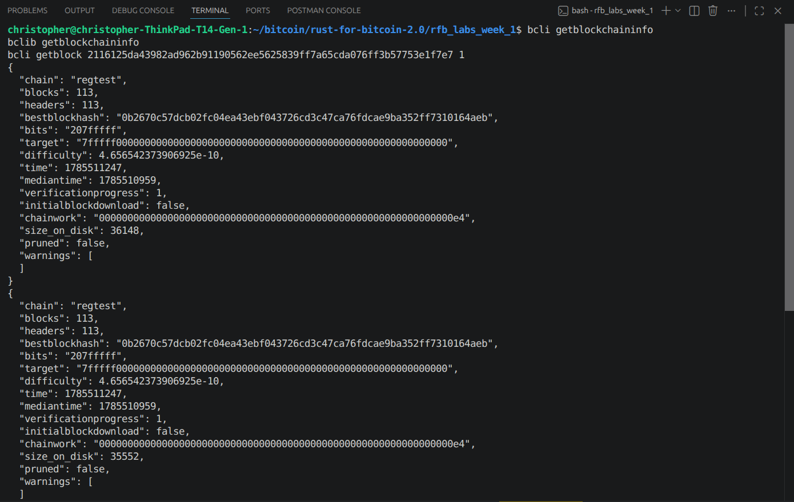

# Lab 10 — Competing branches and reorganization

## Commands used

Node A is the Polar backend (`polar-n1-backend1`). Polar's GUI doesn't expose
scripted node creation, so Node B was added as a second `bitcoind` (same
image, `polarlightning/bitcoind:30.0`) on the same Docker network, reachable
at `172.19.0.6:18444`.

```
docker run -d --name rfb-node-b --network polar-network-1_default \
  -p 19543:18443 -p 19544:18444 polarlightning/bitcoind:30.0 \
  bitcoind -server=1 -regtest=1 -rpcuser=labnode -rpcpassword=labpass \
  -rpcbind=0.0.0.0 -rpcallowip=0.0.0.0/0 -rpcport=18443 -listen=1 -port=18444 \
  -txindex=1 -fallbackfee=0.0002 -dnsseed=0 -discover=0 -natpmp=0 -connect=0

cargo test --test lab_10
bitcoin-cli -regtest addnode 172.19.0.6:18444 add        # A -> B, initial sync
bitcoin-cli -regtest getbestblockhash                     # both nodes
bitcoin-cli -regtest disconnectnode 172.19.0.6:18444
bitcoin-cli -regtest addnode 172.19.0.6:18444 remove
bitcoin-cli -regtest -rpcwallet=miner generatetoaddress 2 <mining address>   # node A, private
bitcoin-cli -regtest -rpcwallet=nodeb generatetoaddress 4 <node B address>  # node B, private
bitcoin-cli -regtest getblockchaininfo                     # both nodes, private tips
bitcoin-cli -regtest addnode 172.19.0.6:18444 add          # reconnect
bitcoin-cli -regtest getblockchaininfo                     # both nodes, after sync
bitcoin-cli -regtest getblock <node A's stale tip> 1        # confirm it's orphaned
```

## Terminal output

```
$ bitcoin-cli -regtest getbestblockhash        # node A, common tip
32b9132dd7e9c89743516c3c27add2afe45fb8c65170f963469d636ab9111ca5
$ bitcoin-cli -regtest getbestblockhash        # node B, common tip (after initial sync)
32b9132dd7e9c89743516c3c27add2afe45fb8c65170f963469d636ab9111ca5
(both at height 109)

--- disconnected, mine privately ---

$ bitcoin-cli -regtest -rpcwallet=miner generatetoaddress 2 <mining address>   # node A
[ "75ad5ab7b878685b330952bfce40fd980773e64df894c41fdf8eb08690381cac",
  "2116125da43982ad962b91190562ee5625839ff7a65cda076ff3b57753e1f7e7" ]

$ bitcoin-cli -regtest -rpcwallet=nodeb generatetoaddress 4 <node B address>   # node B
[ "7dbee02daf3f311322a277947ef9117b5028f4940c691f6b6bda74e6fa3663be",
  "3c6214f55d57a19a3f06eeadb250f35142155a5db90cdf349b5c1c5dc6912bb6",
  "07555d322eae83fb09273de604778c0c3d1e478152a5eaf53dbe981eebb92522",
  "0b2670c57dcb02fc04ea43ebf043726cd3c47ca76fdcae9ba352ff7310164aeb" ]

$ bitcoin-cli -regtest getblockchaininfo   # node A, private tip
"blocks": 111, "bestblockhash": "2116125da43982ad962b91190562ee5625839ff7a65cda076ff3b57753e1f7e7",
"chainwork": "00000000000000000000000000000000000000000000000000000000000000e0"

$ bitcoin-cli -regtest getblockchaininfo   # node B, private tip
"blocks": 113, "bestblockhash": "0b2670c57dcb02fc04ea43ebf043726cd3c47ca76fdcae9ba352ff7310164aeb",
"chainwork": "00000000000000000000000000000000000000000000000000000000000000e4"

--- reconnected ---

$ bitcoin-cli -regtest addnode 172.19.0.6:18444 add
$ bitcoin-cli -regtest getblockchaininfo   # node A, after sync
"blocks": 113, "bestblockhash": "0b2670c57dcb02fc04ea43ebf043726cd3c47ca76fdcae9ba352ff7310164aeb",
"chainwork": "00000000000000000000000000000000000000000000000000000000000000e4"

$ bitcoin-cli -regtest getblockchaininfo   # node B, after sync
"blocks": 113, "bestblockhash": "0b2670c57dcb02fc04ea43ebf043726cd3c47ca76fdcae9ba352ff7310164aeb",
"chainwork": "00000000000000000000000000000000000000000000000000000000000000e4"

$ bitcoin-cli -regtest getblock 2116125da43982ad962b91190562ee5625839ff7a65cda076ff3b57753e1f7e7 1
"confirmations": -1, "height": 111

$ cargo test --test lab_10
running 4 tests
test disconnects_peer_by_address ... ok
test reconnects_peer_for_synchronization ... ok
test reports_convergence_on_the_stronger_branch ... ok
test reads_tip_and_accumulated_chainwork ... ok
test result: ok. 4 passed; 0 failed; 0 ignored; 0 measured; 0 filtered out
```

## Evidence references



- Common tip before the split: height `109`, hash
  `32b9132dd7e9c89743516c3c27add2afe45fb8c65170f963469d636ab9111ca5`,
  identical on both nodes.
- Node A's private tip: height `111`, chainwork ending `...e0` (2 blocks
  added).
- Node B's private tip: height `113`, chainwork ending `...e4` (4 blocks
  added, strictly more accumulated work).
- After reconnecting, **both** nodes converge on height `113`, hash
  `0b2670c57dcb02fc04ea43ebf043726cd3c47ca76fdcae9ba352ff7310164aeb` — node
  A's chainwork now matches node B's exactly.
- Node A's abandoned tip (`2116125d...`, its own second privately-mined
  block) is still known to the node but reports `"confirmations": -1` —
  Core's explicit marker for a block that exists but is no longer part of
  the active chain.

## Explanation

Node A's chain lost simply because once the two nodes reconnected, node B
had more accumulated proof-of-work behind it — 4 blocks' worth against A's
2 — and Core's rule for picking a chain is just "whichever one has the most
total work wins," no exceptions made for anything else. That's the reorg
right there: node A dropped its own two privately-mined blocks and adopted
node B's four instead, because B's chain simply outweighed it.

The reason nodes go by accumulated work instead of something like "who
mined first" or "who says they're right" is that all of that other stuff is
trivial to fake, or can happen by accident from an ordinary network split —
anyone can claim to have been first, and in a system with no admins,
identity doesn't really mean anything anyway. Proof-of-work is different:
you can't fake it without actually burning the real hardware and energy to
produce it, which is exactly why it's the one rule that lets a bunch of
mutually distrusting nodes agree on a single history without needing a
referee.
