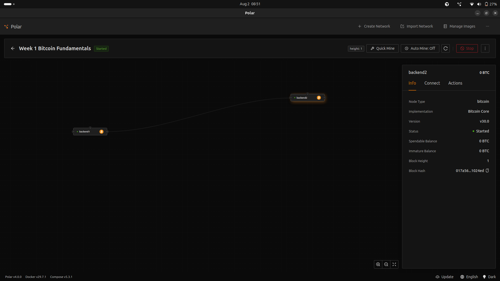
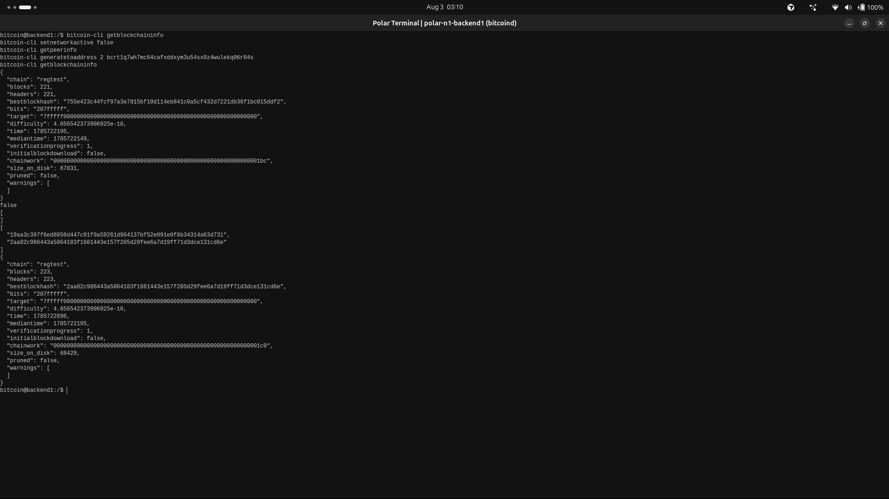
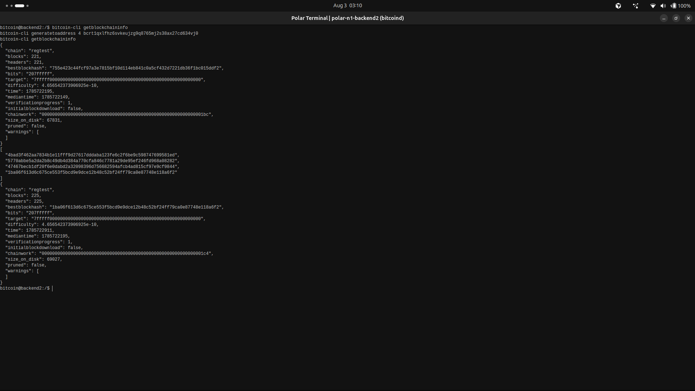
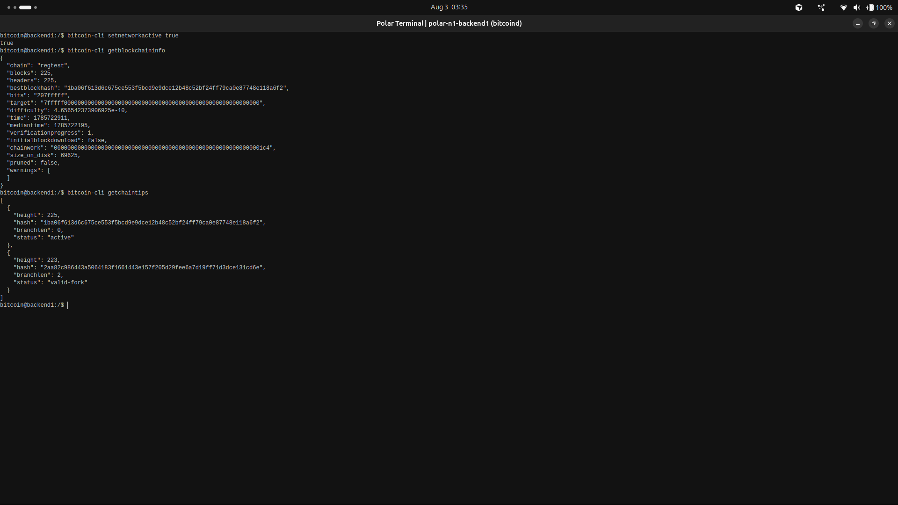

# Lab 10 — Competing branches and reorganization

<!-- Replace every TODO line. The grader scores a section 0 while a TODO remains in it. Rewrite the Explanation in your own words. -->

## Commands used

Polar setup, in the GUI: add a **second** Bitcoin Core node to the
`Week 1 Bitcoin Fundamentals` network, start it, and let both nodes sync.

Below, run each command in the terminal of the node named in the comment.

```bash
# --- Both nodes: record the common tip before splitting. ---
bitcoin-cli getblockchaininfo          # note blocks, bestblockhash, chainwork
bitcoin-cli getpeerinfo                # note the peer address, e.g. <node-b>:18444

# --- Node A: cut the link. ---
bitcoin-cli disconnectnode <node-b-address>
bitcoin-cli getpeerinfo                # should now be empty

# --- Node A: mine two blocks privately. ---
bitcoin-cli generatetoaddress 2 <node-a-address>
bitcoin-cli getblockchaininfo          # short branch tip + chainwork

# --- Node B: mine four blocks privately. ---
bitcoin-cli generatetoaddress 4 <node-b-address>
bitcoin-cli getblockchaininfo          # strong branch tip + chainwork

# --- Node A: reconnect and let them synchronize. ---
bitcoin-cli addnode <node-b-address> onetry

# --- Both nodes: confirm convergence. ---
bitcoin-cli getblockchaininfo          # identical blocks and bestblockhash
```

Tests:

```bash
cargo test --test lab_10
```

`build_reorg_report` compares the two final tips and reports convergence only when
the **best-block hashes** match, not merely the heights.

## Terminal output

Node A is `backend1`, Node B is `backend2`.

**A note on how the split was made.** My first attempt used `disconnectnode` as the
command list above describes, and it did not isolate the nodes. Polar starts both
bitcoind nodes with `-addnode`, so the connection was re-established automatically
before I finished mining. The result was not a fork at all: Node B received Node A's
two blocks, extended them, and both nodes ended on one straight chain with
`getchaintips` reporting a single tip and `branchlen: 0`. I redid the lab using
`setnetworkactive false`, which disables networking outright so bitcoind cannot retry,
and that produced the genuine fork recorded below. The failure is worth stating: a
`disconnectnode` that silently reverses looks exactly like a successful split until
you check `getchaintips`.

### Stage 1 — the common tip, before the split

Node A:

```
$ bitcoin-cli getblockchaininfo
{
  "chain": "regtest",
  "blocks": 221,
  "bestblockhash": "755e423c44fcf97a3e7815bf10d114eb841c0a5cf432d7221db36f1bc015ddf2",
  "chainwork": "00000000000000000000000000000000000000000000000000000000000001bc"
}
```

Node B, at the same moment:

```
$ bitcoin-cli getblockchaininfo
{
  "chain": "regtest",
  "blocks": 221,
  "bestblockhash": "755e423c44fcf97a3e7815bf10d114eb841c0a5cf432d7221db36f1bc015ddf2",
  "chainwork": "00000000000000000000000000000000000000000000000000000000000001bc"
}
```

Identical height, identical tip, identical work. One shared history.

### Stage 2 — cut the link and mine competing branches

Node A isolates itself and confirms it has no peers left:

```
$ bitcoin-cli setnetworkactive false
false

$ bitcoin-cli getpeerinfo
[
]
```

Node A mines two blocks privately:

```
$ bitcoin-cli generatetoaddress 2 bcrt1q7wh7mc64cafxddxym3u54sx9z4wulekq06r04s
[
  "19aa3c397f6ed8056d447c01f9a59261d964137bf52e091e0f8b34314a63d731",
  "2aa82c986443a5064183f1661443e157f205d29fee6a7d19ff71d3dce131cd6e"
]

$ bitcoin-cli getblockchaininfo
{
  "blocks": 223,
  "bestblockhash": "2aa82c986443a5064183f1661443e157f205d29fee6a7d19ff71d3dce131cd6e",
  "chainwork": "00000000000000000000000000000000000000000000000000000000000001c0"
}
```

Node B, checked **before** it mines, still sees the old tip — the proof that the
isolation actually held:

```
$ bitcoin-cli getblockchaininfo
{
  "blocks": 221,
  "bestblockhash": "755e423c44fcf97a3e7815bf10d114eb841c0a5cf432d7221db36f1bc015ddf2",
  "chainwork": "00000000000000000000000000000000000000000000000000000000000001bc"
}
```

Node B mines four blocks on its own:

```
$ bitcoin-cli generatetoaddress 4 bcrt1qxlfhz6svkeujzg9q8765mj2s38ax27cd634vj0
[
  "4bad3f462aa7834b1e11fff9d27617dddaba123fe6c2f6be9c598747699581ed",
  "5770abbe5a2da2b8c49db4d384a770cfa846c7781a29de95ef246fd968a08282",
  "47467becb1df20f6e0dabd2a32098396d756682594afcb4ad815cf97e9cf9844",
  "1ba06f613d6c675ce553f5bcd9e9dce12b48c52bf24ff79ca0e87748e118a6f2"
]

$ bitcoin-cli getblockchaininfo
{
  "blocks": 225,
  "bestblockhash": "1ba06f613d6c675ce553f5bcd9e9dce12b48c52bf24ff79ca0e87748e118a6f2",
  "chainwork": "00000000000000000000000000000000000000000000000000000000000001c4"
}
```

The two chains now disagree:

| | Node A | Node B |
| --- | --- | --- |
| height | 223 | 225 |
| best block | `2aa82c98...131cd6e` | `1ba06f61...e118a6f2` |
| chainwork | `...01c0` (448) | `...01c4` (452) |

Both branches are valid. Both descend from block 221. Node B's carries more work.

### Stage 3 — reconnect and converge

```
$ bitcoin-cli setnetworkactive true
true

$ bitcoin-cli getblockchaininfo
{
  "blocks": 225,
  "bestblockhash": "1ba06f613d6c675ce553f5bcd9e9dce12b48c52bf24ff79ca0e87748e118a6f2",
  "chainwork": "00000000000000000000000000000000000000000000000000000000000001c4"
}
```

Node A now reports height 225 and best-block hash `1ba06f61...e118a6f2` — **Node B's
tip**, matching Node B's earlier output field for field. No command told it to switch.
It saw a branch with more work and reorganized onto it.

The abandoned branch is still on disk:

```
$ bitcoin-cli getchaintips
[
  {
    "height": 225,
    "hash": "1ba06f613d6c675ce553f5bcd9e9dce12b48c52bf24ff79ca0e87748e118a6f2",
    "branchlen": 0,
    "status": "active"
  },
  {
    "height": 223,
    "hash": "2aa82c986443a5064183f1661443e157f205d29fee6a7d19ff71d3dce131cd6e",
    "branchlen": 2,
    "status": "valid-fork"
  }
]
```

Two tips. The active chain, and Node A's own two blocks at height 223 with
`branchlen: 2`, now marked `valid-fork` — valid by every consensus rule, simply not
the chain with the most work. This is what the failed first attempt could not produce:
there, `getchaintips` showed one entry and `branchlen: 0`, which is how I knew no fork
had ever existed.

Tests:

```
$ cargo test --test lab_10
running 4 tests
test reports_convergence_on_the_stronger_branch ... ok
test disconnects_peer_by_address ... ok
test reconnects_peer_for_synchronization ... ok
test reads_tip_and_accumulated_chainwork ... ok

test result: ok. 4 passed; 0 failed; 0 ignored; 0 measured; 0 filtered out; finished in 0.00s
```

## Evidence references



The Polar network view for `Week 1 Bitcoin Fundamentals`, showing `backend1` and
`backend2` on the designer canvas with the link between them, both with green Started
indicators. The right-hand panel has `backend2` selected: Implementation Bitcoin Core,
Version v30.0, Status **Started**. Two real containers, not one node simulating a
second.



Node A's terminal. `setnetworkactive false` returning `false`, `getpeerinfo` returning
an empty `[ ]`, the two block hashes from `generatetoaddress 2`, and the resulting tip
at height **223** with chainwork ending `01c0`.



Node B's terminal at the same time, from `polar-n1-backend2`. Its first
`getblockchaininfo` still reads height **221** with the pre-split hash
`755e423c...015ddf2`, taken after Node A had already mined — the isolation held. Then
its four block hashes and its tip at height **225** with chainwork ending `01c4`.



Node A after `setnetworkactive true`: height **225** and best-block hash
`1ba06f61...e118a6f2`, Node B's tip. Below it the `getchaintips` output listing the
active chain alongside the orphaned `valid-fork` at height 223 with `branchlen: 2`.

Every terminal frame carries its node's prompt — `bitcoin@backend1` or
`bitcoin@backend2` — and the Polar Terminal title bar names the container, so each
stage is attributable to a specific node.

## Explanation

While the nodes are disconnected, each mines on its own copy of the chain and
neither hears the other. Both branches are valid, both descend from the same shared
history, and each node genuinely believes its own tip is correct. This is a fork,
and nothing is wrong yet — a temporary fork is the normal consequence of a
distributed network where blocks take time to propagate.

On reconnection the nodes exchange headers and each evaluates the other's branch.
Node A discovers a valid branch carrying more accumulated work than its own, so it
**reorganizes**: it disconnects its two private blocks, rolls back the state they
produced, connects Node B's four blocks instead, and adopts B's tip. Node B has the
stronger branch already and changes nothing.

A **reorganization** is exactly that switch — a node abandoning blocks it previously
accepted in favour of a branch with more work. Note what does *not* happen: no block
is deleted from existence and no rule is bent. The orphaned blocks were valid; they
simply stopped being part of the chosen history.

Any transaction that existed only in Node A's abandoned blocks returns to the
mempool and can be mined again later. Its coinbase, however, is gone for good — a
coinbase is bound to one specific block. This is precisely the risk that
`COINBASE_MATURITY` in Lab 03 exists to contain.

**The rule is greatest accumulated work, not greatest length.** Those coincide here
because regtest holds difficulty constant, but they are different quantities.
`chainwork` sums the expected hashing effort behind every block in a branch, so a
shorter branch of harder blocks can outweigh a longer branch of easier ones.
Comparing work rather than height is what makes the rule tamper-resistant: producing
blocks is cheap if difficulty is ignored, but accumulating work is not. This is also
why `build_reorg_report` compares best-block **hashes** rather than heights — two
branches can be the same length and still be entirely different chains, so equal
heights would report a false convergence.

What decides the outcome is only the arithmetic of work on a valid branch. **Not
miner identity** — nodes do not know or care who mined a block. **Not arrival
time** — first-seen is a local relay tiebreaker, not a consensus rule, and Node A
saw its own blocks first yet still gave them up. **Not any social claim** — no
announcement, authority, or majority of voices can override a branch with less
work. Every node reaches the same conclusion independently by measuring the same
public number, which is what allows strangers who trust nobody to agree on one
history.
