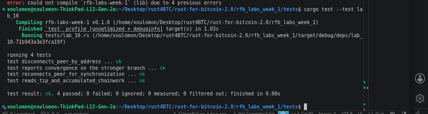

# Lab 10 — Competing branches and reorganization

## Commands used

<!-- TODO: Record peer, mining, chain-tip, and reconnection commands for both nodes. -->
```bash
# Check peer connections
bitcoin-cli getpeerinfo

# Get chain tip before split
bitcoin-cli getblockchaininfo

# Disconnect from Node B
bitcoin-cli disconnectnode "backend2"

# Mine 2 blocks privately
bitcoin-cli generatetoaddress 2 "bcrt1q..."

# Reconnect to Node B
bitcoin-cli addnode "backend2" "onetry"

# Check chain tip after reorg
bitcoin-cli getblockchaininfo
```

## Terminal output

<!-- TODO: Show the common tip, competing tips, chainwork, and final convergence. -->

SHOWING COMMON TIP
```bash
bitcoin@backend1:/$ bitcoin-cli getchaintips
[
  {
    "height": 43,
    "hash": "47207b87b26b037177769bb6c2faeeb1ed31bb43acc82508dc1ffc929778b47e",
    "branchlen": 0,
    "status": "active"
  }
]
bitcoin@backend1:/$ 


bitcoin@backend2:/$ bitcoin-cli getchaintips
[
  {
    "height": 43,
    "hash": "47207b87b26b037177769bb6c2faeeb1ed31bb43acc82508dc1ffc929778b47e",
    "branchlen": 0,
    "status": "active"
  }
]

```

POLAR RECONNECTS NODE AUTOMATICALLY AFTER I DISCONNECT SO NODE ARE STILL IN SYNC
```bash
bitcoin@backend1:/$ bitcoin-cli generatetoaddress 3 bcrt1q8h5fskf88wx9syxlfl43hqttfd2thq4q3j2e2v
[
  "187d9313cd943c7067aed4322a15d07ae9f1bdeb4c29545da81261285cc5ab63",
  "4095e9e643d86561ce95d722c4cd976403f91c5351fe9368ed016a362a41ecd0",
  "279651f0c438381f3d01460a9f6d73b0117a2f55ffc0cddd47474dc1be302ff2"
]
bitcoin@backend1:/$ bitcoin-cli getchaintips
[
  {
    "height": 53,
    "hash": "199e6de7f9a874b875139547a71809a73c95522419c5f450a648c978bc465f3c",
    "branchlen": 0,
    "status": "active"
  }
]
bitcoin@backend1:/$ bitcoin-cli generatetoaddress 3 bcrt1q8h5fskf88wx9syxlfl43hqttfd2thq4q3j2e2v
[
  "3feb0fccfbf42f1d1888b7975af50c248eafb3b91f57c823cc3b3bd86fdee78d",
  "37771035e289c7e369134a82657b097dd300f53bef742938ecab35c484398f99",
  "2539b7ee075365185cb5815fcbe341abe536c6545d12eff1597549ddc8cb17a5"
]
bitcoin@backend1:/$ bitcoin-cli getchaintips
[
  {
    "height": 56,
    "hash": "2539b7ee075365185cb5815fcbe341abe536c6545d12eff1597549ddc8cb17a5",
    "branchlen": 0,
    "status": "active"
  }
]
bitcoin@backend1:/$ 


bitcoin@backend2:/$ bitcoin-cli disconnectnode "" 4
bitcoin@backend2:/$ bitcoin-cli getaddednodeinfo
[
]
bitcoin@backend2:/$ bitcoin-cli generatetoaddress 7 bcrt1q8h5fskf88wx9syxlfl43hqttfd2thq4q3j2e2v
[
  "0ab9acfb1bb5e9364bb82174e73d054339848bbfa0cb11d0a3c3f15e176993f0",
  "299ed4ac3f076d119e50b5d3e48abd3b6f5e6c8c0396e1168323309d2533fb80",
  "29d6e01db8d87a22ad5263db1b6b78b4c82f6c3fa0b03247540e9e2ddf48f4d7",
  "36fc917922adf3862c5d5d1bcd367ab308cc1026f6559b9e76efb23edcaceefb",
  "40474a60e8f0bedb9e7eb25dd7e40fe0be3ca1850d926a3e320beec01badc318",
  "47403aa9b6698813ea5ed1794f7cce956cd1422c0168238f133f5cce7b606497",
  "199e6de7f9a874b875139547a71809a73c95522419c5f450a648c978bc465f3c"
]
bitcoin@backend2:/$ bitcoin-cli getchaintips
[
  {
    "height": 53,
    "hash": "199e6de7f9a874b875139547a71809a73c95522419c5f450a648c978bc465f3c",
    "branchlen": 0,
    "status": "active"
  }
]
bitcoin@backend2:/$ bitcoin-cli getchaintips
[
  {
    "height": 56,
    "hash": "2539b7ee075365185cb5815fcbe341abe536c6545d12eff1597549ddc8cb17a5",
    "branchlen": 0,
    "status": "active"
  }
]
bitcoin@backend2:/$ 
```


## Evidence references

<!-- TODO: Link screenshots or describe the attached evidence. -->
SCREENSHOT OF TEST PASSING IMPLEMEMNTATION OF LAB10



## Explanation

<!-- TODO: Explain the stale branch, reorganization, and most-work-chain rule. -->

Stale branch
When two miners find valid blocks at nearly the same time, the network temporarily has two competing chains ("forks"). Eventually one branch gets built on further and wins — the abandoned branch's blocks are now "stale" (also called orphaned). Transactions in stale blocks aren't confirmed anymore; they go back to the mempool (if still valid).

Reorganization (reorg)
When a node switches from following one chain branch to a different, now-longer/heavier one. It "reorganizes" its view of history — rolling back the stale blocks (undoing their UTXO changes) and applying the new winning chain's blocks instead.

Most-work-chain rule
Nodes always follow whichever valid chain has the most cumulative proof-of-work (not simply the longest by block count — a shorter chain with higher difficulty blocks could theoretically have more work, though in practice they usually align). This is Bitcoin's consensus rule for resolving forks: everyone independently converges on the same chain because everyone follows the same rule.

How they connect: Two chains briefly compete → the one with more accumulated work wins → nodes reorg onto it → the losing branch's blocks become stale → this is exactly why confirmations matter: more blocks on top = more work invested = exponentially less likely to be reorged away.


