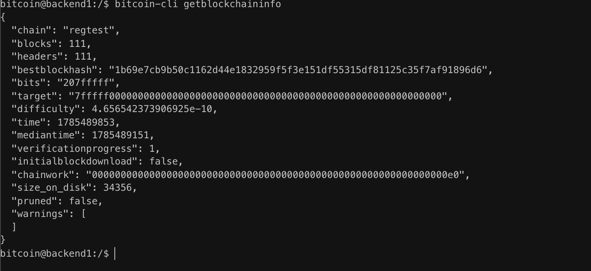

# Lab 10 — Competing branches and reorganization

## Commands used

```bash
bitcoin-cli getblockchaininfo
```

## Terminal output

```text
Chain:
regtest

Height:
111

Headers:
111

Best block hash:
1b69e7cb9b50c1162d44e1832959f5f3e151df55315df81125c35f7af91896d6

Difficulty:
4.656542373906925e-10

Chainwork:
00000000000000000000000000000000000000000000000000000000000000e0
```

## Evidence references

The attached screenshot shows the current chain tip on the regtest node, including the block height, best block hash, difficulty, and accumulated chainwork.



## Explanation

Bitcoin nodes track the tip of the blockchain using the best block hash, current height, and accumulated chainwork. If two nodes become disconnected, they may temporarily build different branches from a common block. When the nodes reconnect, they exchange chain information and compare the accumulated proof of work. The branch with the greatest total chainwork becomes the canonical chain, while blocks on the weaker branch become stale during a chain reorganization. After synchronization, all honest nodes converge on the same chain tip and continue extending the chain with the most accumulated work.