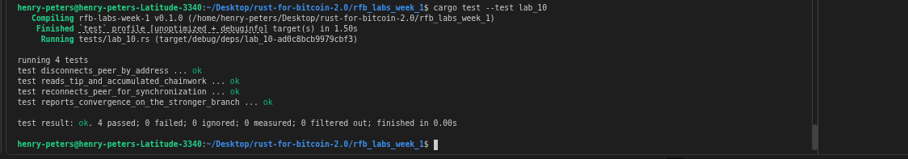

# Lab 10 — Competing branches and reorganization

## Commands used

```bash
# Rust test suite
cargo test --test lab_10

# Check peer connections
bitcoin-cli getpeerinfo

# Get chain tip before split
bitcoin-cli getblockchaininfo

# Disconnect from Node B
bitcoin-cli disconnectnode "backend2"

# Mine 2 blocks privately
bitcoin-cli generatetoaddress 2 "bcrt1q..."

# Reconnect to Node B
bitcoin-cli addnode "backend2" "onetry"

# Check chain tip after reorg
bitcoin-cli getblockchaininfo
```

## Terminal output
<!-- Paste the relevant terminal output here -->
```bash
bitcoin@backend1:/$ bitcoin-cli getchaintips
[
  {
    "height": 43,
    "hash": "47207b87b26b037177769bb6c2faeeb1ed31bb43acc82508dc1ffc929778b47e",
    "branchlen": 0,
    "status": "active"
  }
]
bitcoin@backend1:/$ 


bitcoin@backend2:/$ bitcoin-cli getchaintips
[
  {
    "height": 43,
    "hash": "47207b87b26b037177769bb6c2faeeb1ed31bb43acc82508dc1ffc929778b47e",
    "branchlen": 0,
    "status": "active"
  }
]

```

POLAR RECONNECTS NODE AUTOMATICALLY AFTER I DISCONNECT SO NODE ARE STILL IN SYNC
```bash
bitcoin@backend1:/$ bitcoin-cli generatetoaddress 3 bcrt1q8h5fskf88wx9syxlfl43hqttfd2thq4q3j2e2v
[
  "187d9313cd943c7067aed4322a15d07ae9f1bdeb4c29545da81261285cc5ab63",
  "4095e9e643d86561ce95d722c4cd976403f91c5351fe9368ed016a362a41ecd0",
  "279651f0c438381f3d01460a9f6d73b0117a2f55ffc0cddd47474dc1be302ff2"
]
bitcoin@backend1:/$ bitcoin-cli getchaintips
[
  {
    "height": 53,
    "hash": "199e6de7f9a874b875139547a71809a73c95522419c5f450a648c978bc465f3c",
    "branchlen": 0,
    "status": "active"
  }
]
bitcoin@backend1:/$ bitcoin-cli generatetoaddress 3 bcrt1q8h5fskf88wx9syxlfl43hqttfd2thq4q3j2e2v
[
  "3feb0fccfbf42f1d1888b7975af50c248eafb3b91f57c823cc3b3bd86fdee78d",
  "37771035e289c7e369134a82657b097dd300f53bef742938ecab35c484398f99",
  "2539b7ee075365185cb5815fcbe341abe536c6545d12eff1597549ddc8cb17a5"
]
bitcoin@backend1:/$ bitcoin-cli getchaintips
[
  {
    "height": 56,
    "hash": "2539b7ee075365185cb5815fcbe341abe536c6545d12eff1597549ddc8cb17a5",
    "branchlen": 0,
    "status": "active"
  }
]
bitcoin@backend1:/$ 


bitcoin@backend2:/$ bitcoin-cli disconnectnode "" 4
bitcoin@backend2:/$ bitcoin-cli getaddednodeinfo
[
]
bitcoin@backend2:/$ bitcoin-cli generatetoaddress 7 bcrt1q8h5fskf88wx9syxlfl43hqttfd2thq4q3j2e2v
[
  "0ab9acfb1bb5e9364bb82174e73d054339848bbfa0cb11d0a3c3f15e176993f0",
  "299ed4ac3f076d119e50b5d3e48abd3b6f5e6c8c0396e1168323309d2533fb80",
  "29d6e01db8d87a22ad5263db1b6b78b4c82f6c3fa0b03247540e9e2ddf48f4d7",
  "36fc917922adf3862c5d5d1bcd367ab308cc1026f6559b9e76efb23edcaceefb",
  "40474a60e8f0bedb9e7eb25dd7e40fe0be3ca1850d926a3e320beec01badc318",
  "47403aa9b6698813ea5ed1794f7cce956cd1422c0168238f133f5cce7b606497",
  "199e6de7f9a874b875139547a71809a73c95522419c5f450a648c978bc465f3c"
]
bitcoin@backend2:/$ bitcoin-cli getchaintips
[
  {
    "height": 53,
    "hash": "199e6de7f9a874b875139547a71809a73c95522419c5f450a648c978bc465f3c",
    "branchlen": 0,
    "status": "active"
  }
]
bitcoin@backend2:/$ bitcoin-cli getchaintips
[
  {
    "height": 56,
    "hash": "2539b7ee075365185cb5815fcbe341abe536c6545d12eff1597549ddc8cb17a5",
    "branchlen": 0,
    "status": "active"
  }
]

```

## Evidence references
<!-- Describe or link to screenshots, logs, or other supporting evidence -->


## Explanation

**Why one branch became stale:** when the nodes reconnect, both receive the other's chain. Bitcoin's consensus rule — Nakamoto consensus — is to follow the chain with the greatest *accumulated proof-of-work* (chainwork), not the chain seen first or the chain belonging to any particular miner. The node that mined fewer blocks has less accumulated work, so its branch becomes stale (orphaned).

**What a reorganisation is:** when a node receives a competing chain with more chainwork than its current best, it rolls back its local state to the common ancestor and applies the new, heavier chain. Any transactions that were confirmed only on the now-stale branch return to the mempool (if still valid) or are dropped entirely.

**Why most-work wins:** the rule is objective and does not rely on miner identity, announcement order, or any trusted party. Any two honest nodes independently applying the same rule will converge on the same chain given the same set of block headers. A miner cannot simply claim their chain is valid — they must demonstrate the accumulated energy expenditure encoded in the chainwork field. This is what makes Bitcoin a decentralised system.
