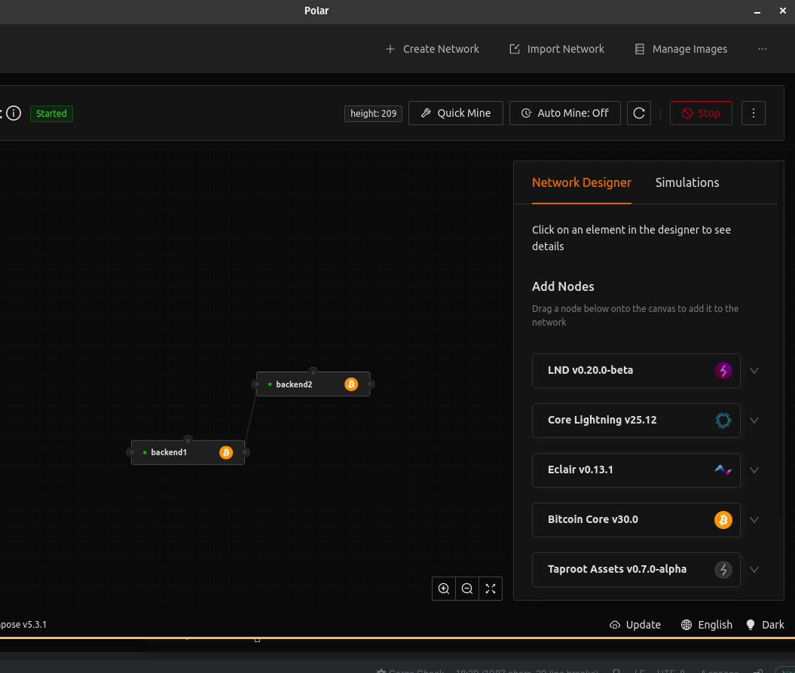

# Lab 10 — Competing branches and reorganization

## Commands used

TODO: Record peer, mining, chain-tip, and reconnection commands for both nodes.
bitcoin-cli -regtest getblockchaininfo
bitcoin@backend1:/$ bitcoin-cli getpeerinfo

## Terminal output

TODO: Show the common tip, competing tips, chainwork, and final convergence.
```bash

bitcoin@backend1:/$ bitcoin-cli getpeerinfo
[
  {
    "id": 0,
    "addr": "172.19.0.3:46792",
    "addrbind": "172.19.0.2:18444",
    "network": "not_publicly_routable",
    "services": "0000000000000c49",
    "servicesnames": [
      "NETWORK",
      "WITNESS",
      "COMPACT_FILTERS",
      "NETWORK_LIMITED",
      "P2P_V2"
    ],
    "relaytxes": true,
    "lastsend": 1785536667,
    "lastrecv": 1785536667,
    "last_transaction": 0,
    "last_block": 0,
    "bytessent": 116376,
    "bytesrecv": 20913,
    "conntime": 1785536650,
    "timeoffset": 0,
    "pingtime": 0.004428,
    "minping": 0.004428,
    "version": 70016,
    "subver": "/Satoshi:30.0.0/",
    "inbound": true,
    "bip152_hb_to": false,
    "bip152_hb_from": true,
    "startingheight": 0,
    "presynced_headers": -1,
    "synced_headers": -1,
    "synced_blocks": -1,
    "inflight": [],
    "addr_relay_enabled": true,
    "addr_processed": 0,
    "addr_rate_limited": 0,
    "permissions": [],
    "minfeefilter": 0.00000100,
    "bytessent_per_msg": {
      "block": 85199,
      "feefilter": 29,
      "getheaders": 698,
      "headers": 25134,
      "inv": 166,
      "ping": 29,
      "pong": 29,
      "sendaddrv2": 33,
      "sendcmpct": 30,
      "tx": 972,
      "verack": 33,
      "version": 135,
      "wtxidrelay": 33
    },
    "bytesrecv_per_msg": {
      "feefilter": 58,
      "getaddr": 33,
      "getdata": 17816,
      "getheaders": 90,
      "headers": 22,
      "ping": 29,
      "pong": 29,
      "sendaddrv2": 33,
      "sendcmpct": 60,
      "sendheaders": 33,
      "verack": 33,
      "version": 135,
      "wtxidrelay": 33
    },
    "connection_type": "inbound",
    "transport_protocol_type": "v2",
    "session_id": "bc5725924cfb54b31af4adb85fa621e1a52db45dd417023842e2c96eb5761ddd"
  }
]

bitcoin@backend1:/$ bitcoin-cli getpeerinfo
[
]
```

## Evidence references

TODO: Link screenshots or describe the attached evidence.


## Explanation

TODO: Explain the stale branch, reorganization, and most-work-chain rule.
- When the network splits, the branch that eventually has less accumulated work becomes stale. It is a valid version of history that is simply ignored by the network in favor of a stronger one
- This occurs when a node receives a new branch that is stronger than its current active chain. The node will "undo" the blocks in its local active chain and replace them with the new, stronger valid branch to remain in consensus with the rest of the network
- This is the "Golden Rule" of Bitcoin consensus. Nodes do not necessarily follow the "longest" chain by height, but the valid chain with the greatest accumulated proof of work