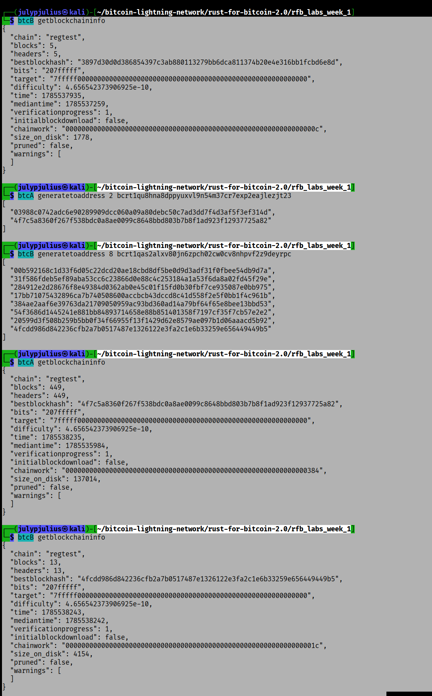

# Lab 10 — Competing branches and reorganization

## Commands used
After aliasing in the terminal here are the commands
```
btcA getpeerinfo   # confirm A has no peers (isolated)
btcB getpeerinfo   # confirm B has no peers (isolated)

btcA -rpcwallet=miner getnewaddress
btcB createwallet miner2
btcB -rpcwallet=miner2 getnewaddress

btcA getblockchaininfo   # record starting tip A (447 blocks)
btcB getblockchaininfo   # record starting tip B (5 blocks)

btcA generatetoaddress 2 <address-A>
btcB generatetoaddress 8 <address-B>

btcA getblockchaininfo   # record competing tip A
btcB getblockchaininfo   # record competing tip B

btcA addnode "172.17.0.1:19446" onetry
btcB addnode "172.17.0.1:19444" onetry

btcA getblockchaininfo   # record final tip A
btcB getblockchaininfo   # record final tip B
```

## Terminal output

THe evidence is shown in the screenshot below

## Evidence references



## Explanation

While the two nodes were disconnected, each mined its own private chain,
unaware of the other's blocks — a **stale branch** is exactly this: a
valid chain of blocks that isn't part of the network's ultimate, agreed
history, because a competing chain with more accumulated proof-of-work
exists elsewhere. **Reorganization** happens when a node discovers a
peer's chain has more total work than its own current chain — it
discards ("orphans") its own blocks back to the point where the chains
diverge, and adopts the other chain instead. This is governed by the
**most-work-chain rule**: nodes always follow whichever valid chain
represents the greatest cumulative proof-of-work, not the longest chain
by block count and not whichever chain they saw first — since work, not
length, is what makes a chain expensive and difficult to fake.
