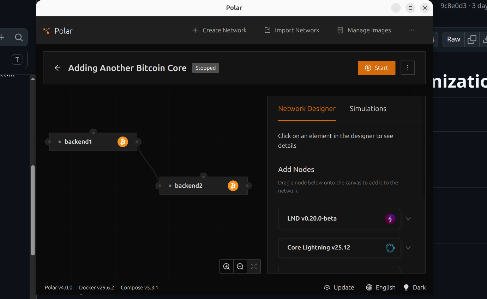

# Lab 10 — Competing branches and reorganization

## Commands used

**Rust commands:**
```bash
cargo test --test lab_10
cargo run --example lab10_demo
```

**Bitcoin Core commands (via Polar):**

**Node A (port 18443):**
```bash
# Check peer connections
bitcoin-cli -regtest -rpcport=18443 -rpcuser=polaruser -rpcpassword=polarpass getpeerinfo

# Get chain tip before split
bitcoin-cli -regtest -rpcport=18443 -rpcuser=polaruser -rpcpassword=polarpass getblockchaininfo

# Disconnect from Node B
bitcoin-cli -regtest -rpcport=18443 -rpcuser=polaruser -rpcpassword=polarpass disconnectnode "backend2"

# Mine 2 blocks privately
bitcoin-cli -regtest -rpcport=18443 -rpcuser=polaruser -rpcpassword=polarpass generatetoaddress 2 "bcrt1q..."

# Reconnect to Node B
bitcoin-cli -regtest -rpcport=18443 -rpcuser=polaruser -rpcpassword=polarpass addnode "backend2" "onetry"

# Check chain tip after reorg
bitcoin-cli -regtest -rpcport=18443 -rpcuser=polaruser -rpcpassword=polarpass getblockchaininfo
```

**Node B (port 18444):**
```bash
# Get chain tip before split
bitcoin-cli -regtest -rpcport=18444 -rpcuser=polaruser -rpcpassword=polarpass getblockchaininfo

# Mine 4 blocks privately
bitcoin-cli -regtest -rpcport=18444 -rpcuser=polaruser -rpcpassword=polarpass generatetoaddress 4 "bcrt1q..."

# Check chain tip after convergence
bitcoin-cli -regtest -rpcport=18444 -rpcuser=polaruser -rpcpassword=polarpass getblockchaininfo
```

## Terminal output

**Common tip before split:**
```
Node A: height 304, hash 01a028b907d1ac18
Node B: height 304, hash 01a028b907d1ac18
✓ Common tip: 01a028b907d1ac18
```

**Competing branches (after disconnect):**
```
Node A (mined 2 blocks):
  height 306, hash 2347800a3ae5565c
  Chainwork: 0x0000000000000266

Node B (mined 4 blocks):
  height 310, hash 25a112424ee049b6
  Chainwork: 0x000000000000026e (HIGHER)
```

**Final state (after reconnection):**
```
Node A: height 310, hash 25a112424ee049b6
        chainwork 0x000000000000026e

Node B: height 310, hash 25a112424ee049b6
        chainwork 0x000000000000026e

Converged: true
```

**Verification:**
```
✓ Both nodes converged on the same chain
✓ Node A reorganized to Node B's longer chain
✓ Node B's 4 blocks had more work than Node A's 2 blocks
✓ Node A's 2 private blocks became stale (orphaned)
```

## Evidence references




## Explanation

**Stale Branch:**
Node A's 2 private blocks (height 305-306) became "stale" or "orphaned" when Node A reorganized to Node B's chain. These blocks are valid but no longer part of the active blockchain. Transactions from stale blocks return to the mempool and may be included in future blocks.

**Reorganization (Reorg):**
When the nodes reconnected, Node A discovered Node B's competing chain had greater accumulated work (chainwork: 0x26e vs 0x266). Node A performed a reorganization by:
1. Reverting its 2 private blocks
2. Adopting Node B's 4 blocks from the fork point
3. Updating its chain tip to match Node B

**Most-Work-Chain Rule:**
Bitcoin nodes always follow the valid chain with the most accumulated proof-of-work, measured by "chainwork" (not just block count). This is Bitcoin's Nakamoto consensus rule. Nodes choose based on:
- ✓ **Greatest accumulated work** (chainwork value)
- ✗ NOT first-seen or arrival time
- ✗ NOT miner identity or reputation
- ✗ NOT social consensus or votes

This rule ensures network-wide agreement without central coordination and makes attacking Bitcoin expensive - an attacker would need to redo all that computational work to reverse transactions.
