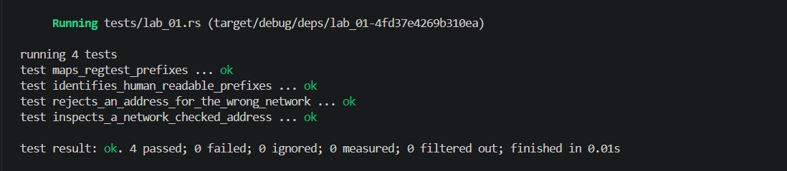

## Commands used

```bash
cargo test --test lab_01
cargo fmt --check
cargo clippy -- -D warnings
```

## Terminal output

```
running 4 tests
test identifies_human_readable_prefixes ... ok
test maps_regtest_prefixes ... ok
test inspects_a_network_checked_address ... ok
test rejects_an_address_for_the_wrong_network ... ok

test result: ok. 4 passed; 0 failed; 0 ignored; 0 measured; 0 filtered out; finished in 0.00s
```

## Evidence references


## Explanation

A Base58Check prefix (e.g., `1` for mainnet P2PKH, `m`/`n` for regtest) is a human-readable clue about an address's intended network and script type, but it is not sufficient on its own for validation. The embedded checksum—derived from a double-SHA256 hash of the payload—provides error detection, catching transcription mistakes such as swapped or mistyped characters that a prefix alone would miss. Network validation goes further by verifying that the version byte matches the expected network (mainnet, testnet, or regtest), preventing funds from being sent to an address that belongs to a different chain. Together, prefix inspection, checksum verification, and network matching form the three layers that make address handling safe and reliable.
