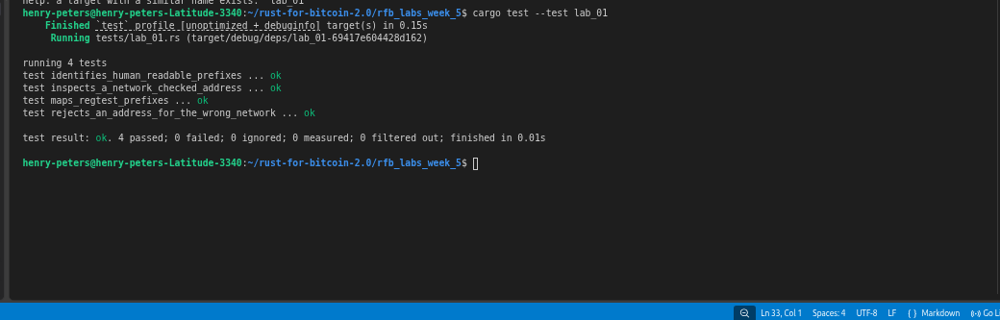

# Lab 01 — Address and network identification

## Commands used
```bash
cargo test --tests lab_01.rs
```

## Terminal output

```bash
  henry-peters@henry-peters-Latitude-3340:~/rust-for-bitcoin-2.0/rfb_labs_week_5$ cargo test --test lab_01
    Finished `test` profile [unoptimized + debuginfo] target(s) in 0.15s
     Running tests/lab_01.rs (target/debug/deps/lab_01-69417e604428d162)

    running 4 tests
    test identifies_human_readable_prefixes ... ok
    test inspects_a_network_checked_address ... ok
    test maps_regtest_prefixes ... ok
    test rejects_an_address_for_the_wrong_network ... ok

    test result: ok. 4 passed; 0 failed; 0 ignored; 0 measured; 0 filtered out; finished in 0.01s
```

## Evidence references



## Explanation
1. Checksum: A prefix like "1" only tells you the format family. The Base58Check checksum (P2PKH/P2SH) or Bech32/Bech32m error detection (SegWit) is what verifies the address
bytes are valid and uncorrupted. A made-up string starting with "1" would pass prefix inspection but fail checksum.
2. Network: Different networks share prefixes (e.g. regtest and testnet P2PKH both use "m"/"n"), so you must parse and verify the network explicitly — the prefix alone doesn'
t distinguish them.
