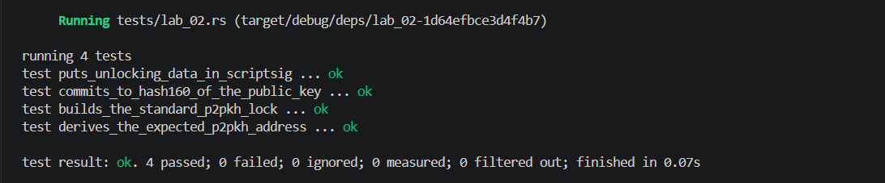

## Commands used

```bash
cargo test --test lab_02
cargo fmt --check
cargo clippy -- -D warnings
```

## Terminal output

```
running 4 tests
test derives_the_expected_p2pkh_address ... ok
test builds_the_standard_p2pkh_lock ... ok
test commits_to_hash160_of_the_public_key ... ok
test puts_unlocking_data_in_scriptsig ... ok

test result: ok. 4 passed; 0 failed; 0 ignored; 0 measured; 0 filtered out; finished in 0.00s
```

## Evidence references


## Explanation

Key identity and spend authorization are distinct concepts in Bitcoin's UTXO model. A P2PKH address is the Hash160 (RIPEMD-160 of SHA-256) of a compressed public key, serving as a compact identity marker that commits to the key without revealing it. Spend authorization, however, requires supplying the full public key and a valid digital signature in the scriptSig to satisfy the `OP_DUP OP_HASH160 <pubkeyhash> OP_EQUALVERIFY OP_CHECKSIG` script. The address (hash) identifies *who* can spend, while the signature and public key together prove *that* the rightful owner is authorizing the spend. This separation keeps addresses short and opaque while shifting the cryptographic proof entirely to the spending transaction.
