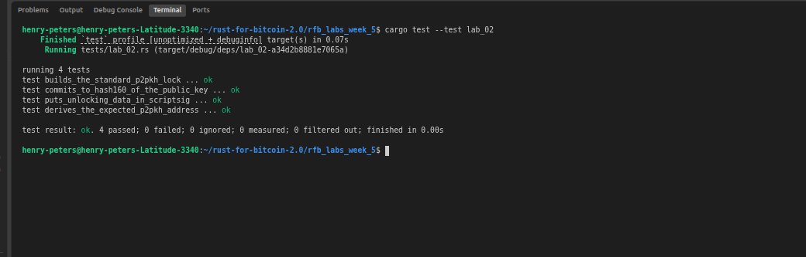

# Lab 02 — Legacy P2PKH

## Commands used

cargo test --test lab_02

## Terminal output

henry-peters@henry-peters-Latitude-3340:~/rust-for-bitcoin-2.0/rfb_labs_week_5$ cargo test --test lab_02
    Finished `test` profile [unoptimized + debuginfo] target(s) in 0.07s
     Running tests/lab_02.rs (target/debug/deps/lab_02-a34d2b8881e7065a)

running 4 tests
test builds_the_standard_p2pkh_lock ... ok
test commits_to_hash160_of_the_public_key ... ok
test puts_unlocking_data_in_scriptsig ... ok
test derives_the_expected_p2pkh_address ... ok

test result: ok. 4 passed; 0 failed; 0 ignored; 0 measured; 0 filtered out; finished in 0.00s
## Evidence references

## Explanation

TODO: Explain P2PKH locking and unlocking in your own words.

P2PKH locking is the process of locking/binding bitcoins to a scriptPubKey an address. For example; 
if Alice wants to send 2 BTC to Bob, Bob sends his address(PPKH format) to Alice, then Alices' wallet decodes the address to get the public key hash then constructs the scriptpubkey, after that the wallet then binds Alicess' 2 BTC to the scriptPubkey that was just constructed. This procees creates an output. this is the P2PKH locking
    While P2PKH unlocking is the process of referncing and output(btc + scriptpubkey) by providing the unlocking data that satisfies the locking script(scriptpubkey). For example, if Bob wants to spend that 2 Bitcoin, he must provide the public key and signature to unlock that output.