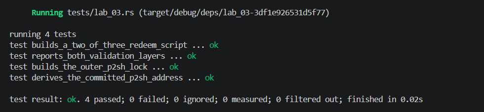

## Commands used

```bash
cargo test --test lab_03
cargo fmt --check
cargo clippy -- -D warnings
```

## Terminal output

```
running 4 tests
test builds_a_two_of_three_redeem_script ... ok
test derives_the_committed_p2sh_address ... ok
test builds_the_outer_p2sh_lock ... ok
test reports_both_validation_layers ... ok

test result: ok. 4 passed; 0 failed; 0 ignored; 0 measured; 0 filtered out; finished in 0.00s
```

## Evidence references


## Explanation

In P2SH, the outer script locks funds to the Hash160 of a redeem script, and the address encodes only that hash. Matching the script hash is necessary to confirm that the spender provides the correct redeem script, but it does not itself enforce the inner policy. The inner multisig rule (e.g., 2-of-3) is enforced only when the redeem script is evaluated during spending, requiring the correct number of valid signatures. This two-layer design separates address verification from policy enforcement: the outer layer ensures the right script is presented, while the inner layer enforces the actual spending conditions.
