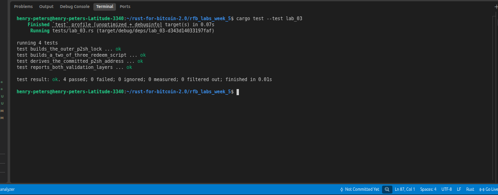

# Lab 03 — P2SH 2-of-3 multisig

## Commands used
```bash
cargo test --test lab_03
```

## Terminal output

```bash
henry-peters@henry-peters-Latitude-3340:~/rust-for-bitcoin-2.0/rfb_labs_week_5$ cargo test --test lab_03
    Finished `test` profile [unoptimized + debuginfo] target(s) in 0.24s
     Running tests/lab_03.rs (target/debug/deps/lab_03-d343d14033197faf)

running 4 tests
test builds_a_two_of_three_redeem_script ... ok
test builds_the_outer_p2sh_lock ... ok
test derives_the_committed_p2sh_address ... ok
test reports_both_validation_layers ... ok

test result: ok. 4 passed; 0 failed; 0 ignored; 0 measured; 0 filtered out; finished in 0.01s

```
## Evidence references



## Explanation

TODO: Explain the outer hash check and inner multisig check.
P2SH has two validation layers. The outer check verifies that the redeemScript you provide hashes to the script hash committed in the scriptPubKey — 
OP_HASH160 <scriptHash> OP_EQUAL. This proves you know the script that was originally locked to this address, but it says nothing about whether you're authorized to spend 
it.

The inner check is what enforces the actual spending rule. For a 2-of-3 multisig redeemScript (2 <pub1> <pub2> <pub3> 3 OP_CHECKMULTISIG), the script is executed and 
requires at least 2 valid signatures from the 3 listed public keys. Passing the outer hash check only proves script identity — you still must satisfy the inner multisig 
condition to actually spend the output.

So matching the script hash is necessary but not sufficient: it tells the network "this is the right script", but you still need 2 private keys to sign the transaction and 
prove authorization.

