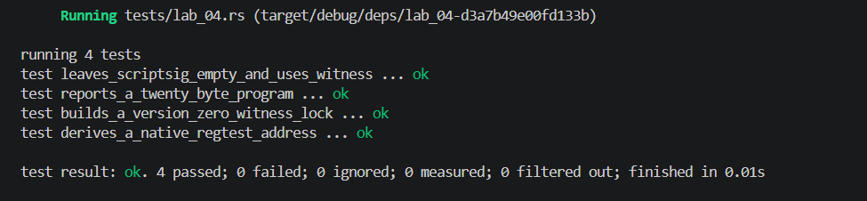

## Commands used

```bash
cargo test --test lab_04
cargo fmt --check
cargo clippy -- -D warnings
```

## Terminal output

```
running 4 tests
test derives_a_native_regtest_address ... ok
test builds_a_version_zero_witness_lock ... ok
test reports_a_twenty_byte_program ... ok
test leaves_scriptsig_empty_and_uses_witness ... ok

test result: ok. 4 passed; 0 failed; 0 ignored; 0 measured; 0 filtered out; finished in 0.00s
```

## Evidence references


## Explanation

P2WPKH (native SegWit) differs from P2PKH and P2SH-wrapped SegWit in three key ways. First, the lock script is a version-0 witness program (`OP_0 <20-byte-hash>`), so the spending condition is evaluated entirely in the witness data rather than the scriptSig, which is left empty. Second, unlike P2SH-wrapped SegWit (which nests the witness program inside a redeem script for backward compatibility), native P2WPKH uses bech32 (`bc1q...` on mainnet) encoding directly, making it structurally distinct. Third, because the witness is serialized separately per BIP 141, P2WPKH transactions benefit from discounted weight units and eliminate malleability of the signature data—advantages that neither legacy P2PKH nor P2SH-wrapped formats fully achieve.
