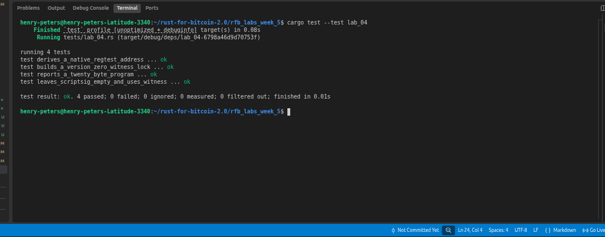

# Lab 04 — Native P2WPKH

## Commands used

```bash
cargo test --test lab_04
```

## Terminal output

```bash
henry-peters@henry-peters-Latitude-3340:~/rust-for-bitcoin-2.0/rfb_labs_week_5$ cargo test --test lab_04
   Compiling rfb-labs-week-5 v0.1.0 (/home/henry-peters/rust-for-bitcoin-2.0/rfb_labs_week_5)
    Finished `test` profile [unoptimized + debuginfo] target(s) in 1.36s
     Running tests/lab_04.rs (target/debug/deps/lab_04-6798a46d9d70753f)

running 4 tests
test builds_a_version_zero_witness_lock ... ok
test derives_a_native_regtest_address ... ok
test leaves_scriptsig_empty_and_uses_witness ... ok
test reports_a_twenty_byte_program ... ok

test result: ok. 4 passed; 0 failed; 0 ignored; 0 measured; 0 filtered out; finished in 0.01s
```

## Evidence references



## Explanation

TODO: Explain why native P2WPKH has an empty ScriptSig.

Initially in legacy transaction(P2PKH), signature and public key were placed in the ScriptSig field of the transaction input but in P2WPH, a separate witness field for each input was introduced, so the signature and public key were moved entirely into this witness field, leaving 
ScriptSig empty (zero bytes)
These are the reasons:
1. Fee discount: Witness data is given a discount — it costs 1 weight unit per byte instead of 4. Since the signature and pubkey are the largest part of an input, moving them
to witness significantly reduces the effective virtual size (vBytes) and therefore the fee. This is why P2WPKH inputs are ~41% cheaper than P2PKH.

2. Transaction malleability fix: In legacy transactions, a third party could modify the ScriptSig (e.g. by adding extra pushes) without invalidating the signature, changing 
the transaction ID (txid). By moving unlocking data out of the part that's hashed for the txid, SegWit fixes this — the witness is committed separately, so the txid is 
stable.