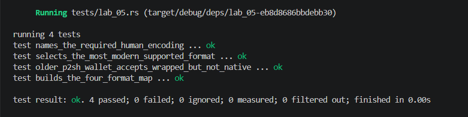

## Commands used

```bash
cargo test --test lab_05
cargo fmt --check
cargo clippy -- -D warnings
```

## Terminal output

```
running 4 tests
test older_p2sh_wallet_accepts_wrapped_but_not_native ... ok
test builds_the_four_format_map ... ok
test selects_the_most_modern_supported_format ... ok
test names_the_required_human_encoding ... ok

test result: ok. 4 passed; 0 failed; 0 ignored; 0 measured; 0 filtered out; finished in 0.00s
```

## Evidence references


## Explanation

An older P2SH-only wallet accepts wrapped SegWit (P2SH-P2WPKH) because it sees a standard P2SH address format (`3...`) and a redeem script in the scriptSig, both of which it understands. It rejects native SegWit (`bc1q...`) because bech32 addresses and version-0 witness programs were introduced by BIP 141/173 and are unrecognized by pre-SegWit software. Sending support differs from spending support: a wallet may be able to *send* to a bech32 address (by treating it as an opaque destination) without being able to *spend* from one (since spending requires witness deserialization). This asymmetry means format selection must account for both the sender's and receiver's capabilities, often defaulting to the most modern format the receiving wallet can actually spend from.
