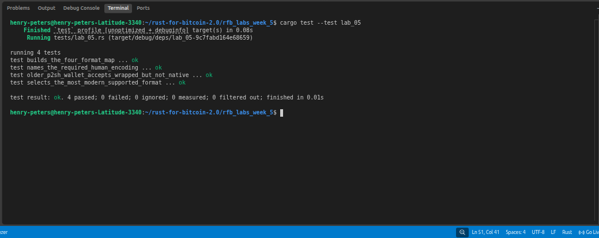

# Lab 05 — Address compatibility map

## Commands used
```bash
cargo test --test lab_05
```

## Terminal output

```bash
henry-peters@henry-peters-Latitude-3340:~/rust-for-bitcoin-2.0/rfb_labs_week_5$ cargo test --test lab_05
   Compiling rfb-labs-week-5 v0.1.0 (/home/henry-peters/rust-for-bitcoin-2.0/rfb_labs_week_5)
    Finished `test` profile [unoptimized + debuginfo] target(s) in 0.49s
     Running tests/lab_05.rs (target/debug/deps/lab_05-9c7fabd164e68659)

running 4 tests
test builds_the_four_format_map ... ok
test names_the_required_human_encoding ... ok
test older_p2sh_wallet_accepts_wrapped_but_not_native ... ok
test selects_the_most_modern_supported_format ... ok

test result: ok. 4 passed; 0 failed; 0 ignored; 0 measured; 0 filtered out; finished in 0.00s
```

## Evidence references



## Explanation

TODO: Explain why a P2SH-era wallet may accept 3... but reject bc1q....

- An older wallet that predates SegWit understands Base58Check encoding (used by P2PKH and P2SH), so it can construct a transaction output to a 3... address. It has no 
concept of Bech32 encoding, so it can't even parse a bc1q... address — it would reject it as invalid before any transaction is built.
- Sending support and spending support are different things. A wallet only needs to encode the recipient's address format to send — it doesn't need to understand the locking 
script internally. Spending requires the wallet to sign according to the script rules, which needs explicit support for that script type. So a wallet might be able to send to
a 3... address without being able to spend from one.