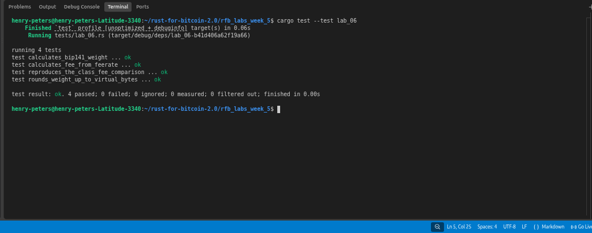

# Lab 06 — Weight, virtual size, and fees

## Commands used

```bash
cargo test --test lab_06
```

## Terminal output

```bash
running 4 tests
test calculates_bip141_weight ... ok
test calculates_fee_from_feerate ... ok
test reproduces_the_class_fee_comparison ... ok
test rounds_weight_up_to_virtual_bytes ... ok

test result: ok. 4 passed; 0 failed; 0 ignored; 0 measured; 0 filtered out; finished in 0.00s
```

## Evidence references



## Explanation

SegWit introduces a two-tier weight system rather than a flat discount. Every byte of a transaction has a weight, but witness data and non-witness data are counted differently. Non-witness bytes (version, inputs, outputs, locktime) each count as 4 weight units. Witness bytes count as only 1 weight unit. The formula is:

    weight = stripped_size × 3 + total_size

Where `stripped_size` is the serialized size excluding witness fields, and `total_size` includes them. Virtual size is then `ceil(weight / 4)`, which collapses back to a single vByte number for fee calculation.

This is not a flat whole-transaction discount because only the witness portion gets the reduced weight. The non-witness parts of a SegWit transaction cost exactly the same per byte as a legacy transaction. A P2WPKH input is cheaper than a P2PKH input specifically because the large signature and public key data have moved into the witness field — not because SegWit transactions are universally lighter.

For the class comparison: a typical P2PKH transaction is ~226 vB, and a P2WPKH transaction is ~141 vB. At 50 sat/vB, that is 11,300 sat vs 7,050 sat — a saving of 4,250 sat.
