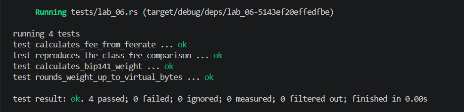

## Commands used

```bash
cargo test --test lab_06
cargo fmt --check
cargo clippy -- -D warnings
```

## Terminal output

```
running 4 tests
test calculates_bip141_weight ... ok
test rounds_weight_up_to_virtual_bytes ... ok
test calculates_fee_from_feerate ... ok
test reproduces_the_class_fee_comparison ... ok

test result: ok. 4 passed; 0 failed; 0 ignored; 0 measured; 0 filtered out; finished in 0.00s
```

## Evidence references


## Explanation

BIP 141 assigns a weight of 1 base unit to non-witness data and 1/4 unit (effectively 1 weight unit per 4 virtual bytes) to witness data, then divides total weight by 4 and rounds up to get vsize. This is not a flat whole-transaction discount because the discount applies only to the witness portion, creating an incentive to move as much data as possible into the witness field. A legacy P2PKH transaction with no witness gets no discount at all (weight = 4 × vsize), while a native P2WPKH transaction shifts the signature and public key into the witness, reducing its vsize and therefore its fee at any given sat/vB feerate. This per-byte differential is what makes SegWit transaction classes cheaper without undermining the block size limit, which is expressed in weight units rather than raw bytes.
