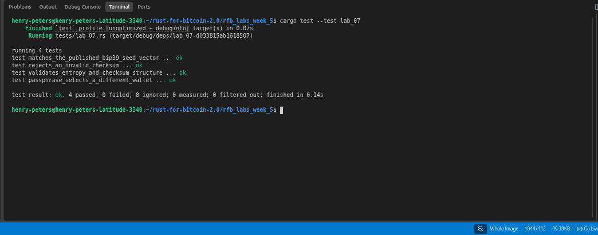

# Lab 07 — BIP39 mnemonic and seed

## Commands used

```bash
cargo test --test lab_07
```

## Terminal output

```bash
running 4 tests
test matches_the_published_bip39_seed_vector ... ok
test rejects_an_invalid_checksum ... ok
test validates_entropy_and_checksum_structure ... ok
test passphrase_selects_a_different_wallet ... ok

test result: ok. 4 passed; 0 failed; 0 ignored; 0 measured; 0 filtered out; finished in 0.17s
```

## Evidence references



## Explanation

**Entropy** is the raw random data that seeds the wallet — for a 12-word mnemonic it is 128 bits of cryptographically secure randomness.

**Checksum** is a short hash appended to the entropy before word encoding. For 128-bit entropy, 4 checksum bits are added (entropy_bits / 32), giving 132 bits total. This lets software detect typos in a mnemonic — a single wrong word will almost always produce a checksum mismatch. Importantly, it is error *detection* only, not encryption; anyone who has the words can derive the wallet.

**Mnemonic** is the human-readable encoding of entropy + checksum. Each word encodes 11 bits from the BIP39 wordlist, so 12 words represent 132 bits (128 entropy + 4 checksum).

**Seed** is derived from the mnemonic using PBKDF2-HMAC-SHA512 with 2048 rounds. The mnemonic is the password and `"mnemonic" + passphrase` is the salt. The result is a 512-bit seed used to create the BIP32 master key. The seed is not the same as the entropy — it is a one-way stretch of it.

**Passphrase** is an optional string mixed into the PBKDF2 derivation. The same mnemonic with two different passphrases produces two completely different 512-bit seeds and therefore two completely different wallets. If a passphrase is forgotten, it cannot be recovered from the mnemonic — the wallet is permanently inaccessible.
