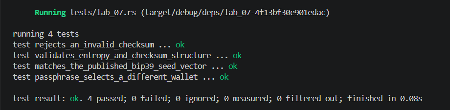

## Commands used

```bash
cargo test --test lab_07
cargo fmt --check
cargo clippy -- -D warnings
```

## Terminal output

```
running 4 tests
test validates_entropy_and_checksum_structure ... ok
test rejects_an_invalid_checksum ... ok
test matches_the_published_bip39_seed_vector ... ok
test passphrase_selects_a_different_wallet ... ok

test result: ok. 4 passed; 0 failed; 0 ignored; 0 measured; 0 filtered out; finished in 0.00s
```

## Evidence references


## Explanation
The BIP 39 checksum appends a fixed number of bits (derived from SHA-256 of the entropy) to the mnemonic word list, allowing detection of a single mistyped or swapped word. This is error detection, not encryption: the checksum bits do not conceal or protect the entropy, they merely allow a wallet to verify integrity. A forgotten passphrase, however, cannot be recovered because the passphrase is used as additional input to PBKDF2-HMAC-SHA512 alongside the mnemonic seed. Since PBKDF2 is a one-way function, there is no way to distinguish the correct passphrase from a wrong one without brute-force enumeration. The mnemonic alone deterministically produces only one seed; adding a passphrase produces an entirely different seed and therefore a different wallet, which is by design for plausible deniability.
