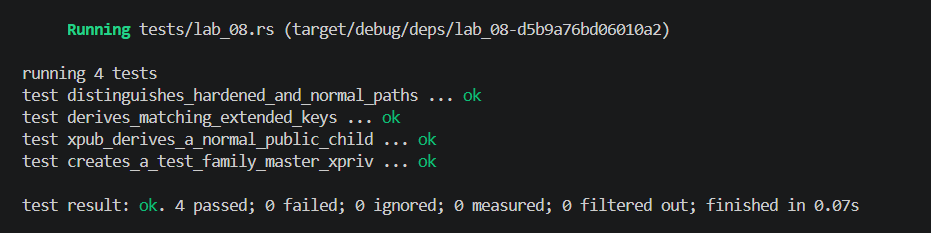

## Commands used

```bash
cargo test --test lab_08
cargo fmt --check
cargo clippy -- -D warnings
```

## Terminal output

```
running 4 tests
test creates_a_test_family_master_xpriv ... ok
test derives_matching_extended_keys ... ok
test xpub_derives_a_normal_public_child ... ok
test distinguishes_hardened_and_normal_paths ... ok

test result: ok. 4 passed; 0 failed; 0 ignored; 0 measured; 0 filtered out; finished in 0.00s
```

## Evidence references



## Explanation
The chain code is a 256-bit secret value that, combined with the parent key, allows deterministic derivation of child keys via HMAC-SHA512. An xpub (extended public key) contains the public key and chain code, enabling watch-only wallets to derive all non-hardened child addresses without access to any private key. However, hardened child derivation (index ≥ 2³¹) requires the parent *private* key as input to the HMAC, meaning an xpub alone cannot produce hardened children—this is a security boundary that prevents a leaked xpub from exposing the parent or sibling hardened keys. This design allows delegating address generation for auditing or receiving while keeping spending authority and internal tree structure private.
