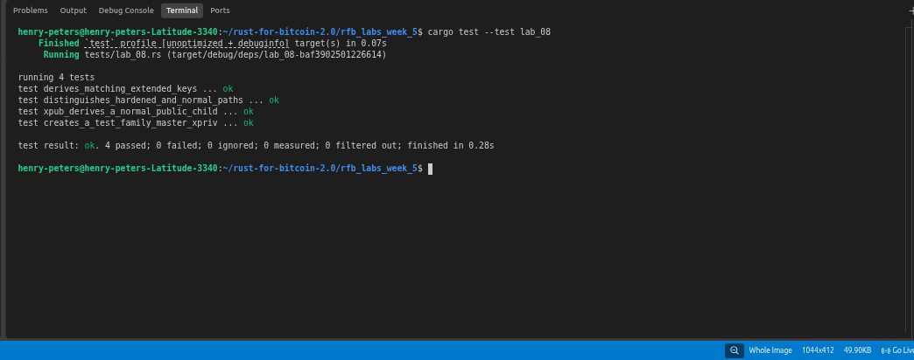

# Lab 08 — BIP32 extended keys

## Commands used

```bash
cargo test --test lab_08
```

## Terminal output

```bash
running 4 tests
test derives_matching_extended_keys ... ok
test distinguishes_hardened_and_normal_paths ... ok
test xpub_derives_a_normal_public_child ... ok
test creates_a_test_family_master_xpriv ... ok

test result: ok. 4 passed; 0 failed; 0 ignored; 0 measured; 0 filtered out; finished in 0.19s
```

## Evidence references



## Explanation

**xpriv (extended private key):** A private key combined with a chain code, serialized with network and depth metadata. It can derive all child private keys below it in the tree.

**xpub (extended public key):** The public key counterpart — derived from an xpriv by stripping the private key. An xpub can derive all normal (non-hardened) child *public* keys without ever exposing private material. This is the watch-only use case: give a third party (e.g. a block explorer) your xpub and they can generate every receive address to monitor balances, but cannot spend.

**Chain code:** A 32-byte value paired with every extended key. It is the secret ingredient in child key derivation — without it, knowing the parent public key alone does not let you derive any children. It prevents someone who observes one child key from working backwards to derive siblings.

**Normal derivation:** Child index 0–2³¹-1. The child key is derived using the parent *public* key and chain code, so it can be performed from an xpub alone. This enables watch-only wallets.

**Hardened derivation:** Child index 2³¹–2³²-1 (marked with `'`). The child key is derived using the parent *private* key. An xpub cannot derive hardened children. Hardened steps are used for the purpose, coin type, and account levels in BIP44/49/84 so that leaking one account xpub does not compromise the entire tree.
